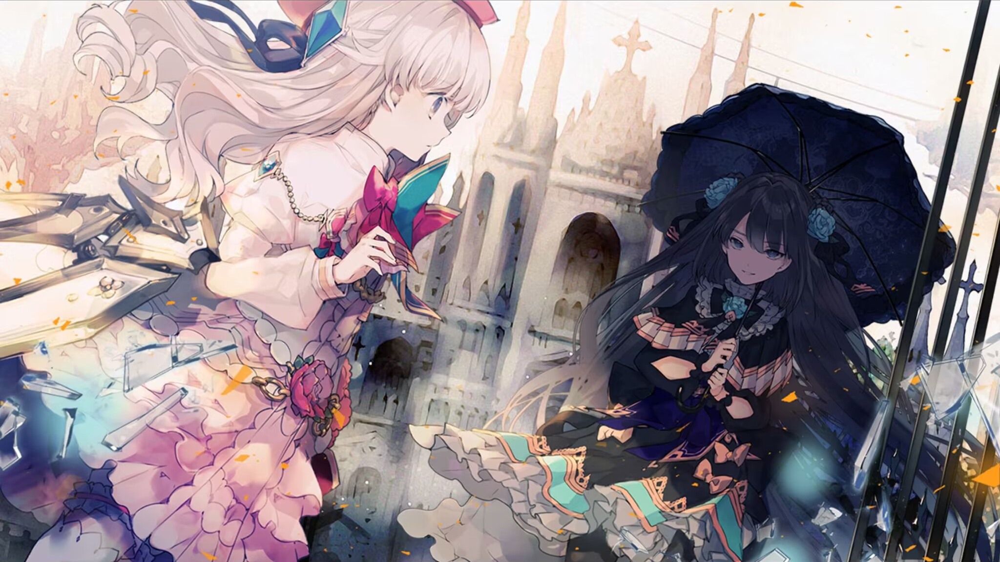

# V-0

- **Unlock Condition**: 购入Luminous Sky曲包，完成1-9，完成2-9
- **Unlock Requirement**: 采用光（Fracture），通过Grievous Lady

The ruin is as common a sight as any other, but the girl in light
nonetheless pays it attention as she steps through.

She's been wondering what the ruins are and why they're there—
wondering if this world she wanders has a past,
or if its decimated landscape is only coincidental.

She feels she has to think about it, not to succumb to the bliss of ignorance.
If she wants a reason, then it might help to know the world, too.
Perhaps this is a reflection of another world?

She has seen things like it within the Arcaea, but that also makes her wonder if in this place
there might be standing towers and buildings that are not in ruin.
Maybe she’s only yet to see them...

This ruin seems like it was once large, grand.
It must have been a beautiful place where many people came, she thinks.
If it did have such a past, then it is a shame.

There is only her, now, moving through pews and broken candlesticks.

There is only her, and she blinks, seeing that there is in fact somebody else.

Somebody else stands still at her left, before a broken wall.

Once, she would have grinned happily, but carelessly at this person.
As she is now, she looks at the shadow-covered girl in confusion,
but certainly not without a fluttering, insuppressible feeling of elation.

Outside of a memory, here in the world and before her eyes, is a person.
All this time she's walked alone, and here is somebody else:
one other living, breathing person.

The other girl doesn't notice her. She is standing in place, holding her parasol, and sleeping.
Her dark figure cuts so strongly against the rest of the world, which shines so bright in the distance,
that she thinks this must be a dream or perhaps a waking memory.

She opens her mouth to speak, and the other girl opens her eyes to consciousness.

She who heralds sad and evil forgotten things opens her eyes
and witnesses the changed and white-clad girl before her.

That breathing the light-bearer found so relieving stops short,
and the dark girl squints, lips parted as if she means to question.
But she swallows instead and raises her brow, tightening her grip of the handle.

Her own twisted elation flows out from her heart, just as unstoppable, but so much more eager.
It climbs to her face, and the girl of chaos offers the girl of light an honest, irrepressible smile.