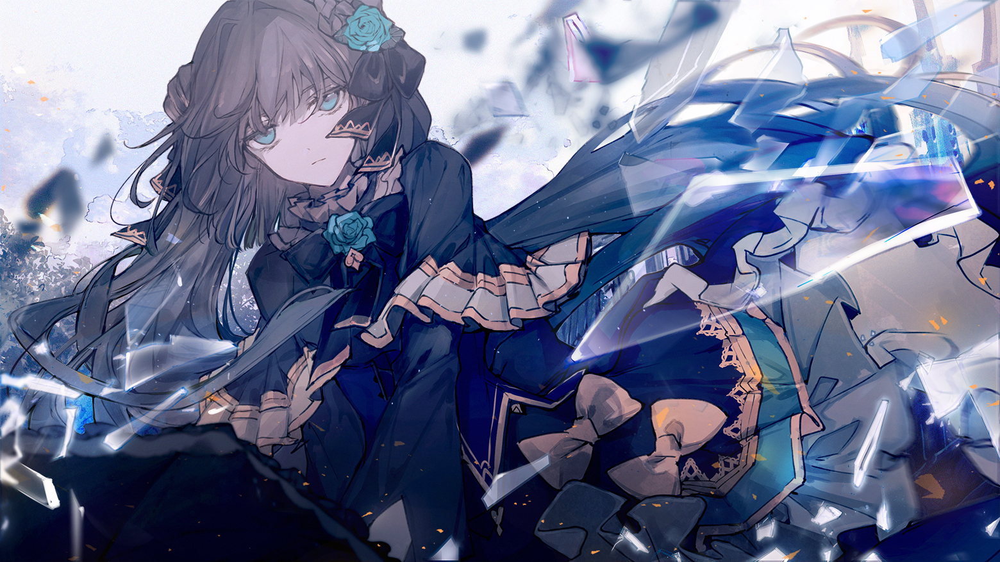

# V-4

- **Unlock Condition**: 购入Adverse Prelude曲包，完成V-3
- **Unlock Requirement**: 采用对立，通过Ringed Genesis

The end.

The girl adorned in shadows peers through the broken window into another time.
Her smile returns.

What a fool she was.
Not the girl in white, no.
Her.

The vision in the glass is no memory.

It cannot be, of course.
What she’s seeing is a future: a future that she should have expected,
the fool, the idiot dreamer.

The glass shows an unmistakable image of herself, run through with a jagged pillar of glass,
the wound seeming to sear her clothing and body apart in a blistering, pale, and consuming flame.

The blank, barren lands of Arcaea stretch out far behind her, and before her,
coaxing the pillar with a lifted hand and a blinding, fiery glow around her shoulders,
is a girl clad in white, a very familiar one, though her expression is hidden from this vantage.

It is the girl standing before her now.
The one she has only just met.
This is no memory: it's a vision of what will come to be.

Faced with this, Tairitsu retreats into herself,
and confronts the one truth she was determined to ignore.

Her conviction didn't matter.
She will never find anything good for her in this world.

That last hope is dyed black now, drowned in despair, forgotten.

What else would happen?
What was her hope for?
Idiocy. Tiresome, blind idiocy.

Tiresome effort.
Tiresome memories.
Tiresome existence.

Tiresome, awful, sick of it. Sick of this, sick of herself,
sick of everything in this never-ending, mocking play.

Miracles? No...

She'd said it herself. This world is hell.
And she knows this, from the fractured ideas of worlds dead and gone:
even angels can one day fall and awaken to demonic form.

The girl in light is just like that.
In a turn final and damning, what was once a mere pit inside her chest is clawed and spread.
It wastes, decays all through in an instant, leaving instead a cold and endless chasm.

As the darkness within it creeps out to coat her insides and choke her thoughts,
she sees Hikari very clearly.

Sees her gaze darting to the shard—sees the panic, the clear knowledge in her eyes.

The girl knows.
And now she can't face her opposite's stare,
won't say a word though she sees clearly.

You're unnerved? Unsettled? Unabashed.
Unforgivable.

That anger twists into hate and loathing, spilling over and arriving in her eyes.

Wicked betrayer; wicked, wicked place.
She tightens her grasp on her parasol,
looking past the shard to Hikari, who is standing still.

Frozen in place, surely, because her ill intentions have been exposed.
It's worth laughing about.

Tairitsu's eyes narrow, and she excises the remains of those burgeoning emotions
the girl had begun to cultivate within her.

With finality she is emptied,
and with that, she knows what she must do.

But this mirror is still one-way, and thus her anger as well.
Hikari is unable to see within this peculiar shard at all.

Unaware, she can only watch in confusion
as Tairitsu's countenance drains more and more of color.

A sense of danger wells up in her, and though she can't understand why, she can feel it there.
In fact, shadows now seem to be crawling up from the earth, light perishing at their touch.

Darkness nears her, and her breathing shortens. She takes a step back.
She almost can't believe it. She certainly doesn't want to.

Even after surviving the harrowing ordeal, that blinding light sky,
something terrible faces her again without reason.

But still, she had survived it.
And now she knows for certain that survival may not allow compromise.

With this thought in heart and mind, Hikari makes a damning mistake.

She reaches for the one piece of glass,
the one that gave her comfort and direction in the midst of her lowest moment.

When she raises it to her chest,
the hairs on the back of Tairitsu's neck rise up as well.

Fear pulsing through her, along with a conviction to never meet with tragedy again,
Tairitsu closes the distance to Hikari in an instant, without warning,
ready to once and for all firmly grab hold of her life.