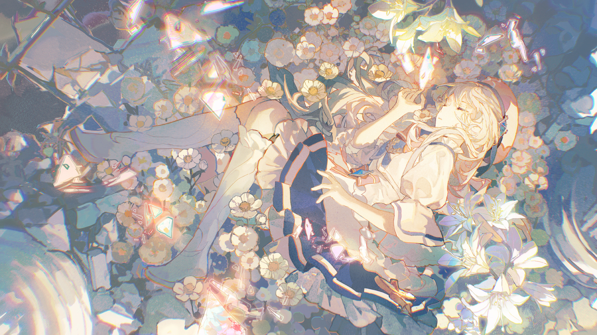

# 0-3

- **解锁条件**：完成0-2
- **解锁要求**：通过Shades of Light in a Transcendent Realm

新的故事已经开篇：又一个故事，两个女孩的故事，如何活下去的故事。

没人能教会你如何去好好生活，只有生活本身可以。

有时，它是那么美好；
有时，它又是那么令人战栗。

这是两个女孩共享的情感和经历。

你是否曾为万物的美丽而流泪？

毫无疑问你已在为这世间的一切不平而哭泣了。

当你再度睁开眼面对这一切，你是否还会在乎？
还是只是满足于苟且活着？

这个世界又是否会允许你感到满足？

----
想要感到开心并不是罪过。

空中漂浮着的记忆碎片，有美好的，也有悲怮的，分别落于两位女孩的身旁……

新的故事即将开篇，你们的丝线在未来将如何交织？

周围都是你的倒影，你的头顶，你的身旁——

无数条世界线的倒影，倒映着的不是可能性，而是确定性——它们都是实实在在发生过的过去。

站好了，好好地看看它们。然后问自己：

你想以什么样的姿态活着？

----
远处传来一声巨响，它的回声不绝于耳。随后，万物归于沉寂。

随后，她们坠入了前所未有的甜美梦乡。

沉静而又安详——一个女孩倚在墙边，另一个女孩靠在废墟的塔楼之下。

好吧，现在她们睡得没那么安稳了。

罕见地，白发女孩倚着的断墙上落下了几点阴影，斜洒在她身上。

黑发女孩则完全暴露在光亮之中，它们肆意摊开于女孩的裙摆上……

随后，她们睁开了眼。

----
……

你知道吗？此段记忆，此篇关于光明与纷争的故事……

……以一粒装满了感情的种子被埋进土中为始。

然后，在被珍视和被唾弃的回忆的共同滋养下开始生根发芽。

再然后，它便茁壮成长，执拗地想去到更高的地方，一如这执拗的时间。

随着她们醒来，命运的齿轮也开始转动——一个被祝福的女孩的的命运和一个被诅咒的女孩的命运开始编织。

随后，一切便又遗忘于历史的长河之中。