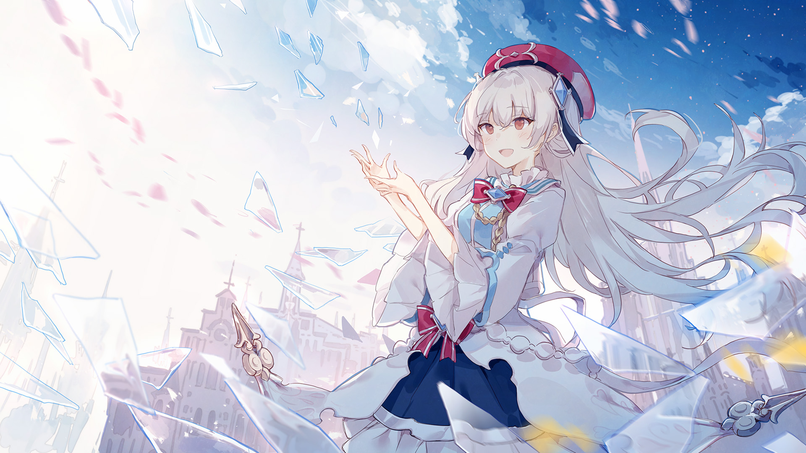

# 1-1

- **Unlock Condition**: 购入Eternal Core曲包
- **Unlock Requirement**: 采用光，通过Lumia

Her first impression was that she'd awakened to a cloud of glass butterflies.
"How pleasant," she thought, "that these figures can move as well. Where are the strings?"

She sat onto her knees, fixed her dress, and found that there were no strings, and these were not
butterflies. Glass shards, flying on their own. "Delightful!" she felt, and so she said it.

The glass reflected another world than the one in white surrounding her. In it she could see
reflections of seas, cities, fires, lights; she rose her hand to scatter them, and laughed in joy.

She didn't know these pieces of glass had a name: Arcaea.
To tell the truth, they were so beautiful that it didn't matter the name.
She entertained herself by touching them, swirling them, watching them.
That was enough, no?

There were six questions to ask: who, what, where, when, why, and how.
Of these questions, she asked none and desired no answers,
content instead to bask in the glow of Arcaea.
This was her meeting with a new world.