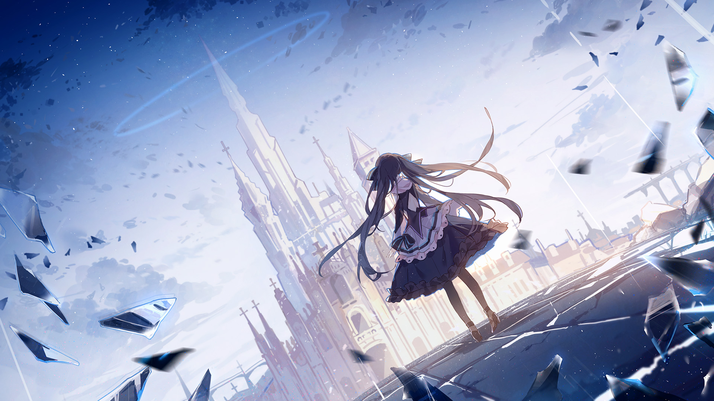

# 2-1

- **解锁条件**：购入Eternal Core曲包
- **解锁要求**：采用对立，通过cry of viyella

她醒来在一座损毁的塔楼中。飘浮着的玻璃碎片是她第一个注意到的事物。
它们引领她前往了室外——那纯白的世界。

纯白色、大片的纯白色，以及更多的玻璃碎片。
它们看上去正在被她吸引而来，而被激起了好奇心的她开始观察这些碎片。

就像透过火车车窗看外头稍纵即逝的景色一般，
她瞧见了阴雨的景象。下一次是艳阳。再下一次是死亡。她厌恶地远离了这些碎片。

虽然总是紧随着她，可这些碎片总能在少女试图捏碎它们时躲开。
少女心中的厌恶渐渐地化为为愤怒，而她迫使自己把注意力转移到那灰白色的天空。
然而，在她仰望天空之际，原先脸上的情绪荡然无存。
她的嘴微微张开来，却因过于惊讶而说不出半句话来。

玻璃在高空中搅动着、闪烁着、旋转着。这看着就像是场玻璃碎片的暴风雨。

她后悔把注意力转移到天空上。但碎片们已经发现了她，渐渐降落下来，要与她打个招呼。