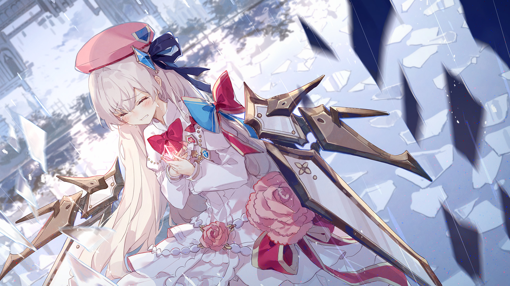

# 1-8

- **解锁条件**：购入Luminous Sky曲包，完成1-7
- **解锁要求**：采用光，通过Fracture Ray

晶莹闪亮的玻璃碎片犹如不均匀的雨滴般落下，如同以往的任何时刻，倒映着那些死去的世界。
位于万物中心的少女全神贯注地盯着那片反射了何种新事物的碎片——仍旧存在的那片世界。

泪水从眼角滑落，她却尚未了解原由。在拾回心智的过程中，她饱受折磨——
她失去了曾经她所拥有的一切，而那些事物如今正纷纷跌落在她的身旁。
但同时，她也为失去了自己的热情而痛苦。那些倒映的回忆展现出一段更美好，却放纵愚昧的时间，
而她也正是在那时走入了她自己布下的陷阱。哪怕她知道那样将会带来何种结局——
这些得过且过，引领她步步迈向麻木的旅途经历——她还会只是为了一时的快乐而重蹈覆辙吗？

玻璃中的鲜红呼应着她衣服上的鲜红，而她紧紧抓住那片碎片，使得鲜红也浮现于她的手心。
随着那温暖的液体流过荧光的表面，过去与今时双双模糊。她终能再次感受情感——
可这股情感却比她从前所感受到的一切都更为强烈。她感受到了足以压垮她内心的悔恨。

----
在这些时间里，她近乎骄傲自满地四处游荡，心中漫无目的。
她搜集着Arcaea，享受着它们，却从未思考过哪怕最小的原因。
她害自己成为备受苦恼所折磨且总感世事乏味的快乐主义者，亲手将自己锁死在这人造的炫目监狱中。

然而面对"为什么"的疑问，这里从来就没有过答案。只是取悦自己？也并非如此。
她跌倒于双膝，怀抱着她胸前的回忆哽咽、啜泣、痛哭，心中明白自己已经犯了弥天大错。
浴于美妙的爱情与绚丽的生命过久的她，已经对这些事物感到反胃，而这残酷的事实让她悲痛不已。

少女沉浸在悲伤之中不断哭泣，尽可能地思考着方才发生的一切，与它们所象征的意味。