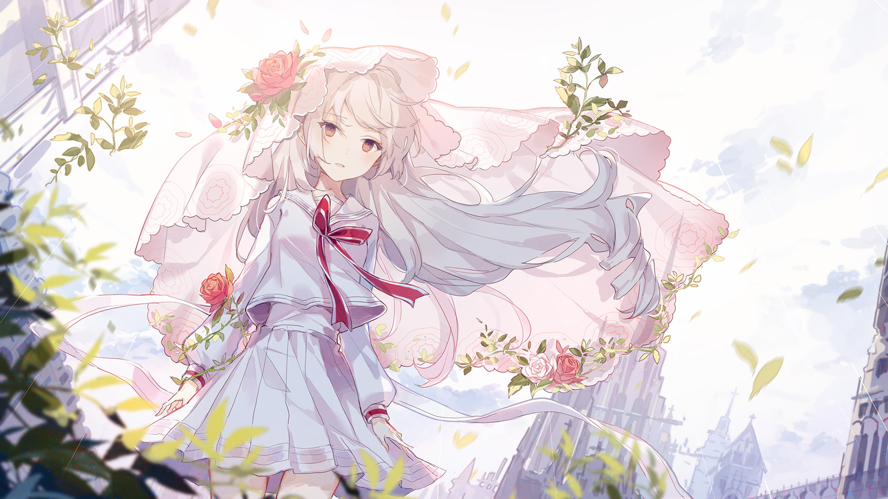

# 1-ZR

- **解锁条件**：购入Luminous Sky曲包，完成1-5
- **解锁要求**：采用光（Zero），通过Ether Strike

"天堂"其实也是地狱的一种。

事实上，虚度光阴和自我放纵是对热情的诅咒。
接连不断地汲取愉快的事物，将会无止境地麻痹感官，
使得"快乐"变得无比朦胧，暗淡，甚至完全失去原本的目的。
如今万物再无目的。她从未拥有过目的。

天空炫目到接近空白。

她也许正四处徘徊，也可能正站在原地；她对此无法确认，而这也无关紧要。
这片她创造的天空的确引起了她的注意，但她却无法辨别其中涵括的回忆。
这已是一片充满压迫感的不透明雾霾，散发着令人窒息的空虚感。她正一点一滴地丧失自我。

而在失去自我时，她始终对这渐渐渗入的瓦解之力感到麻木。虽然她早已不记得，
但是招待她步入这座让人感到愉快，却又让人窒息的牢笼之人，正是她自己。
现在，她甚至失去了为自己担忧的自由。

----
天空变得越来越明亮，少女的心智也不断流逝。在这仅剩的时间里，她仰望上方，好像等待着什么。
明亮——无比耀眼——散发无尽幸福的极彩色苍天：灿烂夺目的回忆淹没了她。

她的思绪终被清空。

并且，毫无意义地，光芒褪去了。

毫无意义地，时间流逝了。

之后，一名女孩仰望着空无一物的苍天。她的思想终止了——与她的故事一起。