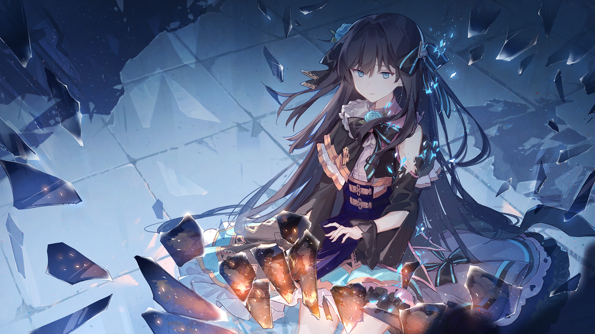

# 2-8

- **Unlock Condition**: 购入Vicious Labyrinth曲包，完成2-7
- **Unlock Requirement**: 采用对立，通过Grievous Lady

The girl had felt many emotions since her waking into the white and ruined world. Mostly, she'd
felt anger, but she'd been able to turn that anger into a strange sort of hope. True, she didn't have
much of a plan. In fact, she was only walking forward because she believed at the end of her steps
there would be something good. She had hope. She was certain that this chaos was leading into
light. She was certain that the torments she was facing, that the horrors she was holding,
could be completely shattered.

Yes, she was emotional. She felt so strongly that when faced with the idea that no, in fact, nothing
had a purpose... she began to suffer.

The cruelest fate is to have hope and see it crushed before your eyes. And so the girl sat on her
knees in a malformed circle of death, looking at a world coming to its end. This was the first time
she had felt the emotion of sadness, and it was quickly turning into despair. The world of Arcaea
was a pointless world. It was the manifestation of worlds gone. It had no substance, only the
reflections of such. Even the glowing and joyful memories she had sometimes encountered on
her way were still only memories of the past. Like night comes after day, they had to have led into
the end she now saw spinning slowly in the air before her. Her eyes welled with tears.

----
She had felt so much since waking up.

She'd felt joy. Joy left her.

She'd felt fear. Fear left her.

Anger left her.

Hope left her.

Even sadness and despair now left her.

Her eyes went dark and she could feel resonance with the glass.
The shell of memories around her began to crack and split open.
She emerged from it and stood in the blinding light, and couldn't feel anything at all.