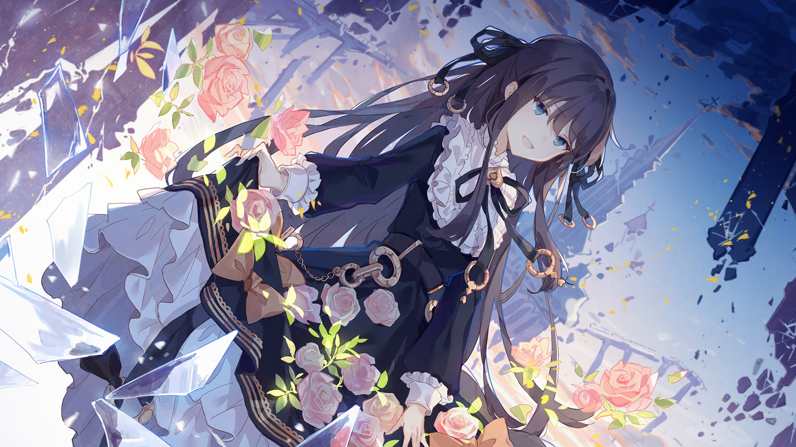

# 2-D

- **Unlock Condition**: 购入Vicious Labyrinth曲包，完成2-5
- **Unlock Requirement**: 采用对立（Axium），通过Axium Crisis

She didn't know it, but she had a name. If she knew it, perhaps she wouldn't have entered the
twisted black maze. It may have been a meaningful name that may have made her doubts much
stronger. But she didn't know, she ground her teeth, and she reaffirmed her beliefs.
The light from before would not shake her, the light of the flower ring would not shake her.
She entered the dark structure and started tearing it apart.

Each wall pulled away was made of misery, each facet held horrors, and the corners were
comprised of fear. This was a castle of iniquity. Simply put, it was grotesque.
It was powerfully grotesque.

And that girl, her grin returned. This was it. Climbing through it, running through it, this was the
kind of disgusting monolith that had compelled her into action in the first place.
She hadn't been wrong. The glass should only be shattered. The mirrors should only be destroyed.

----
And as she gleefully pulled away great swathes of the maze, hallways tumbling into the air,
her smile became warped. She winced; something was wrong with her head.
At the heart of the maze, there was *something* worse than any memory before. She could feel it,
close now, calling to her. Her enthusiasm had drained, and her progress had slowed,
and she saw a wicked shard of glass turning in space, containing the memory of the end of a world.

With a hand on her face, she looked into the mirrored world. She remembered the sea of pleasant
realities below her and the flowers now circling around her. She'd taken down part of the maze's
roof and the walls had subsequently fallen away. Dark glass rained slowly around her, and in the
distance the better memories shone brightly.

She looked into the end of the world between her fingers. She swallowed, and with newfound strength,
removed the hand from her face. She reached out, and dragged the end of the world into her collection
of memories. With this monolith toppled, she felt an honest and genuine surge of bliss. However terrible
the memories she faced from now on would be, it couldn't possibly matter. She was certain now that
she was strong, and she would definitely destroy them all. And so, with a genuine smile and a tired laugh,
she came down from the sky, and the tower along with her, landing after with power flowing through her
and a mere ruin behind her and so marching forth with unwavering certainty: that of a hero's conviction.