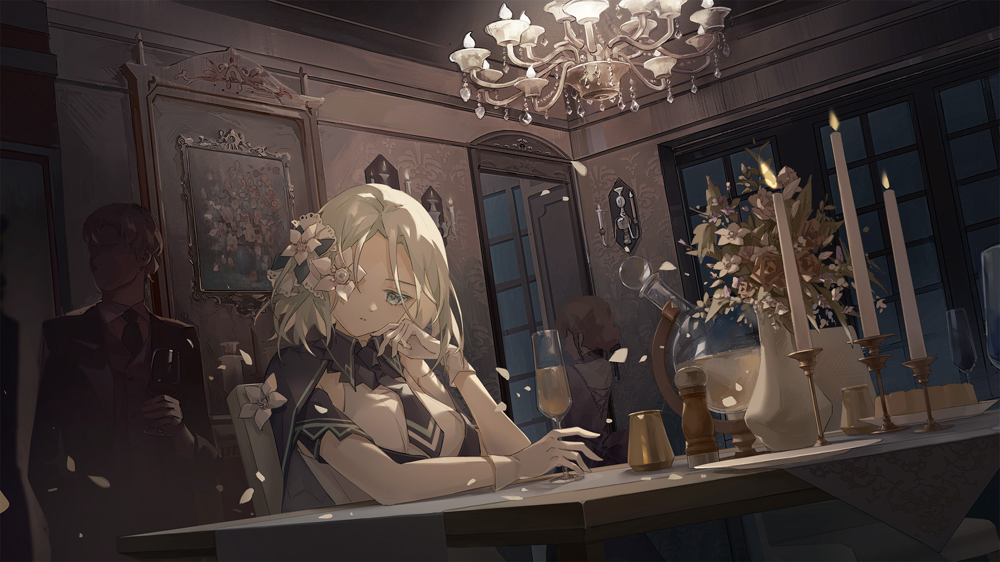

# 3-1

- **解锁条件**：购入Absolute Reason曲包
- **解锁要求**：通过Antithese

夜色将至。屋外，太阳所溢出的琥珀色暮光马不停蹄地想要从天际溜走，
奈何被草坪中的那几台装置捕捉并卷入，
转变为近似月光的柔和射线。

这场宴会带有种独特的气氛。虽然庄园外一个人都没有，但是对上流人士来说，
保持形象似乎比任何事都来得重要。她了解这一切——从一开始便是。她坐在较暗一点的地方，
而被捕捉的阳光则重现于她如今无法触及的天花板与阶梯。
少女静静地思考着潜藏于那些渊博知识之中的涵义。

“拉薇妮雅。”

她的视线从玻璃杯上移走。而她的未婚夫（穿着整齐，甚至能用古板来形容，
但是姿态相当轻松自如）正站在她的面前。

“想好今晚喝什么了？”

她用那只正常的眼睛注视着杯子，答道：“嗯，多纳文……我点了李子汁。”

----
“不错。”他笑着回应，一边环顾房间的四周。
少女茫然地瞧着他的表情，而他假笑着。
“妈妈和大家都说蔓越莓汁更健康呢，不过……”
他说道，并再次朝她瞥去，“喝起来也更苦，不是吗？你也不喜欢吧？”

她想了想，畏缩道：“我不喜欢。”

“那就好。”他轻笑一声，转过身去，“我接下来要去跟摩根聊聊，
不过随时欢迎你加入我们。”

少女点了点头，多纳文就走去壁炉旁的那群老朋友们身边。

----
一如往常，形象的维护是必不可少的。在引线被卷起存入地上的灯笼前，
那凹槽中的火焰只把自身的光辉投出几英寸远。房间的其余场所一片黑暗，却使人感到安心。
挂在上方的几个灯笼刚好提供了足够让人们进行阅读、辨识各自面孔，
以及分配经过了精挑细选的食物和一瓶瓶饮料所需要的光线。在那半面为玻璃的墙壁外部，
如今室外景色模糊不清，隐约能够辨识出野花、石头与溪流：笼罩于深蓝夜幕之下，仿佛一条绸缎。
宴会上有二十位来宾，一半在这个房间里，其他人可能在大厅或是某处的书房——
或许是图书馆也说不定。她所知道的只有这么多。

她细细品尝了她的果汁。她从中感受到了一丝甜味，但这李子汁依然不能让她产生多大的印象。
少女显然能回忆起某种更好的滋味和感觉，但现在她还是试图让思绪集中在舌尖上的味蕾。
可惜，这依然不足以打动她，这味道实在是平凡得出奇。

她将玻璃杯搁在一旁那张矮桌的奇异桌布上。她坐了下来，凝听、观察着四周，
几分心不在焉地抚摸着于她的另一只眼中绽放的花瓣。

----
她听见多纳文说，“但仔细想想，他们现在已经做了那么多了。
我第一次听到这主意的时候，我甚至觉得这完全行不通。”

“嗯，查尔斯对这一点十分确信。”另一位来宾说道——不是摩根，而是娜塔莉亚。

“真让人意外，”多纳文认同道，手指游离于发梢。

“一个完整的世界，全部由人类的双手打造……”他说，“我们人类可真了不起。”