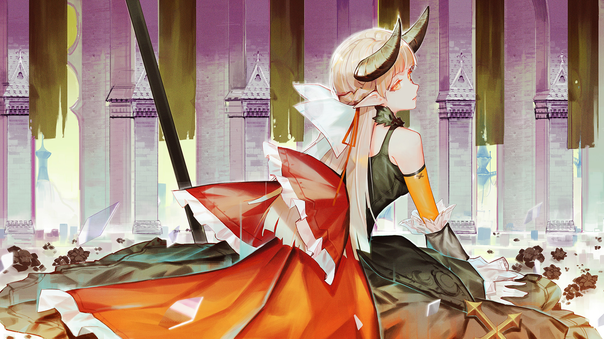

# 5-6

- **解锁条件**：购入Ambivalent Vision曲包，完成5-5
- **解锁要求**：采用忘却，通过Lethaeus

心智的崩坏终于使她平静了下来……多久，她都比从前的任何时候表现得更加安静。

“不要将过多的疑问牵挂于心头。”
这一思想，便是那段记忆的核心要素——而她在一番深思后才觉察到，
这更是她往昔至今始终尝试追循的信条守则。

然而时至今日，她的那些尝试都未免显得心不在焉。那一段古老的回忆始终令她魂牵梦绕，难以忘怀。
她固然完全不打算去遗忘那段故事——却还是忘记了过多除此之外的事物……她终究意识到，
自己已经变成了一具残缺的躯壳。

这种事情，还是忘却为好。

----
今日，她又一次将那些迷途的回忆引领至这片广场；
她试图将这一举动当成例行公事，等其成为生活习惯，再等其转变为顺理成章之事。
或许乏味会在她落入那潜藏于安详地面正下方的深坑之前牵扯住她前进的脚步——若非如此，
那不断呼唤着她的焦油陷坑终会让失足的她被不幸的感受所淹没。
她真切地认为——若感受那些事物所带来的只有痛苦——比起“感受”，果然“遗忘”才是更好的选择。

就在她如此引导着这群Arcaea残片的时候，
其中的某片忽然以一种特别的形式反射了源自天空的光线，以至于她条件反射地望向了它。
她几乎没去多想，随即将那碎片召至了自己面前。

反射的场景：一个孩子正懒洋洋地蹲在路边，用双手遮罩着什么物体。
在她的手掌周围，小小的蚂蚁们显然对她藏在手心侧的事物感到十分好奇，却还是害羞得四散而逃。

这名收割者将更多的集中力投予这段回忆，继而发现那孩子掩藏的事物其实是一只受伤的无花果甲虫。
在一番思虑过后，那女孩便用双手捧起了那小小的存在，从地上站起了身。

这便是全部。

----
许久，这位年轻的观众都处于呆滞状态。可接着，她便傻笑起来。

这还真的……是一段毫无意义的回忆。

那只甲虫的伤痊愈了吗？那孩子活了多久？多少年月，她将这段故事铭记于心？

全然是件愚笨而无关紧要的小事……

少女轻笑了起来。

真的挺讽刺的，不是吗？
铭记某样事物，却使她遗忘了关于自己为何身于此处的揣测。

Arcaea是记忆的世界。
这些记忆隶属于死者？抑或是尚在之人？又有谁能回答这个问题呢？
不论谜底为何，这世界保存着那些任何人或许都会忘却的过去。
灵魂消散、肉身腐朽、石碑碎裂、大地风化……任凭时光流逝，Arcaea都完好无缺地保存着一切。

----
少女已然只身一人。她在此处并未拥有同事，也不存在什么需要起床做任何工作的理由。
但这并不代表她什么都不会做。

此时此刻，她便身在此地。她过去的生命已经到达尽头。
仅仅如此。

但她难道仍有权利掌控一切吗？她依然能感知到自己的职责。
她依然无法回忆起自己给予的那个答案——那个使她成为一位灵魂守护者的理由。
但无论谜底究竟是什么……有一种无形的力量使她坚信，
哪怕心灵早已残缺不堪，但当她再次遇到那个问题时，
一定也会给出与曾经完整的自己相同的理由。

世人本就无法预言未来。一向如此。

无论生命还是回忆，都可能在转瞬间灰飞烟灭……但在此处不一样。
她可能会忘却属于自己的回忆，可面前这些回忆不会消逝。
由一位“灵魂的守护者”正式转变为“回忆的守护者”——她觉得这听上去十分美好。

----
没错。你们将一直被深深铭记——

只要我仍伫立于此。