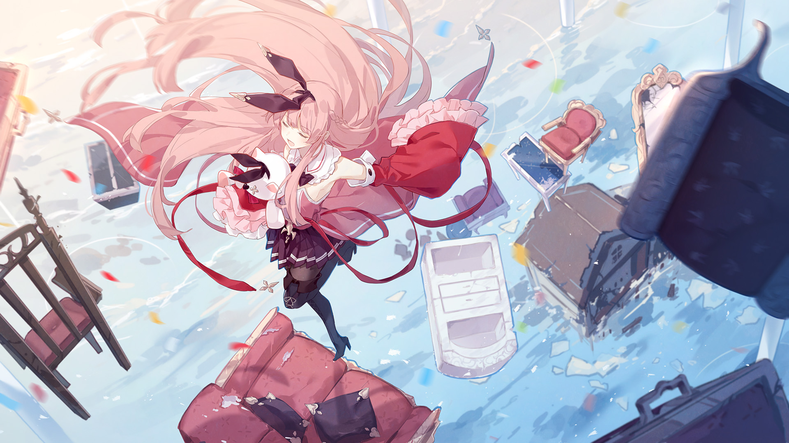

# 4-1

- **Unlock Condition**: 购入Crimson Solace曲包
- **Unlock Requirement**: 通过Paradise

An endless day could be dull. Spending too long under an overeager sun—anyone would start to
yearn for a moon.

Even for her, that sentiment holds true.

"Eighty days of light?"
"Seven months of light?"
"A year... maybe..."

The white of the sky has once again broken through the cracks in the walls of this place she calls
home, and it seems her sleeping body had found the rays while rolling over the floor.

She grumbles, "Turn it off already..."

----
But still, she picks herself up.
Still, she rubs her eyes and stretches her arms.
She stands and finds the door, ready to face another "day" in the seemingly boundless
world of Arcaea.

An adventure that hasn't always been a delight, and travels that haven't always led to discoveries.
Despite that, ever since she'd first awakened a tabula rasa, two things have always remained
consistent:

both her heart and the sky have always been shining.

"Alright...!" she says under her breath. "Some exercise first!"

She holds out her hand before her and a section of glass flies her way.
Not memory glass—
Not "Arcaea"—
It is an ordinary, typical sheet, albeit a large one. When it spins close, she jumps onto it,
and immediately calls another.

----
The home she found is an old beach house on a lonely island apart from the abandoned
mélange-cities found everywhere else in the world. It's a beach without an ocean, houses
scattered around its shores like abandoned shells; and deeper inland is a field of strange, gigantic
poles of white wood. The homes have been picked apart over time, from within and without, in
her tampering. Now she whisks away their walls and windows to create a makeshift set of stairs—
to make a racing track, and then a tunnel. She quickly leaps and runs through the gleaming
passage, if only to give her legs feeling.

All this took was a little acceptance. Days after awakening, it was a simple matter to make the
world of Arcaea bend to her whimsy.

But far below her, just above the sands of the phantom sea, something glints: something sparse
and scattered throughout the water.

Throwing a glance that way, she huffs a breath from her nose, and sports a weak smirk.