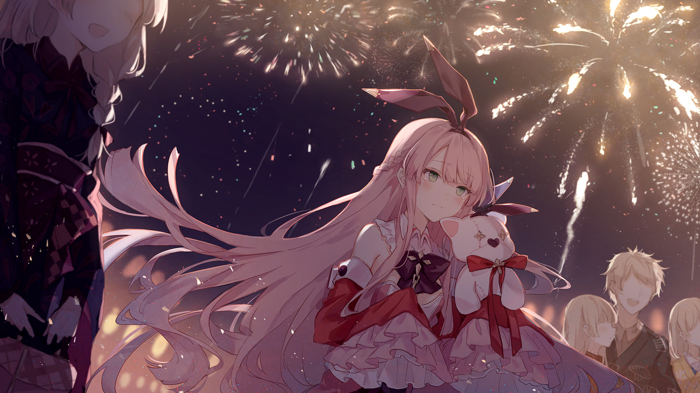

# 4-7

- **Unlock Condition**: 购入Crimson Solace曲包，完成4-6
- **Unlock Requirement**: 采用红，通过Diode

Twenty times? More? She's stopped keeping count.

"Al...right..."

With that whisper under her breath, she crouches in front of a chest made of unfinished wood,
swiping her palm across the top. A wave of dust rises off of it and falls to the floor. She unclasps the
front and opens it up.

Today she is an archivist, exploring one of the old castles in the North, where they had lost land to
flooding. Thankfully, the papers inside this chest were spared from moisture by the chest itself.
Hearing the creak of ancient hinges, her partner calls from another room inquiring about her
discovery. "Scrolls from the fourth era," she answers over her shoulder. She takes one of them and
unfurls it, revealing the history of her people's dealings with the Unseelie.

----
Stories like these amuse her, especially as she tries to guess at what the previous generations might
have confused for fairies and the like in the past. Yesterday, while working as a storyteller, she had
the pleasure of recounting an old passed-down yarn of the teller's ancestors. Some forefather had
once gathered a vast treasure on a faraway shore. On the return across the lake a sylph rocked his
boat with wind, and a passing naiad capsized it with waves. Afterward, the two shared his fallen
wealth. It was quite an excuse for a bout of clumsiness.

But still, she knows it proves nice to think these creatures are around, malevolent and benevolent
both. When her day as an archivist is done and she's returned to the world of Arcaea to rest on the
platform which is now her temporary base camp, she visits the memory of a school instructor and
teaches lessons and rules that would keep any child or adult safe in a world replete with chaotic
nature, sudden perils, and careless people.

The context of magic makes these lessons very interesting to impart and to hear. It really is just a
joyous and fascinating place, and she cannot stop visiting. Its people, whose faces become
increasingly familiar between each shard of Arcaea; its places which become engraved in her own
memory throughout others; the sounds and the sights, everything—

----
It's marvelous, and nostalgic.

When she's been to every other memory she could find in Heaven, when she's explored (as far as
she knows) every part of the land, she at last comes to a bustling, rambunctious festival day—or
rather, a night celebration. It is to give thanks to the gods of birth and harvest, and to dissuade
darker spirits.

She spots the townsfolk named Lancaster and Howard, two gentlemen architects, and they've
gotten on in years from the last memory she met them. But they greet her with vigor and treat her
to a candied apple, which makes her happier than anything else. They point to the sky. It lights up
in a show of a thousand brilliant colors. To those gods. To life, and living it.

However, seeing such a wonderful thing… it doesn't strike her. Her heart does not swell; not with
wistfulness, nor the joy of new experience.

----
She remembers this. She knows why everyone is here.

So, on this final night in these familiar memories, she witnesses the firework sky entirely satisfied.
With tears in her eyes, and a spot of pain in her heart, she finds herself entirely content.