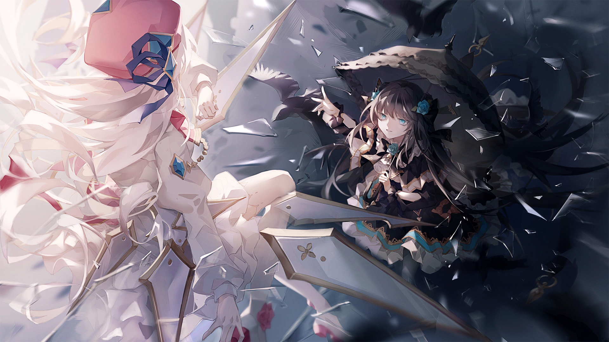

# VS-5

- **Unlock Condition**: 购入Black Fate曲包，完成VS-4
- **Unlock Requirement**: 采用对立，通过Dantalion

It begins like a storm.

The falling glass, now under Hikari’s command, begins to dart everywhere and every way without
order. Though the shards are hers to control, she cannot grasp how to truly use them for a little
while.

Tairitsu, aggravation and concern plain on her face, retreats. Hikari is thus left hidden in a swarm of
edged memories, crouched and still as she concentrates on her newfound power.

Tairitsu surveys the land, looking to the sky and to Hikari’s storm. She holds a hand up over her
head, and thinks: to fight a storm, one must summon a deluge.

Thus, from distant cities and white mountains, the glass of a thousand and more memories are
immediately pulled by her call. Unlike Hikari’s untamed flurry, Tairitsu’s flock is a pattern,
immaculately composed.

Behind the girl in black, the glass assumes the shape of a giant rose, its petals falling one by one in
swirling descents, slicing cleanly through the squall shielding the girl in white.

----
And Hikari—now standing, though afraid—can only respond in patterned kind.

Bloom after bloom and chain after chain follow in their maddening, frantic, distant combat.
From miles off, it seems things are exactly as Tairitsu wished: a clash of two storms.
Rain fighting rain, "lightning" flashing throughout, and their undulating "clouds" joining the fray by
bursting, spiraling, and flowing in an explosive display—a sparkling tumult of furious natural powers.

And beneath the whirling and silver floods stand two girls, each with a blaze in her heart.

Each avoid volleys of shards by mere millimeters, and they begin to run as they fight rather than
holding their ground. Rushing through Arcaea’s plains, they cast glass artilleries and skid along
the shining earth as their improvised bullets fall and scatter like shrapnel. Glass pursues, glass
cuts off their routes, glass aims for feet in an attempt to pin the enemy in place.

----
It is madness: frenetic madness, chaotic yet constant.
Their movements soon become nearly even, steady and regular.

Evade, and fire, always.

Within this overwhelming row of beauty and violence,
they once again find themselves evenly matched.

And thus it is Tairitsu’s turn to gain the upper hand.