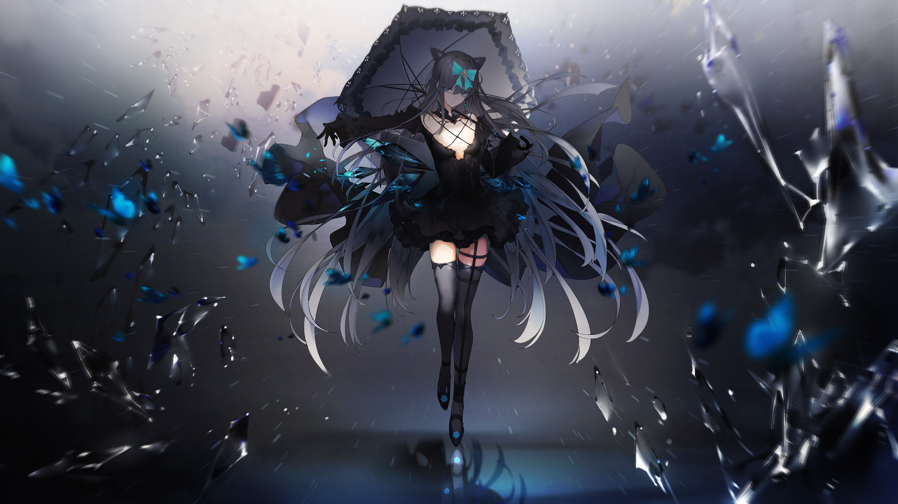

# VS-7

- **Unlock Condition**: 购入Black Fate曲包，完成VS-6
- **Unlock Requirement**: 解锁Tempestissimo

The illusion of an even match shatters, and with its destruction Hikari’s hope finally begins to waver.

Without warning, Hikari’s storm flies to Tairitsu’s side, cloaking the other girl in darkness and light.
As they surround her, her eyes shut for a moment—and when they open again,
those countless memories unfurl behind her as six gargantuan wings.

Now hanging in the sky in blatant defiance of nature,
she lays her sharpened eyes on Hikari.

A simple look reveals to Hikari that the path to victory has been nearly closed.
She had thought the girl a beast before, and now she sees her as what she is:
above, and nigh impossible.

Glass rises up behind her like a gigantic sheet: a skylight, shimmering and clear.

Below, Hikari has little to nothing to fight what will come. At least, that’s how it feels, but...
No... The girl in black does not have everything. This can be survived. It can!
Hikari takes up twenty memories as the window to the heavens breaks.

At first, only a handful of shards hurtle down at her, but they do so rather... slowly.
It disarms her. She starts to think, "this is possible."
As though the elaborate display a moment ago was only that: a display.

As before, Hikari shields herself, quickly blocking the falling glass with unshakable focus,
her eyes darting this way and that to keep measure of the flitting, brilliant crowd.
It makes her confident—she misses nothing. She allows herself a smile.

At the least, she’ll be able to run from this. At the least, this won’t be the end.

A single piece then flies to the middle of her chest, its delivery interpretable only as a message.
It had flown faster than any other piece of Arcaea she’d ever seen.
The girl above speaks to her through this glass shard: "Enough games."

"And enough wasting time. Give up—and die."

The shard cuts through her dress, and Hikari looks into Tairitsu’s eyes.
The girl in black is smiling now, all the sadness and anger gone from her face.
And it’s the most frightful thing she’s ever witnessed in her life and in her memories.

The shard falls out without having reached her skin.

The broken pane whirls into a side-winding tornado. Its mouth barrels down onto her,
slicing fabric and skin, but otherwise simply passes by.
In this is one more message: before the end, the girl in black wants her enemy to know where this began.

Fear overwhelms her. In this riptide of glass, rushing and cutting past her in powerful amounts,
turning up and swirling as if pulled by a great wind, she is made absolutely afraid.
So petrified, she stands fast and watches.

She stands, watching memories of a filthy world.

Memories of pain, betrayal, envy.

Death, suffering, and decay.

Dark. They are only dark. Wherever it is these shards reflect... she sees little light there.
Whatever small sparks she sees fade away in an instant.
This is what the other girl described to her.

The vile reflections of places gone that had been tormenting her since her awakening—
she would now use them to torment another.

Glass hooks under Hikari’s sleeves and stabs into her skirt.
They drag her upward, up into a domain where she can no longer stand.

Tears fill her eyes as an emotion fills her heart: the emotion that comes when recognizing imminent death.
This is not fear.
"Terror" is too little to describe it.

Desperation? Hope?
An awful, arresting feeling.

Her own memories run through her head. It’s as if she’s searching for one that will stand out—
one that will inform her that she’s come across something like this in the past,
and this is how to escape.

But nothing comes.

The black storm rages over torso, cutting with little mercy.
Pure torturous intent, coming closer and closer,
as if the intent alone would inflict a fatal wound upon her flesh...

It is unbelievable.

The situation is so far beyond anything she’s ever borne witness to,
whether in her own memories of those of others.
This disgusting blend of facing the unknown, yet knowing precisely what awaits her on the other side...

Horror.
Not fear.
Horrific understanding.

There is no control over glass for her here.
Something, anything—an anomaly—a miracle.
If something like that appeared, she could make it out. She could step away. She could live.

If there was ever a time, it is now, and here.

The ground below bursts, as if the world itself is rising up to join the hunt.
It is now.
Now! A shard will come to save her!

She prays with all her being for the will of the world to fly to her side and spare her!

For some mechanism of fate, for the wheel of fortune itself,
to produce a "god" that will grant her victorious power!

Beg for it. Hope for it.
Hold that piece which once brought you salvation close to your bleeding chest once again.
That symbol of rescue, of redemption... It will surely—!

Another shard pierces her body, a hateful stake driving at her heart.
It does not reach through, does not strike the heart itself. But its message—a final message—does.
One last message from the girl tormenting her: a simple, merciless message.

"No."

The almost lethal blade in Hikari’s breast holds the memory of a vast and all-consuming fire.

So close to death, her heart thumps, reminding her she’s alive.

Her pupils shrink to points.

Like that memory of flame, her body burns.
It burns with a fluid, vicious heat.
Pain. Agony. Blood—

Her savior shard falls from her hand as she reaches that hand for the terrible wound.

And then, a jagged piece of glass whirls out of the tempest and finds the back of that hand.

Sound escapes her.

Run twice through, her breath has gone as well.

Her gaze is steady on the trio of unthinkable sights before her.

This reality, horrible and unimaginable as it is, nonetheless "is".

And so her thoughts, too, begin to vanish.