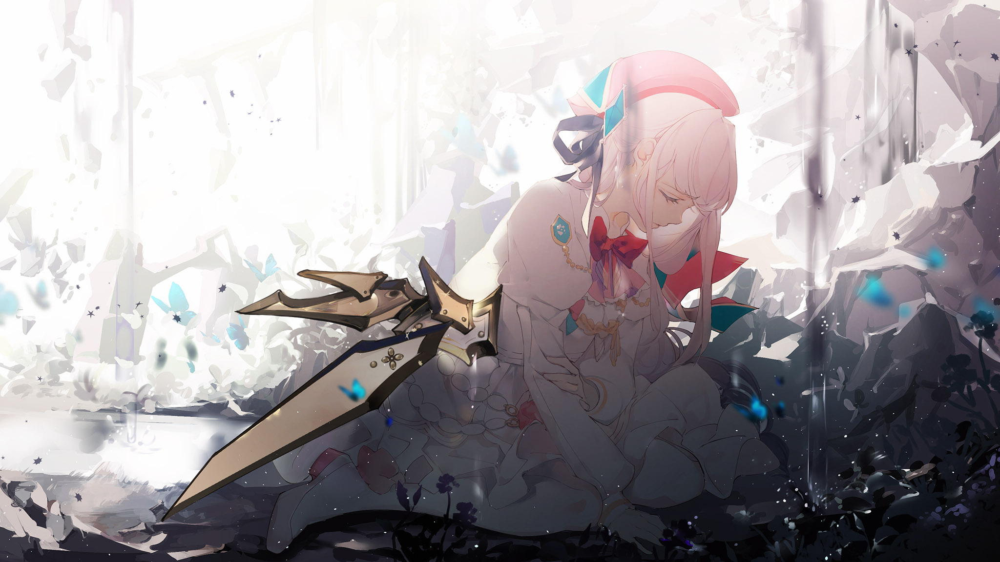

# VS-8

- **Unlock Condition**: 购入Black Fate曲包，完成VS-7
- **Unlock Requirement**: 通过Arcahv

And now, instincts begin to lurch, old and forgotten, in the wake of those thoughts.

They haven’t yet taken hold, those discarded yet practical sensibilities. They have only stirred.
She is still afraid.
She clings to hope by a little finger.

Somehow, she manages to pull on ten memories to aid her,
striking out the needle-glass that had been keeping her in the sky.

Ingloriously she drops to the now-deformed ground,
her chosen pieces afterward hovering over her crumpled, aching body.
Oddly enough, she finds herself smiling now, too.

She pushes herself up with her left hand. For all the enmity evident in Tairitsu’s assault,
she had taken too much pleasure in inflicting torture on her enemy’s body,
rather than inflicting any sort of mortal blow.

Even the shard now in Hikari’s chest,
so near to her beating heart and flickering with horrid, wrathful flame,
did not do the deed.

Maybe it wasn’t intended to.
Regardless, Hikari is still alive.

She feebly sends forth an attack, which is quickly swatted down by the girl flying above her.
That girl now looks worse than any described devil Hikari has heard of in old memories.

A veritable dark queen, ruling night in a world of day.
That ecstatic, yet obviously empty smile...

Seeing this, Hikari can feel it: how her own feelings are beginning to slip away.

Stark reality is sobering her more and more, and rather than dread it,
as she had been only minutes—no, seconds ago,
she begins instead to register each fact present to the situation.

Slowly—or, as slowly as Tairitsu will allow. Her attack is unending.

Shifting her body left and right, guarding her weakest areas with what few memories remain to her,
Hikari examines their field of battle.

It has been torn asunder, and now looks more a wasteland than ever before.
Ripped, ruined all through, like a town in the aftermath of military bombardment.
The glass around them is uncountable. The power Tairitsu has is immeasurable.

Hikari herself is weak.
Not only in terms of strange abilities and control over glass—her body has been run ragged.
She doesn’t have much left before she falls from weariness alone.

Perhaps she could find an anomaly, but say she couldn’t.
What then?
She couldn’t, so "then" is "now".

So?
How do you go on when the way is completely obstructed?
Should you...? Go on?

Glass strikes her shoulder, shining with light.
Hikari stares into its reflection.
So, the other girl can control light too, now. Well...

She decides to think over what she’s observed once again.
She recognizes that she could die here, or she could not.
These are the two possibilities, and knowing that, she finds herself in acceptance.

This could be the end.

In a moment, this could all be over.
And while she’d rather it not, she can’t help but echo the idea:
"So it goes."

After thought, hope, and feeling...
determination is the last to fade from her.

This.

This...

This is not... a laying down of arms.
No...

When she pulls the shard from her hand,
her eyes briefly dazzled from the white flames licking up and searing closed her wound,
she does not press it to her neck.

She would certainly prefer to live... but she would not mind.
She wouldn’t mind, with the odds being so impossible.

Hikari stands in the wind of blades, barely a shard in her employ.
She can’t discern Tairitsu’s face anymore.
Her domain has become pandemonium, and seeing through it is too difficult.

Eventually, while trudging through the flying glass, Hikari notices that
some segments of the whirlwind are reversing in fits and starts.
The bizarre movement is so unnatural she genuinely wonders if the girl above her is doing it on purpose.

It’s reminiscent, she thinks, of a skipping video.
It isn’t any better or worse than the bullet curtains she’s been facing so far, but it is quite peculiar.

The earth quakes.

She utters a "Wha...?" as she feels it.
The earth, quaking?
Here?

It could be that the ground will break again.
Thinking that, Hikari shields her face and chest with her arms.
When nothing comes, she remains curious about the phenomenon.

If it wasn’t the girl above her, Tairitsu wouldn’t have noticed it—after all, she was flying now.

More of the blade storm is shifting and roiling in rough, rigid movements now.
She decides to throw a crew of glass the other girl’s way again.
It passes easily through the waves again, but then it suddenly turns very bright and breaks away.

The shards don’t break themselves... They vanish, and the space where they were looks as if it is cracked.
Once she sees this—once she recognizes what she’s seeing—everything around her enters stasis.

In this instant, the obsidian-glass which had been flying all around her is stuck fast within reality.
To her, it looks absolutely beautiful.

A smile crosses her lips without her wanting. "How pleasant," she whispers, chuckling to herself.
Something so beautiful here: where she could soon find her grave.
It’s so bizarre that it is... to laugh. So she does. She makes earnest yet sad, dry laughter...

But as motion gradually returns to the objects around her, and to the one above...
Above...
The sky...?

A fracture splits across it.
It widens, carving a shape out of heaven, and that immense segment begins to plummet.
Even more bizarrely, hundreds of images flash across it, blinking rapidly from one to the next.

The world begins to fall into strange ruin.
As Hikari bears witness to this, more satisfaction rises to her smile.
The storm is still slow, the image—too fantastic.

The sky—the genuine sky, not an artificial one—is falling, stopping, and falling again,
as if grand pieces of a celestial puzzle are being moved and switched by some befuddled god.

And...
watching it...
her smile begins to gradually recede.

The look in her eyes grows colder, her breath slows,
and the faint glimmer of excitement provided by this cataclysmic view is snuffed out,
replaced with objectivity. Her opinion on the disaster destroying all is delivered in a single word.

With a little appreciation, in a mostly hollow tone, she says, "Delightful."
As if the word has any meaning.
As if the fall has any meaning.

As if the world has any meaning.