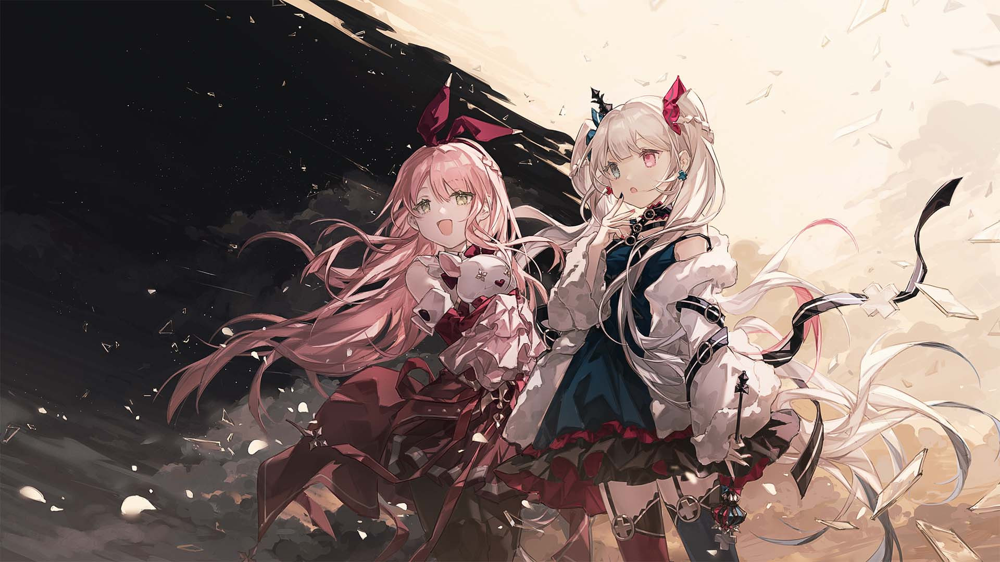

# S-6

- **Unlock Condition**: 购入Divided Heart曲包，完成S-5
- **Unlock Requirement**: 采用白姬，通过Lightning Screw

She, Kou, begins to wonder: has it been weeks, or have months passed between them?

Under the dark, these two girls have wandered together through shadow-bathed ruins: with Kou
leading, and with Shirahime stammering behind; Kou's laughter ahead, and Shirahime's hand at
her back. Further, the "princess's" habit for embarrassment has escaped merely the confines of
memory—rare is the moment she will not stumble or stutter, and by now Kou is well-accustomed
to the shaking, brazen, self-proclaimed "royal".

However, the twin-tailed girl has most definitely, of late, been shaking far less: in her voice when
they talk, and in her movements when they go.

Truly, the two have traveled together long. But it won't be forever.

----
Now Kou and Shirahime, quite a ways into their travels, find themselves at a clear divide.

Though the clouds are torn and the stars brought out, not all of the morning light has faded.

The girls view the heavens without a word, and with awe-filled faces.

After all...

...they now stand at the division between night and day.

----
"Pretty..." Shirahime whispers.

"Yeah," Kou agrees.

The stars of the night are violet. The day is white and golden. Where they meet, what might be
magic—might be memory—churns and twists, like a shifting and prismatic serpent. It is as if
they've found the world's haphazard seam. Seeing it, they almost know: know what the world is,
and how it came to be as well.

Kou brings her eyes down first. Shirahime, however, cannot tear away hers.

"Now what?" Kou asks. "We didn't find anyone, huh?"

"No..." Shirahime replies.

"Should we keep looking together?"

----
Shirahime brings down her eyes as well.
Before them is the new Arcaea landscape: of shadows and light.

She looks at Kou, and calmly shakes her head.

"I'm going to follow the line: I'll find someone out there," she says.
"And you should go back to the heavens and see what they're hiding."

----
Kou raises her eyebrows.

The two have walked for quite some time, and in their time together, Kou believed she had the
other girl figured out. That Shirahime was a boisterous sort—but that all of her flair and bombast
existed only to obscure a shivering heart. Therefore...

"...You're taking charge?" Kou asks, as it's just too surprising.

"Of course," Shirahime says, with a dismissive and teasing glance. "You see this crown on my head,
right?"

Kou chuckles. "Yeah, I see it," she answers.

And Shirahime lowers her gaze again, staring out to the glass hills.

----
She tells Kou, "I'm kidding... I just had the thought: I want to take a chance." Shirahime meets Kou's
green eyes and the girl straightens her back. The princess states, "We should take one, and I think
you'd better do what I can't."

And... after a few moments, Kou nods. She calls a slab of concrete to her feet, and hops on.

"I'll go see the night, then," she says. "Let's meet up when we can!" She grins.

"We will," Shirahime answers with an easy smile. Kou blinks, and loses her own. Once more the
white-haired girl has surprised her. Deeply, she believes those words, and her face brightens up
again.

----
Kou flies to the starlight, and at once Shirahime steps forward.

Perhaps she has forgotten her want of a kingdom.

She already knows: there are others here.

The world is vast, but she will find them.

What a crown and scepter mean is nobility, and what a noble does is draw others to her, like a
much-needed hearth. Maybe her blood is not noble at all.

However, it must be said: despite her whining, her wavering, and her very weak heart...

...her soul very much is.