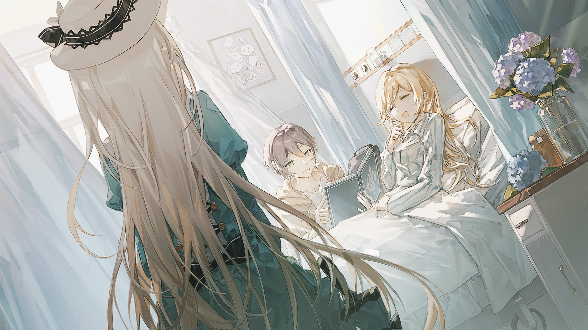

# 7-6

- **解锁条件**：购入Ephemeral Page曲包，完成7-5
- **解锁要求**：采用爱丽丝 & 坦尼尔，通过Felis

她发现自己身处一个平淡无奇，甚至有些灰暗的地方。
这是一间医院的房间，有着白色的墙壁和天花板。
准确地说，这是一间病房——一个安静的房间，窗外是几只扑扇着翅膀的帝王蝶。
而令她惊讶的是，她在片刻之间就认出了这里，她从未意识到的遗失记忆涌入了自己的脑海。

这里的外面有一座公园。
这里的护士们友善而耐心。
这里的天气似乎总是晴朗。
她几乎一直都住在这里。

她感到了晕眩，试图将信息都整理一遍，但还未来得及开始，就听到了身后的脚步声。
她转过身，看到门边有一个人，他手持一朵绣球花，
敞开穿着一件轻薄的带兜帽运动衫，看起来颇有现代感。
他在里面穿的是一件T恤，下面是一件宽松的裤子，以及简约而舒适的鞋子。
他的表情透露着单纯和安心——她认识这张脸。这个人看来就像是坦尼尔。不过，“他”的名字……

----
“……塞德里克。”

靠窗的病床上传来了一声虚弱的呼唤。

年轻人路过她，礼貌地点了点头，然后就走向等待着的那位病人。
不用去看那金发娇躯，也不用看那般面庞就知道，那就是她自己。
这里是她的回忆，她的名字是爱丽丝。

塞德里克将鲜花放进了花瓶里。她的原身旁边已经积累了整整一束花。
他拉来一张椅子就坐在了她的身旁。他手中并无茶杯，也并无言语。

“塞德里克……”女孩无力地重复道，一边从床上坐了起来。“我以为你今天要去工作室。”

“不，不去那里了。我现在自主安排工作时间，爱丽丝”，坦——塞德里克说道。
他们的声音听起来很像。

----
“怎么会？你没事吧？”
两个人都看向她，然后微笑着。
她未加思索就脱口而出。嗯，因为理所当然，她也做不到多加思索。
这是一个新的真相世界，即将开始运转。
看起来，作为身处记忆片隅的观察者，她只是自发地重复了当初说过的话。

“你还在写作吗？”塞德里克问道。

“你还在画画吗？”病弱的女孩问道，嬉笑中又带着些许戏弄。

“‘我还在画画吗’”，他复读了一遍，他盯着天花板，眼神闪动。

“你来这儿了！”她笑着回应道。“说真的，我还以为你很忙呢！”

----
“我画完了三页”，他面带微笑，自豪地答道。

“很好！”

“你呢，一个字都没动吗？”

“我写了！我写了好多！”
 
“那就让我瞧瞧。我这儿也有一本书……”

“好啊！”

女孩把手伸向病床旁边的橱柜。
她都把笔记本和餐具放在里面，除此之外，还有一个她不怎么爱使用的平板计算机。
年轻人从袋子里拿出一本书。是啊……这本书其实哪里也没有去过，对吧？
那都只是编出来的故事……听到的传言……以及美梦。

两个人开始分享、欢笑、打趣。

----
这四天就这样过去了。

在四天后，一切都结束了。他们本来以为，就算无法永远活下去，但她至少还有三百六十五天的时间。
她并没能在临终时见到他。她在一个清晨感到痛苦，并就此消逝。然后，没有然后了。
她只记得有一群人高声喊着她的名字，仅此而已。

坦尼尔知道这一切。

这段回忆很漫长。她能感觉到。它涵盖了临终的这段时光，但她并不想看这些。

虽然她很坚强，但面对这些时还是感到了恐惧。这段回忆中没有任何可以改变的地方。
她的健康总是会崩坏，两个人总是独处，而他总是来不及赶赴结局。
美梦和故事……只靠许愿是无法变成现实的。

她在两人欢笑时离开了这段记忆。她不记得这是不是两人最后相处时的样子了。
她不想知道。

----
你会死。你已经死了。

爱丽丝站在画室的回忆中，记起了这件事。

“坦——”她开始寻找。

但坦尼尔已经不在了。

随即，回忆开始淡去。她能猜到这点……
就像他说的，他只是仿冒品，当真相被揭晓时，他就大限已至。

----
爱丽丝站在Arcaea的虚空中，用无神的双眼望向前方。
万物同时向她发起尖啸。

这个“位面”是虚假的，这幅“身躯”是空壳，这段“回忆”是捏造的。
她的“人生”不是自己的，直至结束也没有什么波澜曲折，更没有陪在身边的哥哥。

你是孤独的，爱丽丝。

你孤独至死。

----
回过神来时，爱丽丝发现自己跪在地上，带着手套的手指插在土壤中。

她感到寒冷。她想要哭嚎，但眼泪却不见踪影。

她感受着……

她感受到了。

“这里是真实的。

因为你所有的感官都‘认为’这里是真实的。”

她的脑海中浮现出坦尼尔的话语。

----
她看着自己的手，她看见了。

她将手套拉紧，她感觉到了。

她将花朵从发丝间摘下，她听到了，闻到了。她对着花瓣张开了嘴。

什么才是真实？是我看到的吗？是我尝到的吗？是我摸到的吗？

如果是那样……

“爱丽丝”死了，但爱丽丝活着。

如果坦尼尔只是一段回忆，那么他肯定还存在着。

以真实而言，她只是个四处游荡的灵魂。

她一路来到了这里，不是吗？如果不去管所谓的“真相”的话。

如果是这样……那便还有出路。

----
她一定会找出办法。

那条来路：通往她一生中最重视她的人。

至于另一个家伙……

如果她没法在旅途中再次找到他，他也知道对方的一部分会永远陪伴在自己身旁，留在自己心里。
也许她也会开始只泡茶而不喝茶。
这份思绪……让她重新露出了笑容，发出了笑声。

爱丽丝当场下定了决心，她站了起来，手指紧抓着“真相”的碎片：
她总是向前看，朝着崭新路途的地平线迈进……

……她永远也不会忘记是什么带领着她前行。