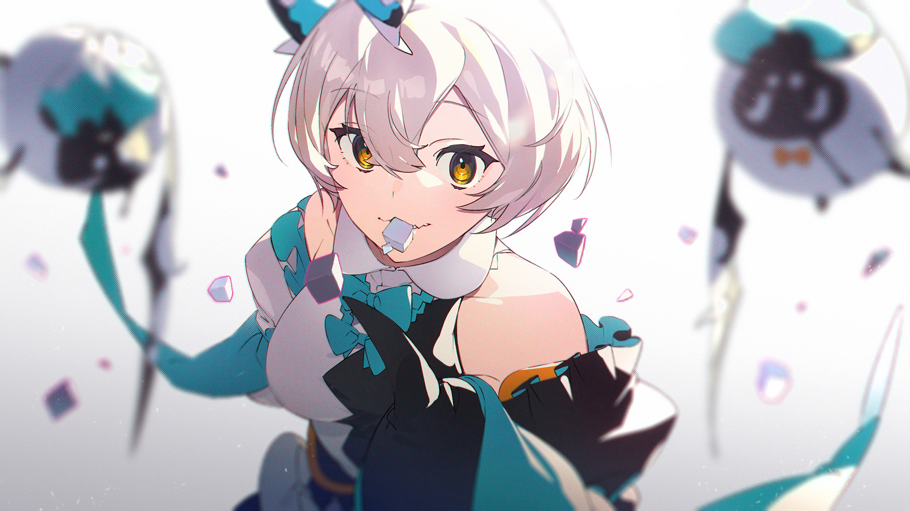

# 11-2

- **Unlock Condition**: 购入init()单曲，完成11-1
- **Unlock Requirement**: 通过Rugie

They never tire: not her, nor her bats.

Drem sits on her head and beats its wings into her face. Fans is flying high,
and shouting about crowds—

"Crowds of... white!" the familiar cries. "White glass, Ayu!"

"Sweets?" Ayu asks through the still-beating wings. As it continues to thump
her mouth and nose, her second bat enunciates:

"Go. To. The. Right!"

Fans adds, "Yeah! The right!"

----
"More sweets?" Ayu asks once more. "More sweets..." she groans as her shoulders sink.
Wings continue to strike her forehead softly. "You already know I like it more with some, y'know...
That I like VARIETY more, guys..."

"That's not how it works," Fans tells her.

And she asks, "It's not how 'what' works?"

Finally, Drem lifts from her head.

"Ayu," it addresses her, flapping now in front of her face rather than into it, "aren't you hungry?"

"I'm always hungry," she replies. And, she rolls her eyes, saying, "Come on, Drem."

----
"Then it's better if you have a big meal!" Drem cries, beating its wings enthusiastically. She recognizes
the motions, slouches slowly, and her gaze begins to drift. "There's a lot of gla—... if you ea—...
Have a better... That's... And..."

She spots a menagerie of shards on a path between two houses from two cultures. She can tell at a
glance that memories of pleasures and memories of pains await her there. She glances at Drem,
then starts wandering toward the path.

"Mm-hmm?" she replies, hearing the upward inflection of a question from her more pestering bat.

"That's right!" it shouts. "So—"

She continues to walk, and soon finds herself along the path proper, queer glass floating overhead.
She sees old days in the reflections. Her stomach growls.

----
And she grabs an opposing pair.

With light in one hand, and conflict in the other, Ayu brings both pieces of glass toward her mouth...
and chomps down.

The mixture is at once a delight.

"Aaah... there you go again," Drem sighs, finally realizing that it has lost her attention.

"Wrong, wrong, wrong," bemoans her bat Fans. "It's not HERE that's a problem, it's the...
The big mess we were telling you to...! Hahhh..." It sighs. It relents. And, it admits:
"At least she looks happy."

"Well," Drem begins, pausing a little while before it says, "yes. At least she looks happy."

----
It is only the truth: these are two tastes that taste great together. It is a rare thing to find them side by
side, and so she always feels coaxed by the opportunity. What this is is a treasure trove. Now, her
smile is interminable.

But after, her bats will beckon her again. Next time, she will listen. Like glass between her teeth, she
finds that hearing them, sometimes, feels altogether "correct". And that correctness is satisfying. She
is driven by satisfaction—she acts to the end of satiation. It is a simple existence, but does existence
need to be anything more?

Ultimately, if listening might let her be sated...

And if silence will sate her too, now and then...

Then her ears will be open, and her tongue will, for a time, be still.