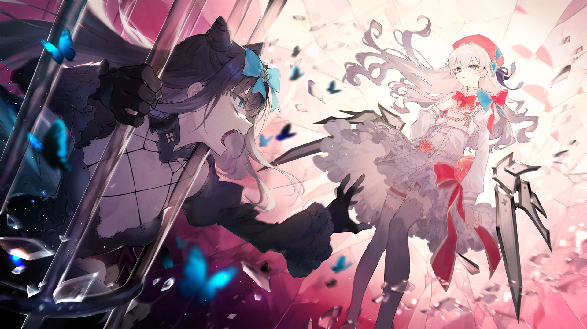

# F-2

- **解锁条件**：购入Final Verdict曲包，完成F-1
- **解锁要求**：解锁World Ender

这种情况先前肯定也发生过。

这种抗拒的方式，这种似曾相识的感觉——

光能感觉到周围的一切都在远离自己。

时光仍处于冰封之中，她的心情也低沉到了冰点。现在的她，只想让自己就此打住。

----
这种想法不是因为光的本性有多么善良。

她只是不在乎罢了。这种刻进骨子里的冷漠，才是她一直以来的样子。
她以前肯定也有过这种想法。

在她的内心深处，有两股思绪正在相互斗争。

——我无法这么做。

——我必须这么做。

这种围绕“应该”还是“不应该”的情感对抗正变得越来越强烈。

但她能感受到内心深处还有一丝火焰在微微颤动。
显然，再激烈的斗争，也无法抹灭她内心真正的希望。

----
对立被定格在光的面前，她的面容与伸出的手因为愤怒而变得扭曲。周围的虹光，
因为破碎而弥漫于空气之中。对立动弹不得，光亦是如此。

光内心的希望告诉她：“等时间恢复之时，只要把她推得远远的就不可能再打了吧？”
只要能停止战斗，就不会再有谁因此丧命。她开始思考这种想法的可行性。

这应该行得通。希望犹存，则应该有其存在的意义。

----
时光再次流动了起来，而对立也在一瞬间被推往远处教堂的大门之后。她呼唤碎片撕裂了门栏上的铰链，
然后一股脑将门上的一根铁杆抓了下来。

她很快就明白了对面那头野兽当下的意图。

她叫来了周围能找来的全部玻璃碎片，并将它们送往空中，任凭那些碎片闪烁而反射着周围的景象。

就这样，她很快便找到了光的身影。随后，她开始撼动着脚下的大地。世界的核心，
连带着地壳都开始变得扭曲，只剩下光站在地上做着无声的抵抗。

她能感觉到对立深深的执念。那是要夺走这一切的执念，无论地点，无论手段，她心意已决。

哈，这就是所谓的希望吗。

----
她笑出声。

什么“希望”，早就不复存在。

阻隔在她们视线之间的一切全部灰飞烟灭，甚至她们自己也已经分不清是谁下的手。教堂的阴影下，
破败的大门前，她们就这样面对面看着彼此。

光脸上露出一丝轻蔑的微笑，她再一次告诉对立：“我说你啊……你并不需要做到这种地步。”

那并不是黑色少女想听到的话。