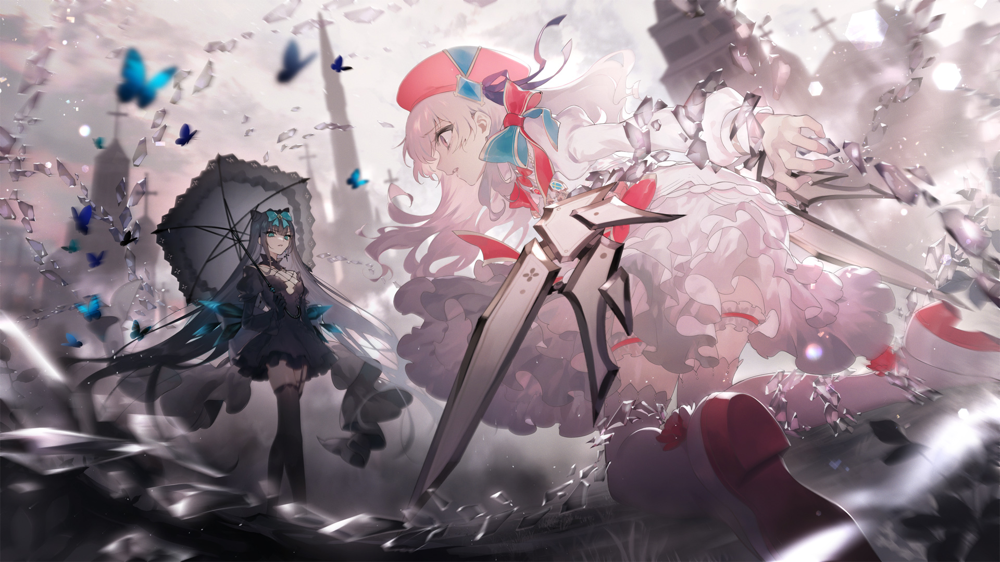

# F-5

- **解锁条件**：购入Final Verdict曲包，完成F-4
- **解锁要求**：完成Axiom of the End的最终挑战

她们就这样在沉默中相遇了。

沉默的少女，沉默的视线。纵使方才战斗的声音在耳边回响，她们也依然目不转睛地注视着彼此。

大地在轰隆声中破裂，狂风在呼啸声中肆虐，建筑在倒塌声中扬起漫天尘土……
但这些都无法让两名少女的视线从对方身上移开。

而光也看得很清楚——

对立的眼神中，依旧燃烧着战斗的怒火。

这不是休战的信号，这是无声的威胁。

----
光深吸一口气，而对立则把目光投向了光的喉咙。她痛恨着光的每一次呼吸，也痛恨着光的每一道声音。

这股恨意刺透着光身上的每一片肌肤。

光现在希望时间能够再次停止，然而时光依旧。

她试着用火焰去烧穿束缚住她的锁链，但它们不为所动。

大地没有颤动，天空也没有响应。

她的脑袋一片空白，这才发现自己已经不知不觉间屏住了呼吸。

----
“……”

天空已陷落得所剩无几……教堂也逐渐化为废墟……

漫天纷飞的尘土弥漫在她们之间，覆盖了整个天空。

对立的眼神里依旧充满着尖锐的杀气。

那股杀气逐渐聚焦在对方身上。这一刻，整片废墟已然变得鸦雀无声。

----
……光依然死死地盯着她，而对立这时把目光放向了一份记忆。她发出一声冷笑。

“我们又回到这里了。”对立微微歪起头继续说道， “你还要再来一次吗？又要祈求有奇迹发生了吗？”

光没有回答。

“……奇迹之所以被称作奇迹，就是因为它们太完美了，完美到根本不可能存在。”

“你透过这些碎片……透过Arcaea见识过太多破碎的世界。所以你应该明白，
奇迹也只不过是另一种‘希望’罢了。”

----
“更何况，无论有没有奇迹的存在……你都难逃一死。”

光深呼着气，而对立则逐渐挺直了身体。

黑色少女继续说道：“你应该很清楚，如果可以的话，我宁可选择忘记世间所有的一切。”

光再次试着动起来，却还是无奈意识到自己已经被完全固定住。她的肩膀被拉得紧绷，
脚趾也蜷缩在了一起。

“我要杀了你。”对立说道。 “连带着这个世界……{{ruby|「你的世界」|Arcaea}}也会一同灰飞烟灭。”

----
她的嘴角再次扬起一抹微笑。这一次，她深吸一口气，随后挤出一记诡异的笑声。

接着，她伸出一只手摸向光的脸颊。随后轻轻抬起少女的下巴。

“你说得确实没错。”对立一边说道、一边把手伸向对方。 “我确实不需要……为了你做到这种地步。”

她收回了笑容，身体也向前倾去。

----
对立的目光……那是一道熟悉的眼神。

是悔恨的眼神，是同情的眼神。

她黑色的翅膀向下收起。

而头顶的夜空，依旧闪亮。

----
尽管方才狂暴的战斗都已经烟消云散……但光的心脏依旧猛烈跳动着。

她不得不承认，单纯“阻止”对方是没有用的。

对立将左手从光的喉咙处收回，而就在这时……

……她的手掌中，多出了一块尖锐且闪亮的黑色碎片。

在这最后，对立说道：

“至少，我想告诉你：

在这里，我的名字是对立，而你的名字是光。”

----
“求求你……”

光勉强发出一丝微弱的声音。

“求求你住手……”

对立歪过头来。

“……还来啊？” 她思考片刻，随后补充道：“什么都不会再改变了。”

而就在这时，一道耀眼的光芒粉碎了光身上的束缚。她站起身并伸出手，试图祈求一把武器——

----
她的身体很快又被束缚住。

即便如此，她的祈求并没有消失，一把利剑开始在她的手掌中逐渐成形。那是一把“全新”的武器，
虽然同样由玻璃构成，但却并不是什么记忆。

这根本就难以置信……剑刃周围的空间似乎在光亮中发生着扭曲。 
Arcaea甚至改写了自身，让自己逐渐适应了这把武器的存在。

----
对立心想：这真是太可笑了……

她以前也见过这种参差的玻璃长柱。

光再一次挣脱身上的锁链，并转起手中的利剑，将其重重插入地面。随即，一股诡异的强风突然升起，
并把对立推往远处。

光举起剑，将剑刃瞄准对立。
但在此时，她发现自己的手在颤抖。

----
对立并未因为这股强风而乱了阵脚，她的目光再次落在了那把熟悉的利剑之上。

无言的视线。

无言的等待。

……她紧咬牙关。

她看向光的脸庞，却发现对方完全无法集中精神。

她看到的，只有摇摆的表情，和踌躇的身躯。

这让她失去了最后的耐心。

----
光的四周开始升起玻璃状的高墙，每面墙壁都倒映出对立逼近的身影，而她们的手中全都闪烁着黑色的光芒。
这是镜像还是实体或许已无从得知，但当这种景象从这些四面八方的玻璃中显现之时，
还是让光的背后惊出一身冷汗。

对立抬起了手，下一秒，她便将穿透对方的喉咙。

----
白色少女的双手一直在颤抖，但她还是紧握着手中的剑。

刺耳的声音开始在她脑中回响，紧接着，心跳声也再一次传到了她的耳边。

只要她再次收回手上的剑并将其插向地面，周围的墙壁就会倒下，而对立也会被再一次击退。

理性告诉她这样的情况将会反复上演。