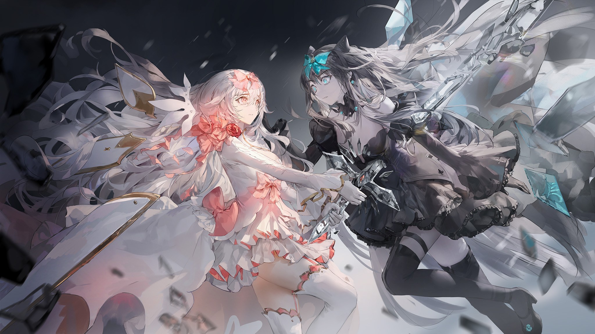

# F-6

- **解锁条件**：购入Final Verdict曲包，完成F-5
- **解锁要求**：解锁Testify

理性告诉她这样的情况还会反复上演。

只要她再次收回手上的剑并将其插向地面，周围的墙壁就会倒下，
而对立也会被再一次击退。

那么，为什么——？

当她感受到对立的手轻柔触碰她的右脸颊时……

为什么，当对立实实在在地出现在她面前之时，
她却举起了剑，
刺穿了对面少女的胸膛……？

她一切的情感都化为了这一剑。
她能从余光看到，对立的右臂因为疼痛向下滑落，
而一块黑色的玻璃从她的手中掉了出来。

一道耀眼的光芒从中由缓至急地迸发而出，直至超越了一切的存在。

随后，呼啸声破门而出，那是带走生命最后的绝唱。
那声音震颤着整个大地，也震颤着对立的全身。

就这样，结束了。

声音趋于沉寂，少女的生命也归于沉寂。

就在她把剑刺穿对方的身躯时，剑刃便吞噬了对方的生命，
她的鲜血与一切都被那道玻璃全然吞没。紧接着，那道玻璃也开始碎裂消散。
短短一瞬，她的生命便失去了活力，而仅存的身躯也随之倒下。

光下意识抓住对立触碰着她脸颊的手。然而，对方的生命却在极速消逝。
不过寥寥数秒，眼前的少女，便只剩下了一具冰冷的身体。

当玻璃制成的剑身瓦解消散之时，一丝温度传遍了光的指尖
可是她的另一只手，却已察觉不到对立的一丝气力。

那名少女的双脚着地，而她的身体则被光打湿而温暖的手托着。
如今的她已阖上了双眼，她眉头紧锁……但也渐渐失去了光泽。
这并非一场安详的告别，可是她的生命就这样画上了句号。

光睁大双眼，感受着自己心脏的跳动。直到现在，她才彻底明白这一切。

她缓缓收回左手，将面前少女的身躯放下。
随后，她再次把手伸向那名了无生气的少女。
她睁大眼睛，紧紧攥着她的手，任凭自己和对方就这样跪倒在地上。

她将手靠在对立早已停止跳动的胸前，
从中的暖意，似乎提醒着她这道伤口是由她而造成的。

事实上，即使是大地和天空也没有幸免于这一剑……
只是她的注意力全部都集中在那个已经血肉模糊的窟窿，而她的周围早已被彻底夷平。
那一剑所施展的力量想必是何等的强大……

周围的景象早已面目全非，天空变得空荡荡的，大教堂也完全不见踪影。

对立身后，有一面碎裂的砖墙再也支撑不住冲击而倒塌，
而那还是因为身处眼前这名少女之后才免于分崩离析。
可是……即使是这面强大的盾牌，也已被彻底刺穿。

光贴近另一名少女的脸，似乎在侥幸地等待着对方的下一次呼吸。
可那再也不会发生了。

她更用力地握住对方的手，只是那只手永远不会再回应她。
这一切逐渐让她气急败坏，她恼怒地将对方的手甩到地上，并将手指甲深深嵌入眼前少女的衣襟。
她再次从手心感受到了一丝温暖，这才发现泪水已经滑落于手掌之上。

她很清楚，她刚刚还体会过这份暖意。
但看到自己亲手被泪水划出血色的泪痕时，她还是被吓得不知所措。

她被吓得一阵哆嗦，差点没有站稳。

她的表情变得扭曲，嘴唇也不停地发颤。

她啜泣出声。尽管她一直用另一只干净的手擦着眼泪，可泪水却止不住地向外流。

她渐渐失去了平衡，而对立也跟她一同倒下。
光把那被血水浸湿的手收回裙摆，而另一名少女的身体则向后靠在了大教堂的残骸上。

她自己的声音在脑海内回荡。

对现在的她而言，那仿佛是充满讽刺的惩罚——

"你不需要做到这种地步。"

……这并不好笑。

现实的一切都没法被轻易忽视。
无论你如何挥舞着双手，皮肤传来的灼烧感也永远不会消失，就如同那把剑一样。

她就这样结束了生命，而你就是杀人凶手。是你杀了她。

可你真的有试着去了解她吗？你知道她承受了多大的痛苦吗？

"现在你又要怎么做呢……？"不，难道你还不明白吗？

这可不是什么微不足道的小事。
这个世界已经记录下了你刚才所做的一切，
而你再也不用像过去那样接着踏上旅途了。

你不应该很开心吗？你赢了啊，毕竟你活了下来。

还是说，你讨厌成为活着的一方？

讨厌活着的不应该是她吗？

因为她讨厌活着，所以你就让她得以解脱。
对啊，所以这是多么正确的决定啊。一定是这样的，是吧。

……你脑袋里都装了些什么东西？

即便到了现在……
　
你还是满脑子只有自己。

这种内疚的想法越是强烈，她的心灵就变得越发脆弱。
她抓住自己的头发，但依旧无法抬起左手。

她止不住一直谴责自己。

谴责自己的卑微，谴责自己的自私，谴责自己是多么自以为是。

然而这时，有什么东西开始在她身边徘徊，并告诉着她……
ㅤ
……这种感觉你并不陌生吧？

恢复意识的她，发现自己苏醒于这个飞舞着玻璃蝴蝶的地方。
"多么令人愉快啊，"她想，"这些美妙的图案居然能在空中移动呢。牵引着它们的丝线在哪里？"

她蹲了下来，整了整裙子，环顾四周才发现这附近没有任何丝线。那些事物，也并不是蝴蝶——
玻璃碎片，不依靠任何外力便飞舞于空中。 "太美妙了！"她自心底赞叹道。

这些玻璃反射出了另一个纯洁的世界。
她从中看见海洋、都市、火焰、光芒；美好的景象目不暇接。
她抬起了自己的手，试图去抓住它们，开心地笑了出来。

……我并不知道这些玻璃碎片有个名字：Arcaea。
实际上，名字对这些过于美好的事物来说并不重要。
我触碰、旋转、观察它们；靠这样来娱乐自己。这已经足够了，难道不是吗？

不。

你早就明白这并不够。或许你差点就因此而感到满足，
但事实是，人类终究是本性难移的。

而这一点你一直以来也心知肚明。

帷幕并不会就此落下。这个故事永远也不会有"尽头"。

只是，这个地方已经没有什么意义，就和你所想的一样——

不过是个哭泣的少女，独自一人置身于这个死寂的世界。

但至少，以牺牲那名少女为代价，你得到了一个值得欣慰的真相。
虽然她差点就能带你离开这里。
这是用少女血的教训换来的真相——

没错。

这里一直以来都是一片乐园。