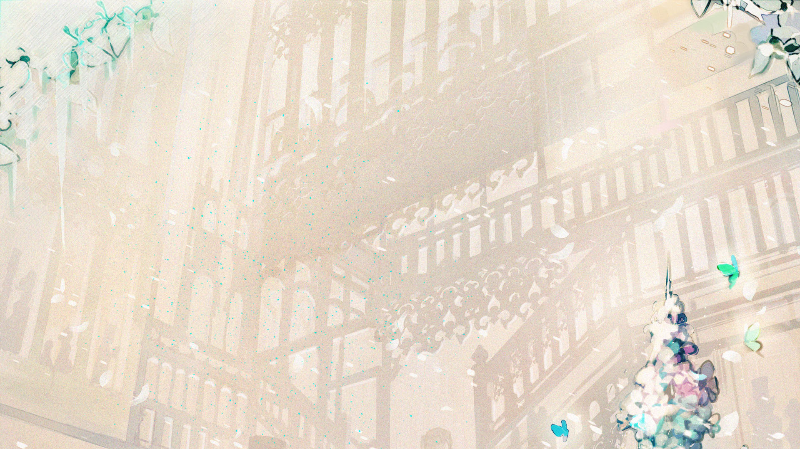
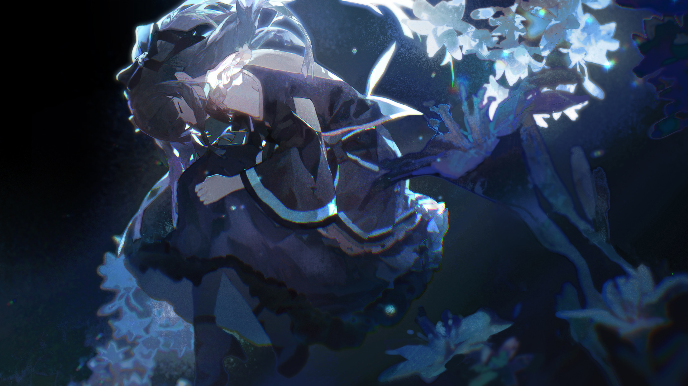
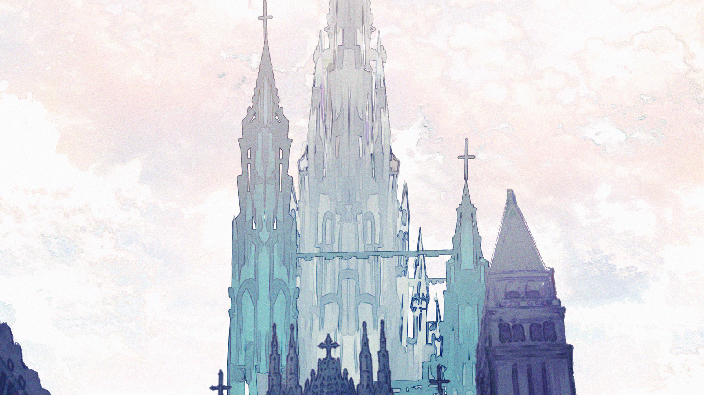

# F-7

- **解锁条件**：完成F-6，购入Final Verdict曲包
- **解锁要求**：解锁Testify

----
乐园——
在生命结束后，那个名为“天堂”的世界。
那是生命落脚安息的终点。
那是灵魂游荡徘徊的远方。

我就在那里，而你也是。

----

----
“……所以就这么结束了？
再也感受不到把手搭在她脸颊上的触感，
再也体会不到被她用玻璃活活刺穿的疼痛……
我什么都感觉不到了……也感觉不到她……

……让我解脱吧……”

为什么？你人在这里，但是……你不是还有一些心结没解开吗？你明明还有些微弱的心跳……
至少还能再撑一会儿。

“不，已经够了……”

----
不，这件事还没有结束……
听好了……快想起来。
快想起来你自己是谁……
你所经历的时间远不止这些，不是吗？你肯定见过比这些还要糟的事。
所以赶紧站起来，再次战——

“闭嘴。”

……那好吧。
那我们就随便聊聊。

“我刚才说话你没听见吗？我已经说过我不想说话了。我只想……想要……”

我只想要你想起来。

----
“……你真的挺烦的，你知道吗？
那你又想起来了吗？如果你真的记得，你应该知道我为什么不……

啊……这是？……
……我好像想起来了……这些记忆正在不停地涌入我的脑海，我全都想起来了。
这么说来……如果这些记忆全是真的话…… 哈，我以前就这么想过，但……这是在跟我开玩笑吗？”

----
……

“在过去的人生里……我为活在这个世界上而感恩，但是……
生活……却是那么的糟糕。
世间践踏我多少次？又唾弃我多少次？无论怎么做，憎恶都如影随形地跟着我。
但我们想要的明明只是……只是运用这股力量来……
来……帮助他人。”

我们吓到了她们。

“‘我们’？你究竟是谁？”

那，“你”又是谁？

----
“真是奇怪……这件事情我居然还想不起来。
……
……你还是就叫我‘对立’吧。”

这样的话……你也这样称呼我吧。

“开玩笑……真的假的？你的意思……该不会是我说对了吧？”

说对什么？

“我是说，她没有经过任何的思考就创造了这个世界。
如果你就是我……如果我在这里曾经度过的人生就这样被重蹈覆辙……
……那她……真是恶劣到了极点。”

----
……我认为她只是还没意识到这一切。

“……如果只是这种理由的话，那她没什么值得同情的。或许她和我来自不同的世界，
但这不是她没有认清自己能力的借口。她绝对知道，只是不在乎罢了。
所以说……哪怕她真的和我一样了解这个世界，我也不会原谅她。我和她不一样，
不是因为我跟塑形者练习了多久，学到了多少东西，
而是因为我们对待这个世界的态度就完全不在一条线上。
要是我有足够的力量……要是我的力量足够改变这个世界——”

要是有的话我也会这么做的，但是我做不到，也没有这么做。

“……所以最后的结果就是：我又获得了一次机会。这就是她所想看到的，而且不止我一个人，
她给了所有人第二次机会。真是蠢到无可救药啊，完全就是一场笑话，不觉得很好笑吗？”

……

----
“什么？你笑不出来？你当然笑不出来。
是啊，这算哪门子的第二次机会，倒不如说是莫大的讽刺。
我如此挣扎地活着，甚至与世界为敌。
即使身心憔悴，血流不止，但我也没有轻易倒下！
即使我早知道这一切都是徒劳，但我还是一次又一次站起来奋战到底！
为什么她要逼我重新经历所有的一切？啊？快回答我啊！……
我只是想做出改变……
我只是不想……就这样放弃……”

……那第二次呢？这一次，你放弃了吗？

----
“嗯……我放弃了。
……
嘿……
我知道我要不行了。在离开之前，我还能再看一眼外面的世界吗？
我还能透过我的鸟儿再看她那个小小牢笼最后一眼吗？”

……没问题。

“太好了。
……
这样看过去，还有好多狭小而未知的角落，而且那里都充满了被困的灵魂。
不，她们或许都不能被称作灵魂。这里的一切说到底都只是记忆，哪怕是我们也不例外。
也不知道她们到底在想什么……那个时候，我只接触到那份碎片的一角，还远没有到完全理解的程度。”

----
大家都很幸福呢。真的，少女们都非常的高兴。

“……那她真是太残忍了……
我……
……我现在真的只想大哭一场。为什么我要这么做？为什么我就这么死了？”

……

“……你的脸色看起来很不错，难道你已经知道答案了吗？
我好像……终于彻底明白了，而且……好痛苦……这一切都好痛苦。
事情的真相如此残酷，而我甚至没有办法流下眼泪……”

----
没错，看来就是这样。

“……？”

你并非真的想丧命于此。那你当时为什么还是那样做了？

“……在我最初的人生中，前方的道路或许暗淡无光……
但我知道它终将引向无数的可能性。诚然，有些道路的尽头会迈向死亡，但只要我选对了方向，
就一定能找到一条出路。
可是这里的情况截然不同，而我当时居然还以为自己同样能在这里找到出路。
我对自己曾抱有这种天真的想法感到厌恶。

这里的道路荒芜贫瘠，而且根本没有能落脚的地方。
不论是踏上哪一条道路，都只能无休无止地盲目前行，直到双腿变得彻底麻木，才能看清真相。
而真相就是，无论你选择了哪条道路走下去，都会发现最后什么都没有。”

----
……我其实并不这么认为。我觉得……一定会有通往其它可能性的道路的。

“你知道你刚才在说什么吗？你现在可是困在这里，只能跟死人说话啊。
拜托，能不能至少认清一次现实？”

……我只是觉得这难以置信。我不会就这样放弃希望的……
我不能接受那……那样的……

“我刚才已经说过了，你不是想知道真相吗？真相就是这里的一切都毫无意义。”

----
不。
真相不该如此。
我不会让这变成真相的。
你也很清楚，如果这就是真相，那这真相实在是过于悲惨而丑陋。

“……
……这我倒是还记得，那是来自我生前的记忆。我就是带着那样的想法才能坚持活下去的。
你真的是跟我一模一样呢。看来她真的彻底复制了我……真相果然如此，
我们大家都是被复制出来的空洞灵魂。
没错……
她还活着，而我们都死了。”

----
……

“但话又说回来……为什么你会在这里？其他人的思绪都到哪里去了？她们的灵魂呢？”

……我不知道，这些我都不知道。

“好吧，但是……
话说，你还没承认过对吧？……那你……直接告诉我好吗？你真的是那个真正的我吗？
你就是我的灵魂吗？”

是的……我就是你的灵魂。没错，我一直以来都一个人在这里。而且，我也一直以来都在观察着。
你还挺烦的，你知道吗？
对立，你不也是真正的我吗？我们大家都是。

----
“或许是这样吧。有可能我曾经是。”

是啊，你是挺烦人的。
像你这么烦人的家伙，一定不可能是假的。

“哈……
……
谢谢你。”

我从来没有想过会看着自己在第二段人生中再一次经历同样悲惨的命运，只是这次事情的走向却不尽相同。

----
“哪里不同了？”

你自己也说了。
你放弃了。
我想让你去……我也不知道。
我真的只是希望事情能往……好的方向发展。

----
……
你还是觉得这一切没有希望吗？毕竟这位“反派”已经死了……

“我知道你是在跟我开玩笑，但……对不起。
我当时气坏了。
我也不想完全放弃。
我也不觉得这真的是穷途末路。
我的意思是，即便在一切结束之后，你也依然在这里，对吧？说不定等我离开之后，
你也还是会继续待在这里……
而且我觉得……到时候如果你还在继续观察的话……
……你也不该像我一样放弃希望。
或许吧，我也不清楚……
……不，我应该很清楚。
那些还在这里的少女，说不定有办法拯救自己。
但愿如此，就像你所说的，让这一切变得更好……
那就是我想要的一切。
如果我没有真的离去，如果你在这一切过后还有办法找到我，我希望你能告诉我，
她们找到了属于自己的出路。”

----
我会的。

“呵，说来也很神奇……
在我还活着的时候，在其他人都还不在的时候，我记得我一直在自言自语……就像现在一样。
但是你知道的……我从来没有感到孤单。”

没有人是完全孤独地活着的。

“没错，就是这句话……我每次都这样告诉自己……
……我想要再次见证这个世界。

虽然这片世界已经被白色所笼罩，只有崩塌的高塔，和飘浮在空中的玻璃碎片。
而且越来越多的碎片，划过白色的轨迹，飞向了逝去的灵魂……

但是，我能从她们的脸庞看出：
这些少女都已不再迷惘。”

----
……“都”？看样子你终于忘掉她了。

“‘她’……？
对哦，她啊……其实我也看得见她。唔，她对于这件事情感到很伤心……
……但这难道不是好事吗？至少，她的内心能感受到悲伤和痛苦了……
这总比没有反应好。”

嗯……是啊。

----
“我不知道她能否缓过来，但我相信她会带着这份悲痛活下去的。老实说……现在想想，
我还得向她道歉。我认为我做的事都是正确的，但是——”

你可没做什么正确的事情。

“噗……！哈，好吧，但是……我不认为自己有做错什么。
我只是想说……我愿意向她道歉。我们都是真实存在的。如果她也是真实存在的……
那么她也不过是一个愚蠢的复制品，看不到自己的无知，却因为这份无知平白受害。

……
看来，我们要到此为止了，是吗……？”

很遗憾，但……是的，时间就要到了。
……
不要就这样离开，好吗。

----
“很遗憾，但……我也没有办法。说实话，我其实不能算是……真的在这里……”

……

告诉她吧。

“……是啊。
……光……
我真的很抱歉。我不后悔所做的一切，但……我刚才心中的那股恨意，其实……
并不是冲着你来的，而是……另外一个你……她现在还在……某个地方，至今依然……还活着……
我还是……不能原谅她。
但你……
……
我希望你明白……你比她更加强大。
光，正是因为如此……
……我知道你一定还会再站起来。”

----
闭上你的眼睛吧。

“我已经闭上眼睛了。”

不要再有任何担忧……

“我心中并没有担忧。”

我们还会再见面的。

----
“我觉得不可能了。
但是没关系。
我已经接受了。

我受尽苦难，但即便如此，我还是想要做出改变，让一切变得更好……

我为了它而战……无论我要面对的是什么……
无论我……因此变得……多么的迷茫……

……

对不起……我选择了死亡。
很抱歉我把一切都抛之脑后。

……但即便一切都是徒劳……我也很幸运地获得过重来一次的机会。
所以没关系……我接受这样的命运。”

----
我知道。

“我希望她知……知道……
我不想要……自己在这个世界……唯一留下的足迹……是个可悲……愚蠢的结局。

……如果你听得见我说的话……光……我想告诉你……
真的……请你一定……要记住……
……
……
我接受这样的人生。”

----

----
白色少女在黑色少女的遗体面前哭泣。

她因为强烈的痛苦和悲伤而不能自已，丝毫没有发现对方嘴角划过的那一丝转瞬即逝的微笑。

这则故事还有很多地方不为人们所知。事实上，有些故事一直到结局都没有被完整搬上台面。

这些故事只剩下零星的残片散落在各处，只有加以拼凑之后才能看清全貌。

----
这就是这个由碎片组成的世界的故事。

被遗忘在这里的少女们日复一日地拾起这些碎片。

她们相信，倒影之中存在着意义；她们相信，她们的存在本身，自有存在的意义。

在这里，有一名白色少女伤痕累累地倒在地上，她身心受创，她孤身一人。

但她也将寻找碎片并带着它们前行。

----
这里的记忆还在继续。

一切都会被记住，并被保留到最后。

它们会不断延续下去。

不会有任何事物被遗忘。