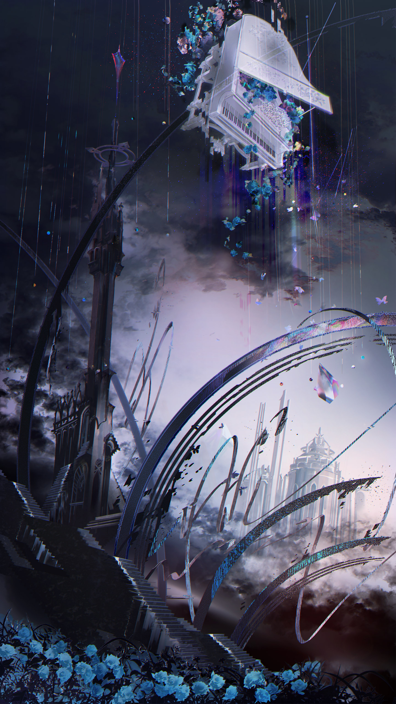
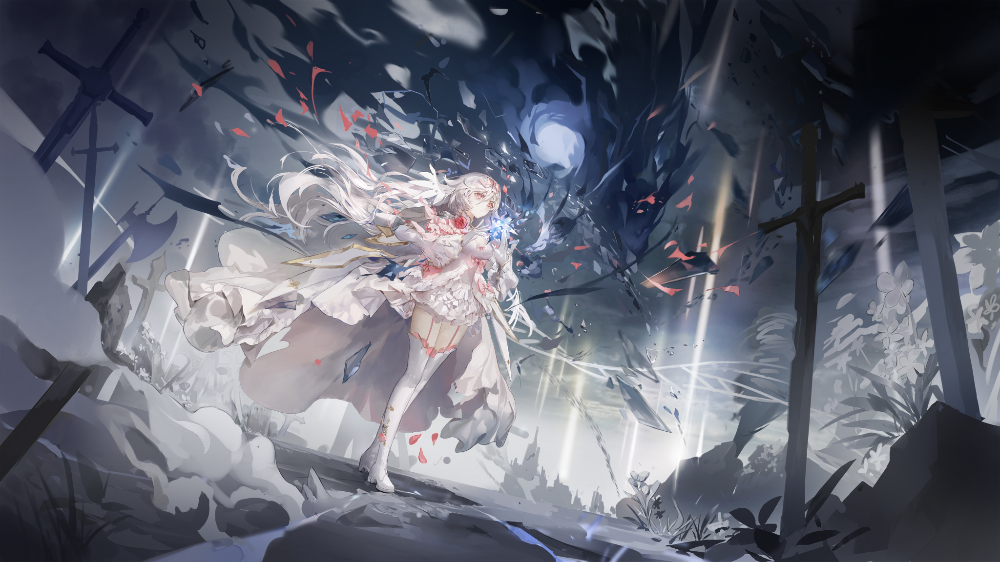
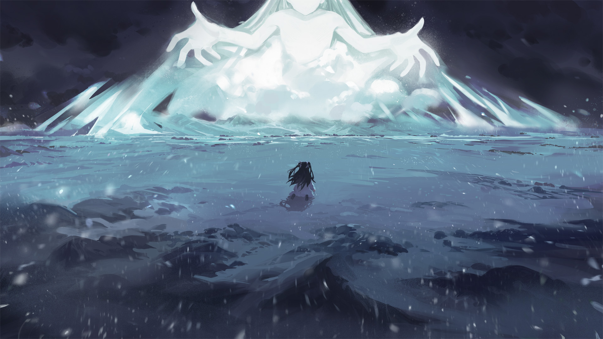
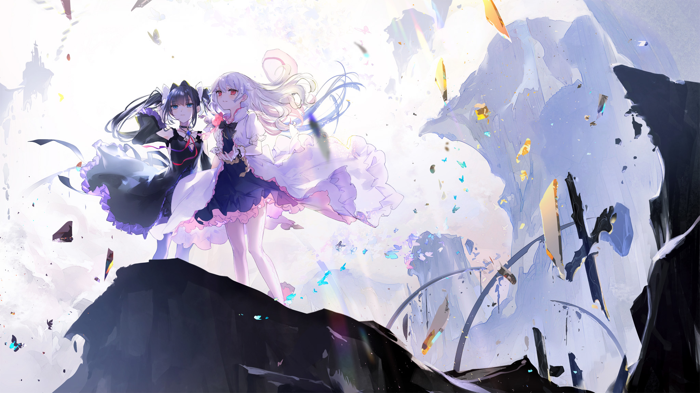

# E-1

- **Unlock Condition**: 购入Final Verdict曲包
- **Unlock Requirement**: 在Last的特殊游玩中选择拒绝命运的安排
- **One Last Dream**

Hikari sits amidst dust and blood.

I see her there... Her folly has ruined her. Self-pity has ruined her.

As she gazes through her fingers, her hand still on her face,
she finds, once more, the sight of you, my second self, dead.

And the apathy which brought about your death—
the apathy which brought about this all—must be threatening to encroach again.

I know it: the girl in white and red can feel it. She can feel that she was meant for this.
That you were meant to die, and she was meant to kill you.

Her back relaxes...
The world itself... Arcaea... She can likely feel tension releasing throughout it.
Relief...

The disorder is gone... It's safe now...
But I can hear it too...
Something like a whisper, easing into her heart, seems to ask her to embrace this state.

To embrace herself, and embrace Arcaea.
...However—

"...Tairitsu..."

...She whispers something to herself: a name. Her voice is shaking, barely audible through her crying.

"What did you mean...? That our names 'here' were those...?"

She falls silent, and seems to wonder.

The whisper comes again, telling her: if you want it, those answers will arrive.
This place—it is an archive to all memory...
...And yet still, she remains silent.

"..."

Beneath her building apathy is a sheer and shining hatred.
She cannot stop hating herself.

Obviously not. After all that's happened... how could she allow an ending like this?
What would it mean? What would it mean for her?

She... She, who walked here, could never accept it.

With nausea eating at her stomach, she clenches her jaw.

"..."

Hikari puts her hand to the dirt and sand below her and lurches up onto her knees.

And she asks,
"Arcaea... Were you here to heal me?"

Her arm relaxes... like a cool sensation has woven up the limb.

"...I can feel it,"
Hikari mutters as her eyes slowly close, her voice still hoarse.

"...Paradise, for someone scared, tired, and weak..."

"..."

She swallows the dry nothingness in her mouth.
Opening her eyes, she grabs up sand and begins to rise to her feet
as much of it pours out from between her fingers.

"I don't know what to do..."
Hikari goes on,
"...but would it be right of me to let you hold me again?"

"It... absolutely wouldn't."

"I... don't want this..."

"I don't want it...!"

—
"Mmf—!"

Hikari suddenly bends over, gripping her stomach and pushing
her other hand against her mouth. She sways heavily.

Her "refusal" seems to be enough to make this world recognize her once more.
As she holds her mouth shut, eyes wide in fear, she suddenly winces.
I can hear it too: a sharp noise, flying suddenly through her ears—through her head—

And inside her heart again—no longer a whisper, but almost a vibrating bellow.
A silent, yet powerful voice filling her and saying: decide, and speak your heart's intent.

"Speak... my...?"

As she is...
...Hikari is nothing but a girl moved by her heart.
And it is heart that brought her here—long before she first opened her eyes.

Is it instinct? Does that "body" remember how this all happened...? How she was before...?

Ha...
I don't really care.
I just... find it very funny, and ironic, that this new heart would undo it all in a single beat.

Her answer... after her breathing has become shallow, after her heart has trembled long past a minute,
is ultimately clear and resonant:

"My intent... is to reverse."

"I have to bring her back."

"This world... doesn't make any sense!
You think I'd die for it? You think I'd let someone ELSE die for it...!?"

"I can't! I won't!
Whatever I need to do, whatever I need to give up... I'll sacrifice it all for that...!"

She holds the earth in her palm, firmly, before throwing her hand out and scattering the sand.

She declares,
"I'll die if it means I can change all this—!"

The world's heart beats, and its sound silences her cold.
It would never give her up. It will not.
The voice fills her again—

And its sentiments, and knowledge, enter her chest and run to her fingertips.

It says, You cannot die.
You were born here to live, and living is what you chose.

Hikari... knows this.
And guilt—apology—forces tears to well in her eyes.

But, the world's heart beats again before she can cry.
Do not die, says Arcaea.

—
Only let it end.

...And so her lips tighten.
Tears break past her eyelid, and trace down her cheek.
And she nods.

A heart beats again...
And like that—

—Arcaea begins to lose its light.

And in so doing, it floods into her, flows into her hands and heart.
It drives her down. It nearly causes her to collapse.

For that while, memories flash across her eyes, but I can tell... they are memories ignored.
Her eyes fix upon your lifeless corpse instead.

I think all she knows now... is "what she has to do".
And I can feel myself being tugged there already... down, down...
down: to where you were slain.

...
Does she... truly understand what it is she's abandoning?
Does she truly understand what is "ending" by this?

I don't know.
　
...You won't either.

...Actually, if she's taking me, then... will I remember any of this? Will I understand?
　
No... probably not. But... she seems so sure of herself now.

...

I'm going to let that heart of hers be the beacon for whatever comes after.
　
...I trust it. You would, too, wouldn't you?

After all, you were right...
　
The two of them... are completely different.

..."Tairitsu"...
　
...I'll be going now.

But don't worry.
　
I will surely take you with me.

The skies are forced down again, and the earth rises to her will.
To die, and to make Tairitsu live again.

Lives and souls cannot truly be brought into this world of the dead.
Only their shapes, only their echoes...

And to begin with,
the souls of the girl of light and the girl of conflict... were never quite ordinary.

Truly, the world was not meant for this.
Surely, the world will shatter for this.
But it will do everything to rewrite it all—or at least try.

It would need both the girl in black's "first soul"
and what fragments can be found of her second self's...

And now one fragmented soul calls out to a full other.
Swiftly, that other soul is torn from beyond the pale.

A tornado flies around Hikari then,
ripping the veil of reality around her apart in a torrent of shadow and light.

Arcaea "remembers" the other girl, and at Hikari's command those memories come rushing back as glass.
They seem almost instantly born. Or perhaps they have always been here.
...Will they even suffice? Can this world weave two fractured souls?

...It will. The rules do not matter. Hikari will make it so...
With these memories of the girl named Tairitsu...
Glinting through the storm, those glass memories come swiftly.

There was a girl here who once walked the lands in agony.
A girl dogged mercilessly by sorrow and grief...
Yet she strode onward to save herself.

To save herself and to grasp freedom.
She had only ever wished for one thing:
the chance to have some reason to smile.

To make this world a better place, she was a girl who stood and faced it,
even if "better" would mean turning this world over.

The memories flash across Hikari's eyes, distracting her even more
from her own encroaching recollections.

Few of the other girl's tears pass through the storm. Much of her pain seems to have been forgotten.

It seems so... but in truth, as a soul of light, still pushing away
the cruel truth of that soul as she is, it is all Hikari can do to find even the fleeting moments
of the other girl's sincerest despair—the rest, the longer of them, lie beyond her grasp.

...However, knowing where that truest pain had led the girl in black, Hikari gives that sorrow up,
and so too gives up the moment that they met, which she cannot find.

The Tairitsu born of this all... will be one who has not seen the true depths of her plight,
but will still know herself as one who was born and lived in the midst of struggle.

New energy booms out from Hikari. Four columns of light, immense fonts of power, erupt from the ground.
It is the world protecting her, as the shadow soul to which she called finally descends.

She almost fails to recognize it at its approach. What floats before her and begins to block the sky
is something like Death: the immense and chilling shape of a phantom. It gently slows as it nears,
and there, at once, the dark begins to flow into the rotating glass.

There she truly comprehends it. With a firm nod, she eases the process, guiding soul to glass.
The lost soul of Tairitsu "before" thus becomes the living essence of the new body to come,
with that of Tairitsu "after" stabilizing the rest of the shell.

The shaking beneath Hikari's feet becomes almost too much to bear.
Hikari remains as still as she is able, and steadfastly directs the new life between her hands.
With a thunderous groan, she feels the world bending in agony, and yet she holds onto her will.

Without being deterred, in her heart she reaffirms her vow.

She twists the core of the world itself. It, too, will fuel the rebirth of a fallen deity.
Like this, finally, once absolute rules are rewritten, and with Hikari's sound and silent order
new death spikes solidly into that core.

In an overwhelming pulse of light and shadow, Arcaea begins to die.

The wish that made existence is overturned. The skies run rapid overhead, and what light remains of this
reality cascades to her from every horizon. As she pushes the crafted soul into Tairitsu's now-floating
and deeply effulgent body, with sweat dripping off her brow, Hikari pushes, too, the entire world—

She channels the life of the earth.

She abandons Arcaea.

Below the now-ending daylight, twin girls watch as clouds rush past above them.

Below the half-night sky, a noble gazes at a rift slowly tearing apart the earth,
and gazes above to see star after star fading.

A girl who tends and cares, a girl who wanders and seeks, a girl who watches and wishes—

A soul of joy, a soul of hunger, a soul of ambition—

A heart of war, a heart of song—

—they see the end, as all the life of the world is taken now to one, distant place.

And soon...

...Hikari feels the last wisps of that life flow into the body of the girl she wishes to save.
Tairitsu's form begins to drift back to the earth as the life fades out from Hikari's hands,
and as it does...

...the girl in white feels, too, that a part of herself is being lost in the current.

...None of that concerns her.

When the winds die down, and as Arcaea's skies above are left slowed, dull...
she feels very lightheaded and plants her foot down before she might fall.

She tries to calm herself, trying to grasp what she, truly, has done.
But... she can't.
And overwhelmingly, her thoughts focus on this:

Is Tairitsu alive?

—

Dust drifts down from the sky again.

She does remember this...

...at the end, at that lowest point...

Nobody was there, and she closed her eyes to tears.

She opens them now, slowly...
　
...just as those memories leave her entirely.

Hikari sees the motion in her brow.
The girl in white holds her own fists over her mouth and her breath catches in her throat.

For all the splendor, she thinks, it was all so simple—

Too simple—
Could her wish have been granted for so little as hope and effort?

Hikari shakes her head of these thoughts. She steps forward, shaking.
Tairitsu's eyes open fully, and blink once, before their lids fall again halfway.

Hikari rushes forward then, falls to her knees, and hugs the other girl.

"Wh... What...!? What are y—!?"

The girl is silenced as Hikari clings to her,
embracing her more tightly than anything else before in her life.
And, Hikari starts to sob.

She uncontrollably cries into the other girl's shoulder—
the girl who stares back in disbelief, unsure of anything.

...Many more rifts have been carved through the landscape.
The light which once eternally poured from the sky has been suddenly, and starkly dimmed.
The world... is wounded.

And yet, Hikari's focus remains on "what"—"who" remains.
Tairitsu lifts her hand, and places it gently upon Hikari's shaking back.
Each unknowing, the two comfort one another at the end of the world.

"I'm sorry... I'm so sorry..."
Hikari endlessly repeats.

"...Whatever you did,"
Tairitsu replies,
"you made it right, didn't you? So why are you apologizing...?"

Hikari slowly pulls herself away, though she still holds the other girl.
With her eyes and nose reddened, she gazes on Tairitsu with misery, and tugging elation.

She suddenly buries her face in Tairitsu's chest, and Tairitsu holds her in return, softly.
The scene begins to quiet, and the girl in black allows the girl in white to weep.

—

They set out into the gray world.

For a while, Tairitsu holds the other girl's hand to walk her forward,
but it doesn't take long for their paces to match.

She does not remember her tragedy—at least, not the worst of it.

And the black shards... They don't take interest in her any longer.

For Hikari too. Those white shards which were so fond of her no longer dance nearby and close.

One has lost some aspect of dark, and the other... and the world... continue to lose light.
Though...
...to smile sincerely, Hikari no longer needs the light of glass.

The girls walk to a cliff's edge.
They look out to see a land of lost memory, slowly falling to decay.
And it will decay. It will collapse, fade, and crumble to nothing.

They stand there, not knowing this, and only "knowing" each other,
foregoing the past, and foregoing memory.

Tairitsu looks to Hikari with a steady, and quietly warm expression—
It is the expression she wore once, whenever able, within another life.
Hikari, seeing it, smiles with the simplest ease.

"What awaits"...?
What awaits could never matter.

That sense of "completeness" they each feel... cannot be shaken.

And...
Implicitly, Hikari knows this journey is at its end.
The road to the future lies ahead, and there a new journey will begin.

...She takes the time to acknowledge that she cannot know what, precisely, that journey will bring.
She can never know what might happen.

She acknowledges this, and closes her eyes to another thought:
...Did she know, before, where her steps would take her?
She only, always, stepped forward.

...

If you've chosen life, then choose to live.
Live in this world. See this world. Feel it and truly accept every last moment.
With this sentiment, she chooses to hold firm.

She lets her eyes open and she breathes in the air.
The unknowable winds ahead, the girl beside her,
the faces she has not seen, and the hidden places beyond...

She holds all of it close to her heart.

She takes Tairitsu's hand.

Because they will go on.