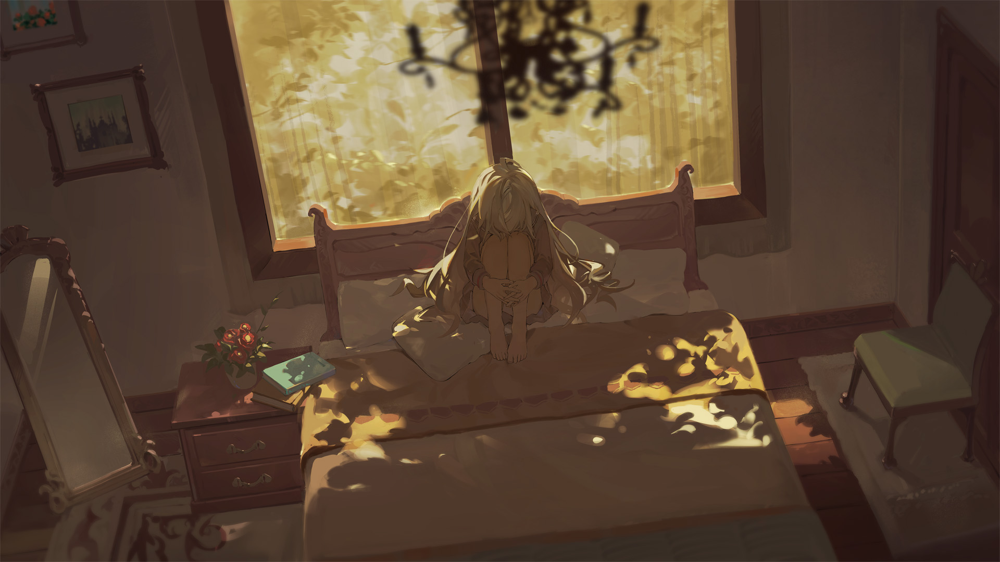
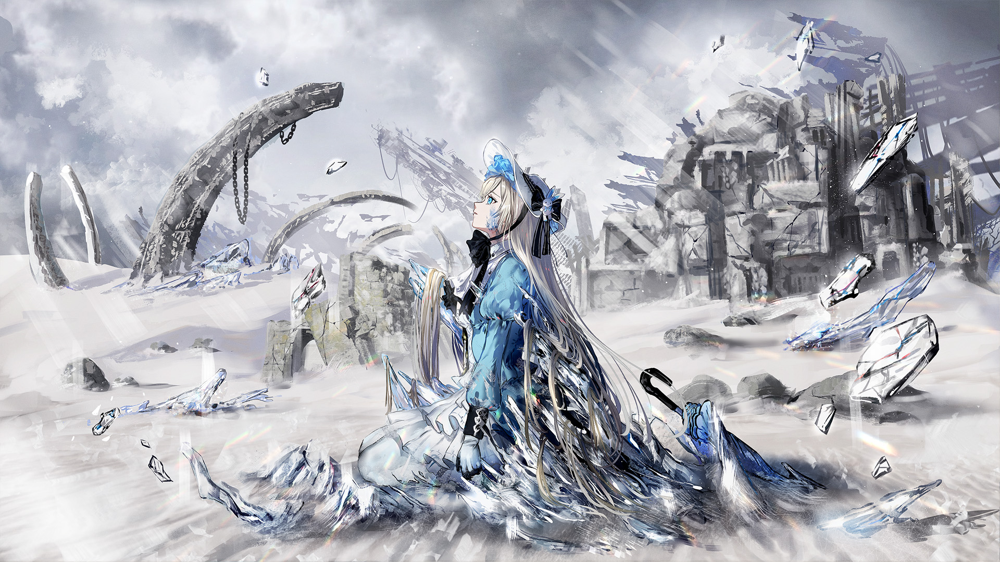

# E-2

- **Unlock Condition**: 购入Final Verdict曲包，完成E-1
- **Unlock Requirement**: 在Last的特殊游玩中选择接受Arcaea的一切
- **A Perfect Wish**

----
It wasn't long ago...

Somewhere dark and cold...

A barren, empty land rested in silence; newly cold, and newly empty, under a sky
leaden with dense clouds. The green leaves and red flowers had turned gray, and
only the footsteps of the living remained to tell that they all had once been
there. White now fell from the heavens and covered up their steps. No snow fell; only ash.

All had frozen, and winter had yet to come.

----
On the ash and ice-covered earth, on her knees, was a girl with her neck craned up to face what light
now bled through the gray. Her eyes were wide and staring. Before that light was an angel or, maybe, a god.

There was no home to turn to. Her mother and father were dead. Her guardians were dead. Her fellow
fledgling Shapers were dead. Her people, who had always scorned her, were all dead. All that remained
of what she knew was a shard of glass in her hand—a fragment from her window. But still, perhaps,
there was a chance—

----
She was chosen, and special.

She was young, but learned.

She only had to try.

If she tried, very hard, there was perhaps the smallest chance... to reverse time's flow. To strike back.

To even, maybe, turn into a sort of "god" herself.

----
Thinking she could stop all of this.

Thinking she could bring everyone back.

The girl looked at the shard of glass in her hand, and wished to save the world.

----
—However...

...she could not.

Will alone cannot create strength from nothing. She had all the will that one could imagine,
and her will was worthless.

Knowing that, she began to cry.

The will of the god above was worth more. Its wish had been for her and her kind to vanish, fall,
and fade into dust, and that wish would be granted, in moments, by its hand.

The girl saw her eyes in her own reflection, and watched as the image became distorted
with her tears. She could see her grief through her shaking jaw, and her impotent, overwhelming pain.

Nothing mattered at all. Nothing she had ever done, and nothing now.

The black-haired girl kept her head bowed as the angel descended. When it reached her, it raised its hand.

----
And shortly, she was gone.

----
That child's name is forgotten.

The reasons for her death... were beyond her.

Her life would not be remembered by anyone.

But when she died, another wish took her away.

----

----
—

It wasn't much longer ago than that...

Somewhere warm, though still dark...

She had made it dark. Another girl in another time and another place, with all names forgotten. She had
drawn her curtains. She had locked her door. A chair was beneath the knob. She sat on her bed, and kept
her eyes wide and staring.

She hugged her knees.

Staring.

She stared into nothingness.

----
She was overwhelmed by "herself".

----
A memory played endlessly in her head. She could see the view from atop the stairs, and vividly hear
her parents' words, whispered from beyond her sight.

They weren't saying anything against her, but they were still discussing her.

It wasn't that they didn't love her.

She could not love herself, and she felt that inside of her, something was missing that would allow her
to love them.

She very well could still see the view from atop the stairs. She had felt everything tugging at her to
let go of the banister then, and fly to the marble foyer below.

But what if it didn't work?

The girl had managed to return to her room after that and quietly lock herself away.

----
Why couldn't she disappear?
Why couldn't she walk off into nowhere?
Why were her thoughts like this?
Why was her mind like this?
Why couldn't she disappear...?

Her nails dug into her calves.

Her stare widened. Her breathing quickened.

And she wished that she could run away.

----
The girl with white hair was troubled. The girl with white hair was a god.

She was not troubled because she was a god—her godhood was a fact she never knew.

In her heart, she made a sullen wish for refuge, and that wish was granted:

"Somewhere else, where I can be happy."

----

----
—

The girl with black hair died, and a wish called her soul away.

In a distant world, in another reality, a girl more powerful than her had made that wish.

The white-haired girl was so powerful that her wish had created a world.

A world with a meaningless name: "Arcaea".

----
Arcaea was a sanctuary meant to save the dead.

Though she'd been alive when she'd made her wish, she still keenly felt that sense of "death".

She'd given it no consideration, none at all—in fact, she couldn't have thought straight if she'd
tried. She only wanted something there for herself. It's possible, really, that if she knew the fate
of those caught in Arcaea's web, she would see herself as having done a very good thing.

The world reached out to countless other places across time, across separate realities.

It was alive, and though it had no thought it nonetheless "wished" to share life with those dead.

----
Unguided, it caught any it could that spoke to its "heart".

In a space crafted between the seams of the real, in darkness spotted with soft and distant purple starlight...

...so many souls were wrapped into the weave, and brought to a new and shining border beyond the black.

The world of white...

From there, the world made a perfect imprint of each, and also released each. It gave each imprint a warm
place, gave them a new shape...

It gave them infinity, to view and relive endless life in safety.

But it could not truly save its maker...

----
It was able to take true souls, double them, and bring the doubles into new bodies, releasing those
first souls to whatever else awaited them... However, the soul of the one who would be known as "Hikari"
was fixed back in its first world. She was still alive.

...Arcaea, always unthinking, instead forced a copy of that soul as best as it could.

And much later, it found a soul more tragic than any other it had yet to find, similar to its mother's...

Strangely, that soul could not be properly kept either. When released, it could not leave the false
world's border like the rest... and so began to watch its star-crossed copy on the new, white earth instead.

Tairitsu... woke in a ruined tower.

----

----
—

And time passed...

Unthinkably, one of the saved had threatened everything...

But mercifully, the one who had made this all returned, and soon the world was safe again...

Arcaea was only crafted to exist. It had called out to its maker, and that maker had heeded that call. Like
Arcaea had made a monitor for the shards... like it bid that monitor to swallow up any anomalies that
fractured its fragile existence...

----
So now, it exists, and has existed.

It has existed, ever since, for over one thousand years.

----
The red blood that stained the earth was erased, leaving behind pure, white land. Tairitsu's body
was burned away...

Warmth filled everything. The sky grew bright.

The pearl and nearly endless landscape came together again.

And now, it is a truly beautiful world...

Dotted in figures: of girls who chose to rest in a land of endless travel. They chose to be frozen, and to
stare eternally into this world of the lost. And if they are thinking at all... it is of a very distant past.

And that was surely the better choice…

That was surely better than walking and watching other places forever...

----
They must be happy. They need to be.

Arcaea had nothing else to give them but that choice. The world was
still buried "inbetween", and escape was—

—and... any realms outside of it... were outside, and away, and could
never be seen again.

So, the twins, the girl with a blade, the traveler, the noble, the girl with a song...

They and others are angelic figures.

And the glass shards of Arcaea often come to rest now, too. They gather along
walls and pillars, compacting in great and plentiful formations. Like crystals.

Like corrosion.

----
—This beautiful world is overseen by a god. Above it all, Hikari watches passively...

...and remembers…

----
She remembers everything old worlds have forgotten. She sees them, with marginal warmth
or interest. An indulgence, of sorts, for the mind of a faded and listless god.

Maybe... she has transformed. Who she was and who she is... She must be "higher" now.

She cherishes a truth she can only pray that others would understand—though if they
will not... She has only chosen to watch the world.

Yet... though she watches it passively, she knows she has given them "everything".

----
...

...Outside her purview, a philosopher and satellite wander.

Beneath it, a horned woman tends to precious memories.

A woman with a flower in her eye... trudges through silent lands.

It is vain. It is vanity.

Arcaea now—is vanity.

And that... is better than the alternative.

Better than the world which spits at you. Better than yourself, who loathes your very way of being.

Living to love being alive, and succumbing to vanity...

----
...Reality, in all of its facets, is an empty, worthless, and inconsequential thing. The only thing one could
ever want would be to take what one can out of it.

Take pleasure. Take love. Take hope. Take power.

And with it...

...

Hikari believes this: one has no need to do anything.

----
Take. Live. And, sincerely, love being alive.

Love that...

Though not even for a thousand years, nor even a thousand more... will life ever mean a thing.

----
After all, reality marches on with no discernable "end" in store. And Arcaea, specifically,
was never anything more than a vessel for memories.

Incorporeal, contained, silent memories—while the outside remains unseen, unnoticed, and uncared for.

And those memories will exist forever here in that silence, together with those lost lives Hikari has saved,
and with her turning no eye to those lives, as always.

Because here there is no memory unseen—no emotion not felt. This is "all", which Light shines down upon,
and which Light grants.

It is for happiness. It is for eternal peace; unlike in any life you might have left behind.
This: she loves. This: Arcaea—

—Given to lost lives with neither favor nor condemnation.

And so, like this, the wheels of fate here continue to turn...

...while no destiny waits beyond.