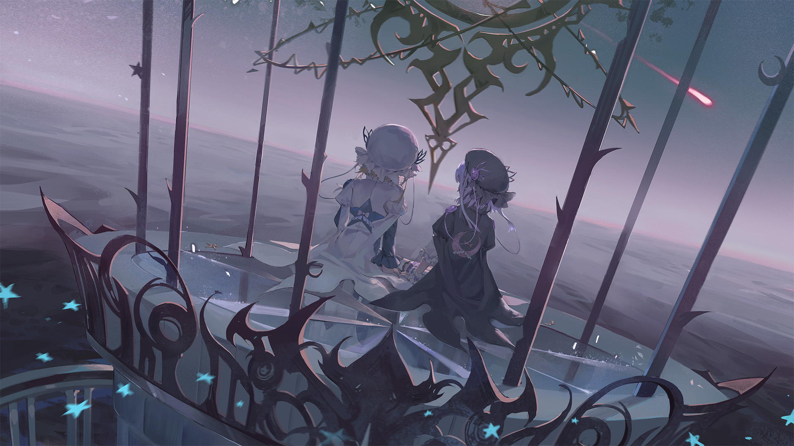

# 10-5

- **解锁条件**：购入Binary Enfold曲包，完成10-4
- **解锁要求**：采用露娜，通过Memory Forest

我们已经登上灯塔，通常那会有一盏灯在那扇窗台不断闪烁着——
我们其中一人把手放在膝盖上跨坐在那里。
另一人则站在她的身旁，一手扶在那个窗台上，用一种从未听过的的节奏拍打着。

在看向其他事物前，我们就这样看着彼此。
而我们另一只手，指尖碰着指尖；有时一只，有时则是两只，
漫不经心地玩着除了按压对方的指头外毫无规则的游戏。

----
“如果我真的开始变得比你更好，你会怎么做？”妹妹问道。
“如果我开始每次都获得更多的掌声，或是每次都在卡牌游戏上击败你，或是——”

姐姐回道：“你的假设真多。”“很多如果——而且都是很大而空的如果，不是吗？”

“这个嘛……”另一人开始说道，一边心不在焉看着我们身后那盏破碎的灯。“嗯，是这样没错。”

我们继续那场漫无目的的游戏。

----
“但你不该就此放弃。何况真的不必由我来告诉你这点，对吧？”

……我们一起笑了。

我们携手一起将目光转向那片景色。

----
世界早已干枯。而我们唯一发现的生命就仅剩彼此。
那无形的太阳无情地击垮所有的一切。我们依然相互连接着，看着这一切，保持放松。

悄然无声之间，我们似乎达成了共识——

“我想要再试着种种看花草……”

“对，我也是……”

我们凝视着Arcaea，没有再多说什么。

----
一颗红色彗星划破天际。

我们看向天空……

……黑夜早已降临。