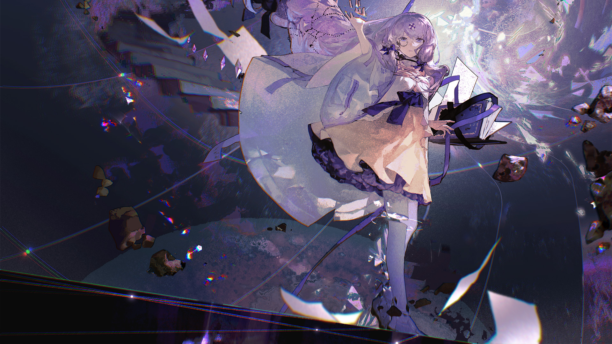

# 9-5

- **解锁条件**：购入Esoteric Order曲包，完成9-4
- **解锁要求**：采用拉格兰，通过Aegleseeker

什么时候发生的呢？

黑暗是什么时候消失的……什么时候变成这样的呢？

黑暗消失了。世界消失了。

在Arcaea之外，什么都不存在。

她动了动嘴唇，但没有空气能用来传播声音。

这里没有什么可以震动。所以也不存在声音。

她看到的是……一个模糊而奇怪的位面。

好像因为她看了之后才让这里变成这样的。

好像我不该看到这个似的。

----
回去的念头在我的脑海中浮现，于是我思索了一番。
或许我刚到这里的时候就应该好好考虑这个选项了。那样的话，我可能还有机会回头。

但现在，我已经迷路了。

不对……

要是说“迷路”，首先得有“地方”和“路”不是吗？

上下左右之类的，常见的座标方向……

这些东西通通不存在。应该这样说：这些事物已经消失了好一阵子了，
只是我到现在才意识到而已……而且关于“我”这个主词，我相信也是不存在的。

你看，我的双手已经消失不见。我的双脚也已不复存在。我的双腿也完全不见踪影。
我的舌头该在的位置，现在空无一物。

也许现在的“我”所代表的，只有我的眼睛，和我脑中挥之不去的某些东西。

----
所以，也就是说……

我有个新的发现，那就是在你失去了移动的能力和感官的体验之后，精神很快就会开始分崩离析。
我需要集中精神——很显然这个世界的神明还从未如此做过。

......

……嗯。

没错……在这里的现实是缺乏合理和完整性的，就像是没有蓝图的设计……仅凭模糊的印象。

----
先有了土壤。再有了阳光。阳光消逝之后，繁星点缀着深邃的夜空。
而在那之后呢？谁知道呢。至少，知道的人不会是你。

真假的……

你。你想从这里得到什么？为什么带我来这里？为什么要隐瞒我曾经的一切？

我肯定“拥有”某种过去。不论那是什么，你都从我这里把它夺走了。

......

----
我是跟其他人一样死去的吗？

我是跟那个深爱自己哥哥的少女一样死去的吗？还是跟那个红衣少女一样死去的？

也许你觉得我会为此感到害怕？

这样的事情……哈。

这样的事情对我而言又有什么意义呢？啊？

我被困在这座牢笼之中，这座专为满足你的观赏需求而打造的牢笼。
对我而言，有什么意义呢？一切都是为你而存在的，不是吗？
一个天堂……亦或是一种逃避？你是怎么做到的？这重要吗？

到底什么才是重要的？

----
……我又开始烦躁了。

太荒谬了。

哈，我……现在真的明白了：她为什么讨厌这个世界。

任何了解这个世界的人都会想要看到它消失。

也许你认为你是我的救命恩人？你从来没有拯救过我。
就算你有……现在看起来，我也把一切搞砸了，是吧？这一切是为了什么？

我到底该如何是好？

卡戎...

----
卡戎并不在这里，是吧？我的身体在这里吗？我想要——

让我……

让我消失吧……那为什么卡戎要“阻止”我？现在回想起来的话——

我是在回想吗？

我的眼睛还在这里吗？

我看不见。
我刚才在哪？
不，不，不。
不，不，我真的没办法回去了吗？
我没办法从这里逃出去吗？
我不能移动吗？
不，不会吧，我真的不能？

----
如果我还有指甲的话，我说不定会把它们通通咬光。

你懂的……

虽然你可能是用一片指甲把我创造出来的……

我 不 是 一具空壳。

我能感受到这一切。我 不 想 要这样。

你能听到我的想法吗？

这里的一丝一毫我 都 不 想 要。

----
我想要 知 道 真相。

真 相 就是 这 样？

这里，一 无 所 有——

......

……知道了这一切都是虚无……

我可以感觉到某种不安的感觉在我的肚子里翻搅……肚子？肚子？而且……我的双手在哪里？

好吧……我早就失去它们了……

——

----
你不能称“这个”为光明。

我很难用言语描述我现在所处环境。

我想，当我离开那个已经毁灭的世界并进入虚无时，我也迎来了黑暗。

但它又和普通意义上的黑暗不太一样。它不会使你亮得睁不开眼睛。它不是非黑即白那样的。

光明与黑暗。我在无数个世界里都见过这些东西，它们是最基本的元素。
光明和煦又温暖，而黑暗则代表恐惧和未知。

但，我还是期望着了解黑暗。

......

----
我隐隐察觉到了这一点，随后很快就明白了：这个世界是为了怯懦之人所造的避难所。

但那人不是我。

我不是创造这个避难所的那个懦夫。

因为如果是我的话，我会把一切做得更好……

卡戎过去……现在就证明了这一点。

我向黑暗前进是因为我想找到更好的真相，虽然真相和我一直认为的一样残忍又苦涩。

我身处这种状态太久了，已经失去了时间概念。

但每隔一段时间我就会再次看到它：

光明——真正的光明——就在远方。

----
......

也许它一直在引导我。

我不会向任何人承认这一点。

毕竟向自己一直看不上的东西低头实在显得自己很失败。

不过，我可以清晰地感觉到，那股光亮在召唤着我。

那股来自旧世界的光正闪闪发亮，并且在呼唤我。

在那道光里，我能看见救赎……

----
......

好吧。我会牵着你的手。

----
当我再次靠近它时，我的指尖恢复了知觉。而且我发誓，我能看见自己的呼吸。

我想，我应该会“返回”了。

如果回去了，我相信我不会紧抓着真相不放。 

我不会忘记，但我也不会时刻惦记。

我相信着，不是吗？

我能比那位“神明”做得更出色。

但是，首先，我需要更多人的帮助。

----
我不会简单地认为或嘴上说我会更出色。我会真正做到的。我一定会的。

不过说实话……逃到这里，没什么可骄傲的。

相反，这是报复。

我会改变这个世界，或者创造一个更好的世界。

你把这里搞得一塌糊涂，嘿，这不是反而让一切都变得可能了吗？

我认为是这样的。

不……

就是这样的。

——