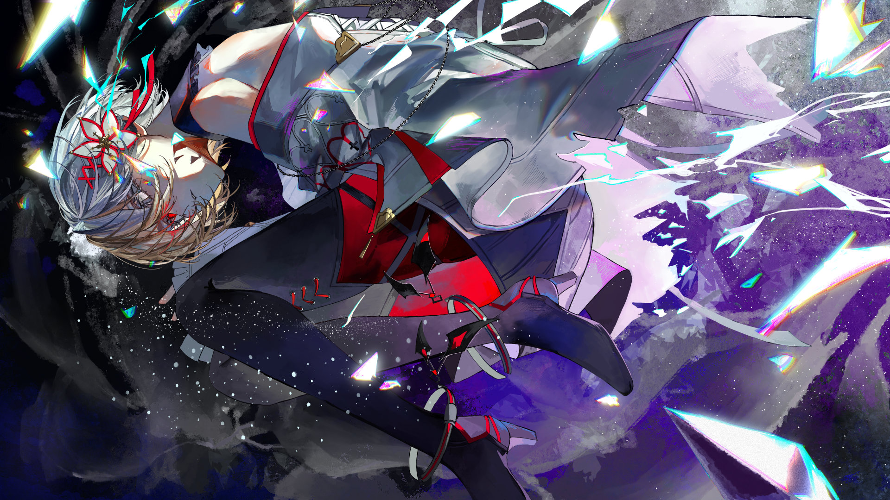

# 12-?

- **Unlock Requirement**: 解锁ALTER EGO后，游玩Absolute Nihil内的任意曲目并触发地图9-11的解锁

...

...Oh?

Another memory... that girl's.

Are these ones fond of me now? ...You see that? It seems that some rules never change...

Hm. This is...

----
The second life... I believe. The "copy" process... Why was this recorded?

Arcaea... isn't it usually interested only in the girl in white? ...We do know this world isn't one for making 
sense, I suppose. A random fluke?

Oh... or perhaps it's shame... Look here:

----
Something looks to have gone amiss.

We've watched a few entries from here in the Void, but never do they look like this...

The memories haven't been woven and nor have they dissipated—they're all together in a clump of 
turning energy. Why?

----
This is like the soul that was stuck on the border... or it reminds me of her, at the very least.

This collection can't be considered a "soul" under ordinary circumstances, however.

Was Arcaea unsure what to do with them? Why not make them into glass—

...Ah. The process completed. Another mystery left for us. Those discarded memories, what happened 
to them? Have you any theories? I...

...Hmph... quiet as always. I really should have given you the ability to speak, Charon.

----
But, well, perhaps this explains the difference we noted before.

Clothing near always changes once we enter here, but our bodies are always copied rather exactly.

I had wondered what gave Vita her half-paler hair and that odd eye, different from the memories.

----
Seems this memory doesn't follow much longer... No, we won't take it with us. Gathering memories 
causes such aggravations...

I'm very curious about the "lost memories", though.

Perhaps they entered the Void? Or if they're memories at all, then... hm.

----
Well, enough dawdling. Let's continue.

Time rarely stops here, after all.