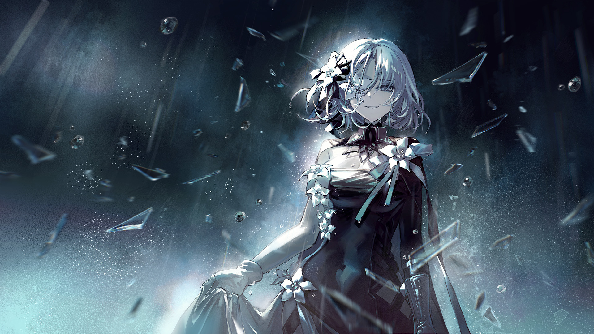

# 18-6

- **Unlock Condition**: 购入Absolute Nihil曲包，完成18-5
- **Unlock Requirement**: 采用咲弥，通过Judgement

"It's raining..."

Vita came to me in a corner of my glass library, and told me that.
In the bright and dark cave, I looked up to her from where I sat, and then I looked away.
Rain...

In all my years in this place, I had never seen rain, and now rain and snow
and thunder and lightning all had been seen by us on the horizons every so often.
And now it was there.

I stood.
"Vita..." I began,
"we will be going, and when you follow: you will follow and hide behind."

"'Going'...? Where?"

"To Lethe," I said, "to kill her."

I walked past her and, after descending,
made my way to the mountain's lowest exit.
Vita was delayed, but followed just as instructed.

"...'Kill'—what!? No!"

She shouted at my back, followed me all the way down,
and trotted out behind me as I went into the rain.

She protested, protested.

She grabbed my cape and I pulled it from her hands.

She picked up a stone, and threw it at my back.
I kept on, and finally she screamed:

"Why!?"

Rain fell on and between us as I stopped and turned to face her.
She met my eye. Her red and white eyes were shimmering.

"Vita..." I said, "this world is dying."

"Yes..." she muttered and at the time I thought—Ah, so she knows.
"So... So why would you want to... kill...?"

"I felt something in what she gathered, something I have never felt in what we have built," I explained.

"If... I want to rescue us all, I reason that I must discover what that something was,
and take and use it. With it, I might make the miracle that will build a new world.
Lethe, however, won't understand the theory, and we have no time to try with her."

"Her belief... How she lies to herself would never let her reason. Her heart is a fire.
She will aim those feelings at me, and we will come to blows."

"You won't try?" she accused me, and I smiled.
"You should at least try!" Her face bunched up, and her fists balled.

And, when I turned from her again—
as the rains around us slowed, and then stopped—
I said, lightly: "Fair. Watch safely away when I do."

I have taken much of my own glass to Lethe's place.
As I approach there, our collections almost meet,
but never blend together.

It is bright. On this cliff's edge, the world is bright from glass.
Lethe, beneath it, is cloaked in shadows.
Over the edge, the Void yawns.

"Reaper," I call to her, "let's put pettiness aside. Help me."

"Help you?" she spits. "After you've done all this!?"

Ah.
She must think I'm responsible for cracking this world at its core.
...She thinks so little of me.

I glance behind myself and, unable to see Vita, I turn back to Lethe
and continue our conversation.

It goes, and ends, as terribly as one can imagine.

Shouting.
Insults.
And her scythe: swinging down on me.

I travel from shard to shard with a little trick of the flower at my eye.
I refrain. I turn around her. I try. I am trying.
Until I no longer can.

I swear to her I will take her memories.
She swears to me she will mend Arcaea's shattered core.

I feel disgusted...

It begins to rain again.

Blade clashes against glass. Water sprays between us.

I dance a violent dance alongside hers, vicious.

She swings, aiming to kill me. I cut across her face with glowing glass.

My head is pounding.

Sickness twists inside my stomach.

I have failed, and nothing I am doing here matters at all.