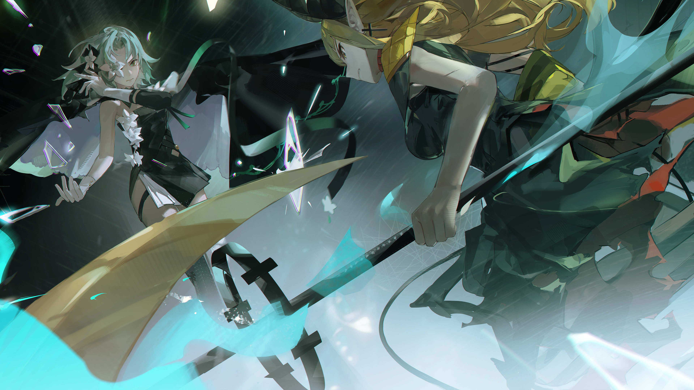
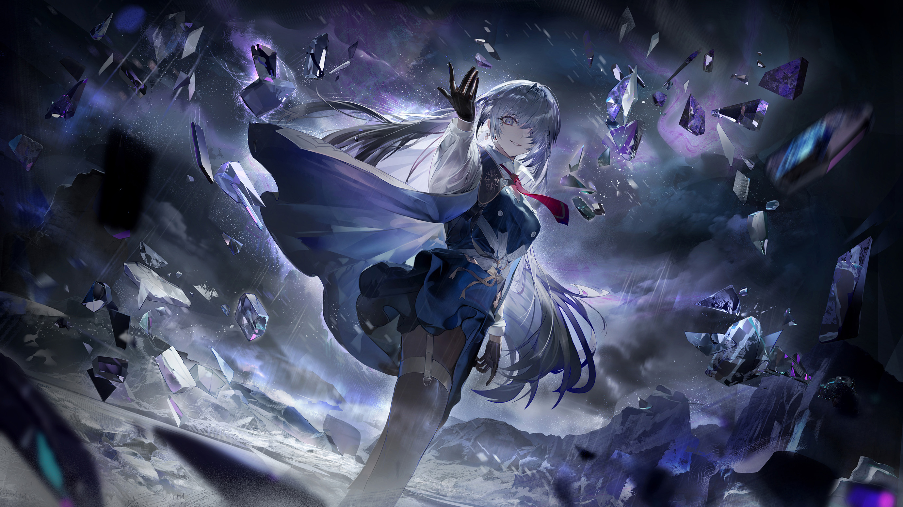

# 18-7

- **Unlock Condition**: 购入Absolute Nihil曲包，完成18-6
- **Unlock Requirement**: 通过ALTER EGO

This is no clash of great powers. This is no immense and weighty battle.

In this struggle between myself and Lethe...

When I win, I will win "nothing".
And when I lose, I will lose "nothing".
I know it.

We are only two misguided women believing in a better ending for us,
but it is not to be.

We are nothing. Our lives have meant nothing.

But I still want to try, and nausea is plaguing me for feeling so.

As Lethe pulls back, and with surreal strength drags her scythe toward me again—
As I cast glass upward and downward to stop the blade and pierce her chest—

Our battle is ended by a finger falling between us.

"!?"

"What—!"

A slender, gloved hand touches down where our edges were ready to meet.

When it does, my entire body pulsates and pain almost cripples me.

My glass scatters, Lethe's scythe flies from her hand. We both are blown horribly backward.

The earth itself pounds as if it is a great drum being beat once by an immense rod.

We are then stopped in the air—

The air itself violently pulls back—

And I strike against the ground as Lethe's scythe flies forward
and cuts me deeply across my side before skidding down behind me.

For her, for Lethe, several shards of my glass burrow into her left arm.

We both crash down on our knees, being made to bow.

And though I feel torn apart...
I raise my head, I do not let it fall.

Standing still between us is a strange new woman, with long and pale hair,
and strangely piercing eyes.

She looks to me, she looks to Lethe.
She is smiling.

"Enough of all of that, you two," she says.

"If you play so roughly, you might hurt something precious in your process."

I step up, best as I can, still only able to kneel and now breathing raggedly.
Her way of speaking worries me...

She looks at me again.

"Now... hello stubborn girls," she says.

"It isn't nice to meet you."