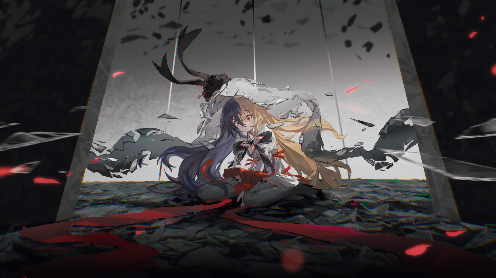

# 15-4

- **解锁条件**：购入Lasting Eden曲包，完成15-3
- **解锁要求**：采用摩耶，通过Rise of the World

她现正处于一个边缘，坐在光与影的交界处。脑内的声音仍没有停止，撕扯着她的鼓膜，叫嚣着。
她的双眼无神地盯着远处，乞求自己不再需要思考。

太迟了，错误已经犯下，悲剧已经酿成。造成的再多痛苦和损失，也都成为了历史。
时光无法倒流，过去无法改变。但……真的什么都做不到吗？可否拭去她的泪痕，抚平她的伤疤？
一片碎片自上空飘落，缓缓来到她的身边。两片、三片……越来越多，如细雨般，
最终形成了一个茧房般的屏障，将她隔绝于阳光之外。

----
让她喧闹的想法平静下来？
不，不行。
分散她的注意力？抑或是好好哄哄她？
她的注意力已经很涣散了。
怎么办？该怎么办……

碎片一反常态地暗了下来，由它们组成的屏障像细腻柔软的布料开始朝下折叠，直到将她完全包住。
真是令人哭笑不得啊，怎么会有玻璃觉得自己是柔软的呢。但奇怪的是，摩耶抬起了头。
尽管畏缩了一下，她最终还是抬起了头……她看到了碎片中的那些东西：记忆。

----
碎片中承载的那些记忆的主角都另有其人，她看到了所承载的那些悲伤和苦痛，
看到了人们所犯下的那些错误。Arcaea没有其他能给她看的回忆了，而她就这样静静地看着……

没有血流成河，没有刀山火海，也没有枪林弹雨。

只有痛苦、孤独而又无助的人们，无依无靠，无人可以诉说，更无从谈起抚慰。
是啊，孤独这样的绝症，又怎会有药可医？

----
她思索着。她看到了形形色色的人，男女老少，无一不是泪流满面。
她看见了那些大限将至的人们无力地笑着，手中还攥着早已褪色的相片。

这便是这个世界想要向她传达的：
你觉得自己再也不会感到开心了。你觉得不如就此放弃。
但何必要如此呢？

过去确已过去，它的烙印并不会消失，不过有一些、甚至说大部分“烙印”，
其实是你自己给自己上的枷锁。你不是还活着吗？那个世界的确毁灭了，但你仍在这里。

----
……

求求你……

留下来吧。