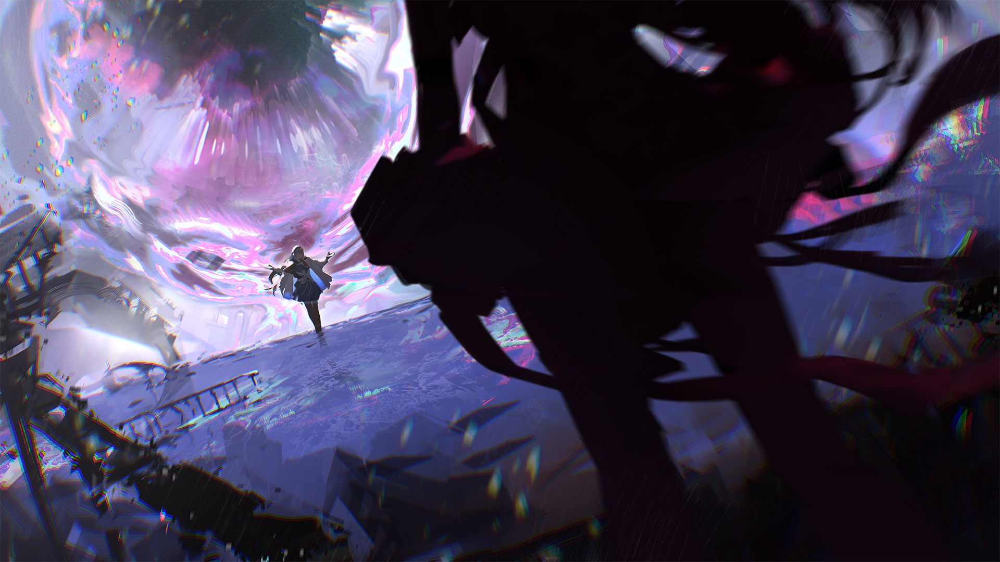

# 16-7

- **Unlock Condition**: 购入Lasting Eden Chapter 2曲包，完成16-6，完成15-6
- **Unlock Requirement**: 采用摩耶，通过Arghena

The skies all converge on one point. A vortex—a funnel forms, as vast as that sky itself. The firmament 
is shaped as if it is draining downward, and then suddenly it shifts entirely in a hundred, thousand 
ways. Color spreads out across the heavens.

A maelstrom of color, all draining downward and crackling!

The purity of light finally and utterly shifts to colors more than prismatic...

New color! Heretofore unknown and powerful color!

And ah, yes—I think it's the perfect timing! Let's start a storm!

----
Below, Maya witnesses my entrance, until the whole world's sky turns red.

That color inverts. Shifts—Shifts—Shifts! And finally, my hand passes through.

Lightning and rain begin to fall with might. A storm, a storm! Winds turn and throw towers down—
throw walls and buildings down! Snow and ice pelt the earth. The sky ripples as my own colors 
bleed all around me—coat me.

I descend into Arcaea, as weather—as life—as nature all come with me, and I grin. For I will leave 
the sky unbroken, hmhm...

Amidst the chaos and storms I have brought, I land gently to the earth before you and of course 
I curtsy, and I bow. As my hair and yours are cast all around in the gale I say—

"Hello, hello, Maya—

I have so wished to meet you."

----
When do I reach you...? I take no time stepping over to you... holding you, embracing you...
Feeling you...

These shoulders, your spine...
Your stomach and side, your fingertips... this hair of yours, oh...
Don't you tremble, now. I am only looking.

Ah, and of course, your face... I softly hold your breaking, crying face.

What might you be thinking as you look upon me with those quivering, two-colored eyes?

I am thinking about plucking out your red eye, and examining it more closely. It, in particular, is 
intriguing and beautiful. Oh—don't worry, I will leave it there, and instead simply find who you 
took it from...

But what are you, Maya...? What are you in this world already so incomprehensible...? I simply 
must have "you".

Holding you with one hand at your back, I snap the fingers of my other and take "time" away.

----
Listen now: every world is made with something in mind, but I already knew that Arcaea 
stood out with exception.

It has been said and said: Arcaea was made with "heart".

Still, without fail, within every world I have been able to find three "parts":
The surface world, the law underneath, and underneath both of those the seed of a wish and 
its tangent desires spreading like roots.

As I stop time in Arcaea, and look past the first and second layers, all suspicions are solidly 
confirmed that this world's fabric has no "weaving" at all.

No, it is instead more like a sea. Arcaea's fabric exists as an ever-shifting, almost 
incomprehensible thing which one tends to describe with terms of emotion: calm or raging, 
dark or peaceful.

Ebbing, and flowing...

----
You would ordinarily see gorgeous lines of order establishing a world's rules beneath the first layer, 
and yet there are none in that gold and cobalt underneath.

The only establishing lines there are a strange and sketched mess past the second layer—frenzied 
white scrawlings vaguely marking the bounds of an almost infinite black canvas. Each twisted and 
errant thing there is a clear-cut "wanting". It is all sorrow... and hope. Only these define this world.

And like you, Maya, I love it. It is wonderful...

But as I try to add a new idea as a line amidst all the others, perhaps to wrest some true control 
here, Arcaea rejects me again. Why? That makes it tougher and tougher to manifest my domain...

It seizes my fingers and stiffens my arm. It even seems to want to rewrite "my" existence—until 
in fact it removes my whole spasming limb. My arm separates from me and begins color-shifting, 
dithering in midair, rapidly vanishing and unvanishing... Time even resumes, and in this new 
chaos you, Maya, witness a very terrifying sight.

My apologies...

----
It takes great effort as Arcaea tries to pull me out of this reality, and even sever my body along space 
and time, but I would do anything for you, Maya. Through any storm, through any sickness, through 
any power overwhelming I would and can do anything...

With snaps and pain and nausea, feeling not "here" but "there" and with a strange vision of a dark 
room in midday filling my head, I will my arm back to my body and reach out to Arcaea's fabric. 
Reach out... Reach, reach!

Leave "me" here!
World of memories! From this day forth, you shall never forget me!

I carve the last and most beautiful idea—the most beautiful line in Arcaea's fabric:
I carve into Arcaea my own true and hallowed name.

And it's set, and it's done: an eternal and immutable change. I am now "here", forever. So, I'll 
waste not a second more.

I begin to split time and space apart myself—behind me. At last I open a black and shining gate 
to "mine" and gently, Maya, while you're so still from shock and fear and confusion, I begin to pull you in.

----

----
And there, there, you begin to unravel.

As your fingertips meet with the boundary, your voice is lost and you start to unravel into glass threads.

You unspool from your hand, past your arm, and to your chest and your body in a beautiful, silvery sight. 
Little wondrous splits without a single spot of blood continue all throughout your skin and where there 
might be inner parts... In waves of countless, brilliant, almost prismatic threads, you are drawn through 
the dark hole I have opened.

Your shape now is like a melting harp waving through the air; its strings made of the prettiest white 
quilt being split down slowly at its seams...

Ah, ah...
Fall into the best place, Maya...

And stay away from here forever.

When the last thread of you passes time and space, I close the gate shut.

----
White begins to overtake the sky once more.

I gaze up above as the storm begins to die down.

And watching it fade, I remark to this world that hates me:

"Arcaea, Arcaea...

"Hello to you as well."