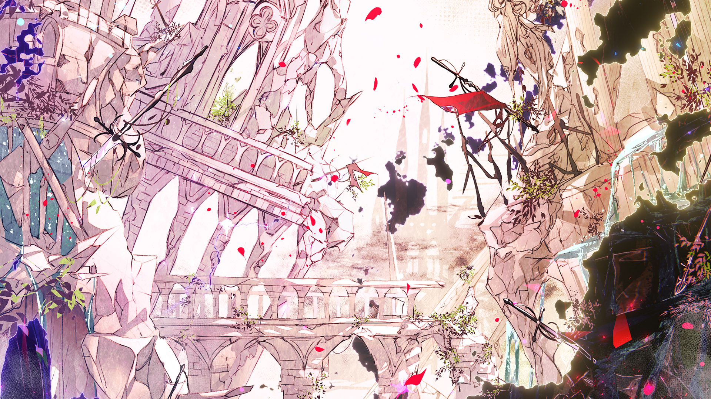

# 16-8

- **Unlock Condition**: 购入Lasting Eden Chapter 2曲包，完成16-7
- **Unlock Requirement**: 采用摩耶，通过Abstruse Dilemma

My storm finally and completely disappears. The last vestiges of the color I left in heaven die.

But oh no, no, I am still here, Arcaea—still here.

What an agonizingly long journey it has been.

----
Yes... I am here now. I, who saw this place through a passing glance between realities and simply had to visit.

I am thinking, even, of staying.

You know, this world is broken now... but it's still here. That is beyond incredible. I have never seen 
something "shaped" this terribly and this greatly; I really need to dig into it—I need to know more 
about it. I need to learn about it, I need to find those who live their second lives here. In one case: 
a third! So, so incredible! And ah, what a lovely story of three lives!

I run my hand through my hair as I think of it. Rainwater runs down over my skin, and I cannot help 
but laugh again. I hug myself, and soon find myself chuckling, and laughing, and laughing all the 
more until it almost hurts...!

----
Because isn't it a shame? It's a shame, you know!? You see: this world has been missing a god! Ah, it had a 
god but for an instant! For a fleeting moment, it was whole and just after—ah, it shattered at its very core! 
Have the people here been worried ever since?

Oh, oh, there's no more need to worry. No, no, none have need of worry at all!

This fading, sorrowful, wonderful world has been once again blessed...!

In my grace, in my providence, you will all find happiness again...

Yes... a god has come here to set everything right and well for you all.