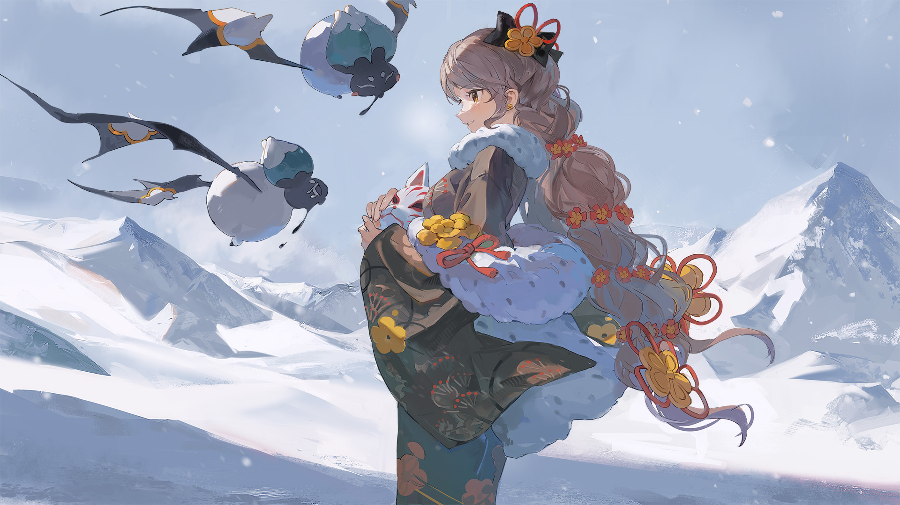
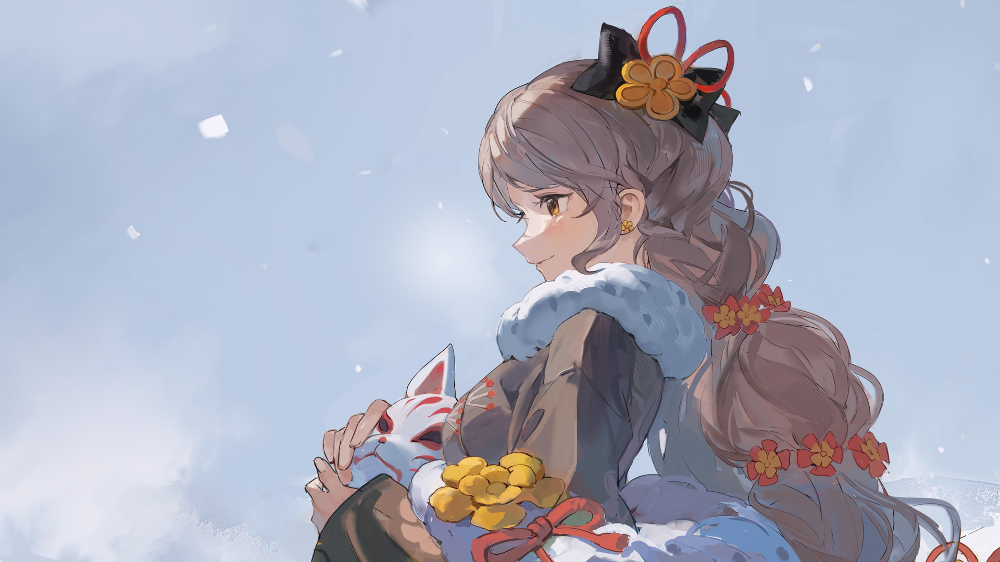

# 17-6

- **解锁条件**：购入Sunset Radiance曲包，完成17-5
- **解锁要求**：采用群愿，通过Hotarubi no Yuki

这次旅途大概耗费了她三天三夜，全为了达成一个动机真诚而思路清晰的目标。
在悄然落下的飞雪中，静谧无声的雪地里，这段旅途最终于回归起点之时到达了终点。

群愿回到了地表，满眼尽是玉树琼枝，跟随她的步伐一起窸窣作响，
夺目的强光也自她离开那段回忆后一并消散。再次听完她的感谢，它又一次离开了她，
又一次踏上了自己前途未卜的旅程。她们……一定还会再度相遇。
 
她身旁的异象碎片一路跟随着她，毫发无伤。或许实际上正是因为它的存在，她才得以顺利返回……
不管怎样，一切都结束了。
 
群愿回到了原来刚出发时自己所在的那面峭壁，开始一步步往上攀爬。她使尽浑身解数，
一路紧赶慢赶，不敢耽搁哪怕一点时间。
 
到达顶端后，荒芜而又熟悉的广袤地表尽收眼底。
群愿此时听到了什么东西在拍打着空气的声音——原来是两只扑扇着翅膀的蝙蝠。

----
她转过身，看到了一只白黑相间（还有橘色和绿色）、长得像蝙蝠的生物正心急火燎地向她赶来，
而它的身后还紧随着另一只黑白相间（还有绿色和橘色）、长得像蝙蝠的生物。
当看清楚她带回来的东西是什么的时候，这两只小东西顿时显得尤为兴奋，
急不可耐地几乎是立即扑到了她面前。

“就是它了！”其中一只开口道。
“就是它了！”另一只附和道。
“就是它了？”群愿问道。
 
“就是它了！”两只蝙蝠异口同声，大声答道，“就是它了！就是它了！感谢！感谢！太感谢了！”
 
“喏，”群愿将那枚被禁锢的异象碎片拿到跟前给它俩看，说道，“之前你们跟我说，你们的好朋友病了，
因此需要它，我没拿错吧？”

----
“没错！就是它！它能让我们的朋友好起来！”其中一只答道。那枚异象碎片悬浮在它俩中间，
组成它囚笼的十枚碎片幽幽发着亮光。
 
“它必须得让我们的朋友好起来！”另一只附和道，夸张地点了点头。
 
“能带我去见见她吗？”群愿温柔地开口询问道。
 
“啊，那个，可能不太方便……”听起来更稳重成熟的蝙蝠回答道。
 
“啊，可能……可能有些危险……”听起来更孩子气的另一只蝙蝠回答道。
 
“好的，没关系，那麻烦告诉我后续她怎么样了呀！”

----
“好哦！我们到时会来找你的，好不好？”其中一只答应道，笃定地在空中盘旋，
碎片和它的球形牢笼随着它的动作上下移动，这一举动貌似打扰到了另一只蝙蝠。
 
群愿轻轻一笑，点了点头，回应道：“好。”
 
“谢谢你，善良的好心人！你是世界上最好的人！你是……”蝙蝠停顿了，它模糊不清的脸转了过来。
只见那张脸抽动了一下，好似泪珠的东西从两只眼睛一般所在的地方滴落下来。
 
……它哭了。
 
“好了，德莱姆，该出发了。”第一只蝙蝠飞回来跟它说道。它再度朝群愿点了点头，
又一次向她道谢：“谢谢你。”
 
“不用客气。”她说。
 
随后，两只蝙蝠便飞远了。

----

----
“……”
 
群愿目视着它们，直至它们的身影逐渐消失于远处的地平线。她轻哼了一声，微笑着转过身，
面对着这峭壁的边缘，坐了下来，两条腿懒散地悬在半空。
 
……这是来到Arcaea的第几天了？
或许，几年都过去了吧……
见过了裂开的天空，见过了破碎的穹顶，见过了无光的世界后……
唯独没见过的，是脸，属于生命的、活生生的脸。就连这两只蝙蝠的“脸”也只能用“模糊”来形容。
 
“真是的……”她感叹道，同时笑了笑。她皱了皱鼻子，微笑着的脸微微抽搐起来。“真是的，哈哈……”
 
她捂住自己的脸，将自己湿润的双眼隔绝于夜空之外。
 
仍在颤抖着，她告诉自己：
她不清楚它们要救谁，但……
……她做出了正确的决定。

----
“我希望……”
 
她开口道，但她并未全然说出自己的心愿。她的目光掠过这趟旅途所经过的地方，
掠过仍未停歇的风暴。她抬头，看向天空。
 
一束光从中划过。双眼不禁瞪大，她的笑容再度变得有力了起来。她轻声说道……
 
“……我，只愿……”
 
在深夜的死寂中，在逐渐黯淡的薄暮时分里，在被雪白不断浸染的灰暗大地上……
 
她对自己说，对天空说……
 
对大家说：
 
此念，如愿以偿。