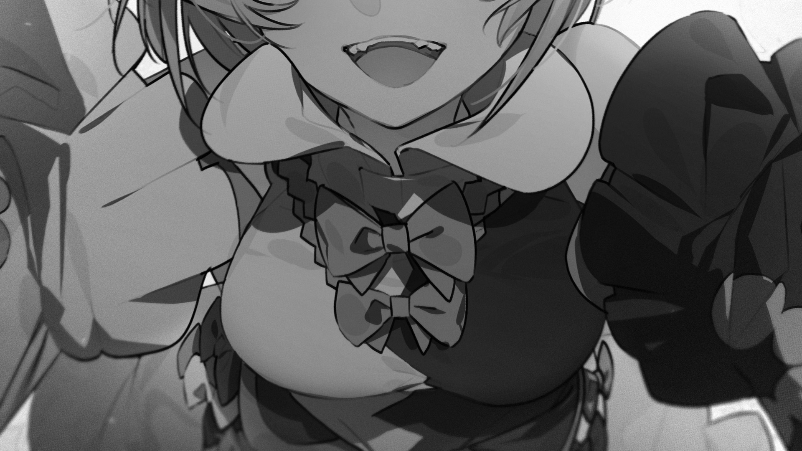
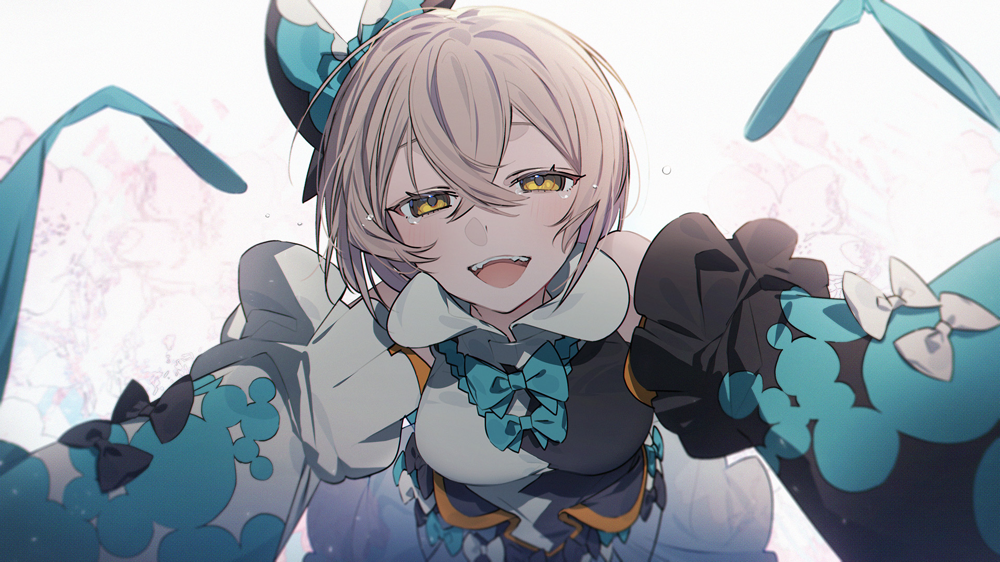

# 11-8

- **Unlock Condition**: 购入Désive单曲，完成11-7
- **Unlock Requirement**: 通过Désive

At an unseeable depth, in a place only one near and dear could find, Ayu begins to wipe away her tears.

These tears—she knows: she is lucky to have tears to shed when things hurt.

The voice, silent now—she knows that it is unlucky to not. But now, at most...

At most she can say:

"Why are you sad?"

To which the voice tells her, it is sorry.

And, "Hey?" she asks. "What makes you happy?"

----
"Me—Me, I like eating good food!"

It knows.

"And Fans, and Drem...!"

It knows.

"I like 'making friends'—You know!?"

Yes. It knows...
The voice in the dark...
It likes people, and whenever people feel they can smile.
It despises itself, and what it has done. It despises a history of poorly made things, and mistakes.
It abhors tragedy...
But, happy endings...
Happy endings are nice.

"Oh, then, it's okay, it's okay," says Ayu, gently, "definitely. And, and, I'll tell you why...!"

----
The voice awaits her wisdom.

"Because," she says, acting smart, "as long as you keep on going, you can find things that make you smile!
 Like walkiiing, or fooood... friends! You know? You know!? Okay, listen—!
"That's what the world, and life and living in life are all about! We... We keep going, and we get happy 
endings—waiting for sure! And, if... if you..."

Ayu chokes briefly, pushing a sob down in her throat.

And, smiling brightly, she tells the voice honestly:

"If you haven't found a friend yet, then I'll be your first!"

----
Through a snowstorm; through fainting, freezing—a stranger fought for something beyond Ayu's sight. 
That something is brought close to her now—close to her lips, and her stomach churns; the dream 
shimmers by its mere presence. That something, though now weak, and though now caged, is still and 
forever remarkable.

For it stands against nature, for it is "flaw" manifested:
That "anomaly" begins to build a bridge between incompatible places, like a bridge built between clouds 
and sea.

----
In fact: while it is strange, and while it is remarkable, an anomaly is never "special".

They are errors: echoes of one heart's weakness, cracking across a wish.

Being as they are, they may be more similar to the truth of that one heart than the sincere wish it left 
behind... Unspecial, and yet all the same ruinous.

Fate does not drive a flaw. Pain like this is not coaxed by hopes or woven threads. And this anomaly in 
particular: like all the others—once powerful, immense, and devastating—was not found "because" it being 
found was wanted.

Most were found like tricks of wind: bereft of rhyme or reason.

This old and crippled shell of hurting—
It was found from sincere love, no miracle, and nothing more.
Building a bridge, it finds itself between her teeth, now.

----

----
As she smiles, Ayu feels it there as glass, and she bites down—shattering it utterly, and 
unexpectedly shattering the dark.
Leaving this place blinding... In a wild burst: turning shadows into sunlight. As shining dust slips down her 
throat, the light of the earth slips down with it—channeled through the crushed and clear shard pieces.

It's almost... as if... a sigh can be heard, not rumbling but soft. Something happy, something kind.

The overwhelming light around her continues its path, and so begins to fade as it flows down her throat.

Able to see again, she casts her gaze around, and the unseen voice leaves her with this:

You're right, Ayu.
Thank you.

As Arcaea's light fills her stomach, new color fills the dream—

----
She awakes again with Fans and Drem above her, and they're both crying.

Her body feels weak. Her two bats cling to her tightly, pushing against her face and calling her name.

She hugs them, she smiles, and she cries as well.

She hugs them tighter than ever before.

Snow falls over them in the daylight and, happy, the three friends share one another warmly.

----
...Was it medicine or miracle? Was it friendship that kept her from crossing the border?

...It was. It was.

And, when the light first overwhelmed her dream, she saw the memories of how hard her friends had gone 
to protect her.
...She would need to protect them, too.
To protect them and, of course, the new friend she has made.

When they've all let one another go, when they've spoken of the journeys they've taken and of the kindness 
of strangers...

Ayu smiles. She smiles and smiles, and laughs.

----
Her endless hunger is gone.

She and her bats look again to the horizon, like they always do.

And on they will go...

For the happy ending that awaits.