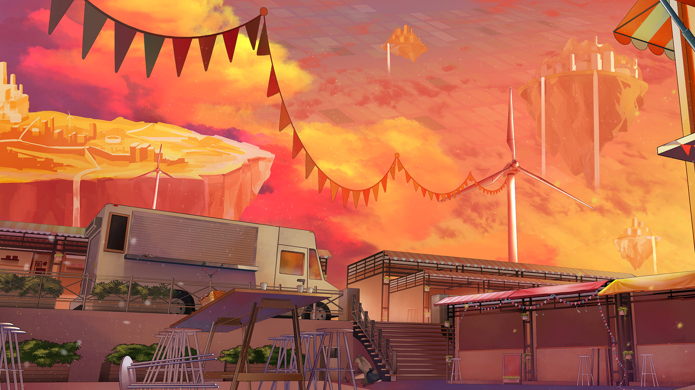

# 19-7

- **Unlock Condition**: 购入Rotaeno Collaboration曲包，完成19-6
- **Unlock Requirement**: 采用露娜 & 伊洛，通过Inverted World

Ilot kind of sounds like you, Luna.

She seems pretty stupid, but in a cute way. I could understand why she and Hoppe were friends.

You see... after she came up in conversation Hoppe wouldn't stop talking about her on our ride up to an 
island. She was nervous when we went to the port, relieved when I proved my status as a resident, and 
endlessly thankful that I would allow her to come up. And when we were talking I brought up her friend 
again and, "Ilot!" "Ilot..." "Well, Ilot, she..." went this girl.

It wasn't all happy. There were a lot of complaints—but I told her it was fine to complain 
after she told me "Sorry, all I'm doing is complaining." Cute.

----
Since she was so miserable, I tried to cheer her up in a tricky way... I asked her what kind of places Ilot liked.

She said her friend liked rivers. Ilot would probably be by a river—on a Floating Island. If, of course, she was 
there—and I told her: "Did you already forget? She is."

"You mean... you weren't messing with me when you said that?" asked Hoppe.

I was. "I wasn't." I said with a smile—and she didn't look like she believed me...

But actually... my key was beginning to glow as the ship got closer to the Floating Islands. Did yours too?

I really did have a feeling we might meet there.

And maybe?

Maybe... in some other story...

...fate would {{ruby|turn over|Rotaeno}}.