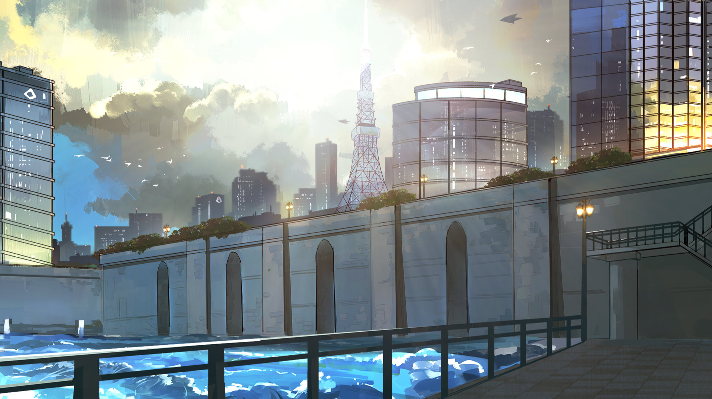

# 19-1

- **解锁条件**：购入Rotaeno Collaboration曲包

这令人哭笑不得的事，就再给你讲一遍吧。
 
还记得我们一起深入黑暗那会儿吗？你看起来根本不为所动，但我一眼就能看出你是在故作镇静，
因为如果我自己都感到有些害怕的话，就别说你了。眼前的世界在逐渐离我们远去，最后只剩下了
无数的阴影和有点亮过头了的云层——这些还只是在地震频发和那束光突然显现在天空之前就发生了的，
所以我们根本不可能想得到后来究竟都会经历什么。露娜，我知道那个时候你其实害怕极了，但我其实
也和你一样，故意装成一副冷静镇定的样子。
 
随着我们不断深入、越走越远——“走”更多是一种形容，而不是对我们动作的一种精确描述——
我们也逐渐能透过那些像窗户般透亮的云层看见之前我们在Arcaea中到访过的地方了。
 
再然后，我们便发现了那飘浮在碎片中的世界：阿古亚星。
于是，将两人的钥匙举到那片碎片面前后，我们便一同进入了那里。

----
这个水体及其庞大而丰富的世界由数不尽的惊奇与科技构成，除了遍地都是的仿真机器人全天候地
在为人们提供全方面的便利和帮助外，人们还可以时不时抬眼望下天空，并顺带感叹一下上面那无数
飞驰而过的飞船和就那样浮在空中的岛群的神奇组合。
 
借着白日的光亮，两人抬头望向了那座纸醉金迷的奇特之地——浮空岛的身份和地位于我们而言
并非秘密。你在我前头一路小跑，小手兴奋地指向天空。
 
“打个赌呗，看谁在太阳落山之前能先混进去！”你说。
 
我笑了笑，轻哼了一声。是啊，今天刚好有个住在地表的小屁孩企图偷摸混进去参加上头举办的
“夏日庆典”被发现了——看来你这次的一时兴起也不是那么没来头。
 
没问题。我向你挥挥手，就这么随意地放任你溜之大吉了。
你还是很可爱的。

----
我「记得」，我是岛上出身的，而你则完全相反——你是地面出身的一个“孤儿”。但我还从来没有
跟你确认过你是不是也跟我一样对此有种微妙的感受。
 
并不令人不安，也并非是一种“不好的预感”，我只是确信……
 
这个地方，其实是一个陷阱。
 
我们两个，其实都没法离开这水的星球，对吧？