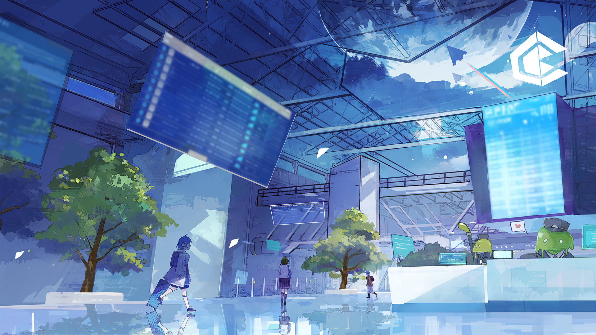

# 19-2

- **解锁条件**：购入Rotaeno Collaboration曲包，完成19-1

哇！真的太离谱了！这个世界到底是怎么回事啊！
 
来来来！快让我再给你讲一遍这令人哭笑不得的事——
 
在黑暗中走了那么久之后终于发现了这样一个水资源丰富的高科技世界，就好像终于把漆黑阴森的
洞窟挖穿后开到了一个全是宝贝的宝箱一样啊！爱托，你怎么可以一点反应都没有啊！
 
更别说还有那些浮在空中的岛屿……
 
这段记忆就是关于夏日庆典的，明亮、酷炫、丰富而又精彩——我记得我看见了的，参加了的！
我早就想去了的！
 
更重要的是……我是想要溜进去的！
 
喂喂，说真的，这么难得的机会，为什么要浪费啊？那小孩是给逮着了，没错，但是她只是运气
差了点，她的逃票思路并没有问题啊——这么想着，我在与你匆匆道别后便立即赶往了港口。

----
那可是真正意义上的热闹。夏日庆典如火如荼地进行着，即使是平日管控严格的浮空岛在此时也是
一副车水马龙的样子。看着街上满满当当结伴出行的人们，我也能料到这段时间的治安肯定会更加
严格。但这可能更是一件好事，我跟你说——这反而说明我也许有空可钻，甚至有些地方还会因为
人手不够而疏于管理，而这样的话，混进去不就容易了吗？
 
很显然，我也不是唯一一个想耍这种小聪明的人。
——因为我跟
另一个女孩撞了个人仰马翻：在某个角落转弯的时候，我和迎面而来的她来了个铁头功大赛，结果
就是两个人双双撞倒在地，头上的帽子还刚好易了个主。
 
戴着她的白色帽子，我站起身，揉了揉自己身上新挂的彩。戴着我的蓝色帽子，她也随后站起了身，
冲我大声喊道：“喂，你有何贵干啊？！”我想开口让她小声点，但她头顶上戴着的我的帽子此时碰巧
滑落了下来，最终盖在了她脸上。
 
我把自己的帽子从她脸上拿了下来，这时才注意到这个女孩是谁——她就是那个之前被抓到的
想偷偷摸摸溜进去的人。于是我直接开口问了：“你刚刚也是想偷偷混上去上面的飞船吗？”

----
“蛤？！”她的回答简短而干练，只有一个感叹词。但随即她上下打量了我一番，很快便放松了
警惕——我估计是因为她看我们俩差不多大。“你……你想溜进夏日庆典的会场？”她反问我。
我点点头表示肯定，接着她也点了点头，幅度很大那种。“那太好了！”她说道，“那我俩搭个伙吧！
哦对了，你可以叫我伊洛！”
 
“露娜。”我回应道，抓住了她的手把她从地上拉了起来。我们挑了个隐蔽的地方再度藏了起来，一边
不断寻找可以突破的地方。“要抓紧时间了，我们只有一次机会。”我说。
 
找了一阵子，我们注意到了在一艘飞船舱门前不停徘徊的一名守卫，看起来里面通往的是装货区，
而它来来回回应该是在清点什么。观察了一会，我发现这守卫来回一趟的时间都大概是二十秒。只要
有十秒的时间应该就够了……起码对我来说足够了。

我握紧伊洛的手：“我数到三，咱们就冲进去。”

“一、二……三！”随着最后的口令也已下达，我们二人同时跑了出去，从背对着我们的警卫身后
溜进了飞船内部。