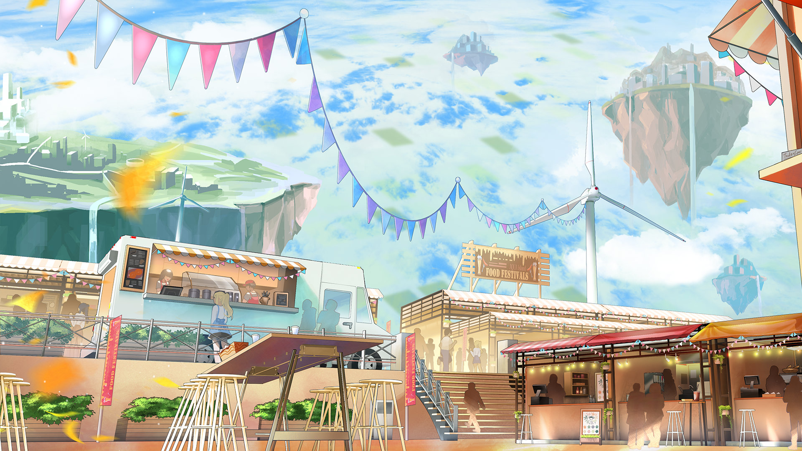

# 19-6

- **解锁条件**：购入Rotaeno Collaboration曲包，完成19-5
- **解锁要求**：采用露娜 & 伊洛，通过MVURBD

我不记得我们的家乡是否举办过庆典了。
我还记得不少东西，比如大家在满丛的鲜花中、斑驳的天空下载歌载舞，但我确实不再记得我们
是否有过庆典这种东西了。
 
倒不是说我「忘记」了，倒还没那么严重。
我只是觉得自己好像不记得了。因为我们在Arcaea待的时间或许已经多过我们在家里度过的
时光了吧……
 
不过……
就事论事的话，这个夏日庆典还真的挺好玩的，爱托。

----
那是我第一次吃到刨冰，也是我第一次玩到不是我自己“开发”的游戏。我的确不是第一次吃冰淇淋
和西瓜，但……那段时光真的很美妙。
 
而且，站在岛的边缘俯瞰整座城市的复杂构造，眺望汪洋大海的无尽风光，将这整个世界一览无遗的
时候，你就会觉得……
 
……这一切的一切，都真的太棒了。
即使伊洛也是第一次来到岛上，她却能够像本地人一样带我去各个地方打卡。
这么一想，
我好像确实忘记当面感谢她了……真的很感谢你，伊洛！

----
但其实，她好像并没有玩得十分尽兴……尤其是那天后面的时间里，她的心不在焉愈发明显。
刚从飞船的储藏室里溜出来赶着参加庆典的时候她可兴奋了，但慢慢地她便越来越显得不那么开心；
后来，我将手里的棉花糖递到她面前的时候，她甚至正紧皱着眉头，一副愁容满面的模样。
 
当我问她她怎么了的时候，她才坦白说，她生朋友的气了——因为她的好朋友荷珀不愿意跟她一起
上来浮空岛玩。她觉得在荷珀眼里，一张通行证比她这个朋友更重要。很显然，这两个人闹矛盾了……
而我和你一般不会闹矛盾，所以其实我没有太明白为什么她会这么生气。
我跟她支了个招，说到时候她回到地面上可以好好给她朋友炫耀一番。现在看来或许这并不是个
好主意……
 
不过爱托，起码我有在旁边陪着她，聆听她的烦恼，不是吗？
……于是，那天就那么过去了，夜幕低垂时，我们终于开始意识到，好像“回到地面”并不是一件
那么容易的事情。