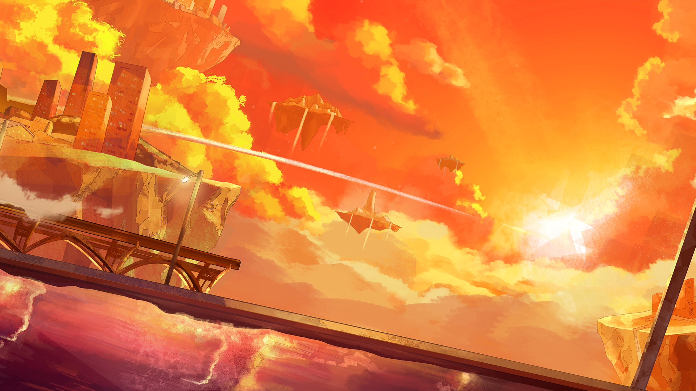

# 19-8

- **解锁条件**：购入Rotaeno Collaboration曲包，完成19-7
- **解锁要求**：采用露娜 & 伊洛，通过Vulcānus

太阳开始落山了，而我们仍然没有找到离开浮空岛的方法，此时庆典也早已结束了。
 
伊洛忍不住哭了起来，而我甚至不知道要说什么才能安慰到她。
 
我的天，她甚至跑掉了！我赶紧去追她，一路穿过公园，追到了河岸边。她跑到河岸边便不再跑了，
而是自顾自坐了下来继续哭。
 
我走到她旁边，也坐了下来。我蹙了蹙眉，伸出手轻轻拍了拍她的头。要是坐在河边哭的人是我，
你又会怎么做呢，姐姐……

----
让我想想……你有时候会唱歌给我听；于是我便给她唱了一段摇篮曲，也不知道她喜不喜欢……
不过，她好像确实哭得没那么厉害了。
 
橙色的暖光下，宁静的小河边，我注意到，挂在自己腰侧的那把钥匙正散发着柔和的光芒。
 
于是，我跟伊洛说，一切都会好起来的。
于是，我静静地等待着，等着你来。

----
那段记忆的确与以往不大相同，对不对？
 
当我们拿出自己的剑形钥匙合力解除那段记忆的时候，确实有什么不同寻常的事情发生了。
 
那，究竟是什么呢？
 
你知道吗？

我不敢笃定，所以，我想问问你。

我之所以会犹豫，是因为……这次的体验真的太过真实、太过美好了……并不仅仅让人觉得反常。

这不应该是记忆体验中事情发展的寻常轨迹，关于这点，我很确信……
但我觉得，这次不仅仅是不同以往，兴许……奇迹真的发生在我们身边了。

----
爱托……当你跟荷珀终于出现，她们二人奔跑着最终紧紧拥抱在一起的时候，你默默朝我比了个
“嘘”的手势——那时我便突然意识到……
你绝对知道些什么！！
 
那时，我正想让你好好给我解释一下为什么你要暗示我噤声，但还没来得及开口，你就蹦蹦跳跳地
来到了我面前，叉着腰，手臂揽上我的肩膀，得意洋洋地笑道：“别问，问就是奇迹发生啦。”
 
而我伸出手，在你的双眉之间弹了个脑瓜崩。

----
“谢谢，真的谢谢！”荷珀快要哭出来了，不断地在向我道谢。
 
“诶，可是，你是谁啊？！”伊洛看向了你，问道——她也快要忍不住哭了，但我此时已经没法确定
她是因为生气、伤心还是开心才哭的了。
 
我记得我当时真的差点没忍住想给你来一下，因为你竟然说自己是“一名‘事了拂衣去，深藏功与名’
的无名英雄”。
 
“她叫爱托，是我的姐姐，我们是一对双胞胎。”我说。
 
“你有个双胞胎姐姐！？”伊洛大惊失色，而我不禁皱了皱眉，心里有种不好的预感……“你为什么
不跟我讲啊！你唱歌那么好听，你们两个就应该马上出道啊！偶像组合、双胞胎组合啊！”

荷珀迟疑地小声开了口：“伊洛，这能说吗……”晚了……我咬紧了牙关，默默等待着那一刻的到来；
我的脸肯定也一下就红了，因为——
 
“啊——？露娜，你唱歌给她听了？！”
 
……我就知道。

----
当一切事情都解决了之后……

道别的时刻终于来临，荷珀向我们鞠了个端正无比的躬，而伊洛在朝我们不断地挥手，仿佛使出了
全身的力气。我们跟她们说了再见后，回程的路上你便一直用手指戳我，即使我已经因为不堪其扰
而不满地拧起了眉毛你也没有善罢甘休。好吧，我现在才想起来，我那时还忘记在你面前吹嘘一番了，
毕竟可是我赌赢了……
 
于是，我们和那两位女孩正式道了别。
 
随后，就像是正在坍塌的纸牌堆一样，那段记忆开始自我们周遭层层剥落。最后，我们又回到了
完全的黑暗中。

----
一回到原来那个阴森可怖的地方，我便忍不住开口问你：
 
“喂……爱托……事情一般不会这样发展的吧，对吧？”
 
而我得到的答复只是一个轻描淡写的“难道不会吗？”
 
“可是……好像她们还是会遇上麻烦的吧！荷珀确实有那张证，但她……还有伊洛……”
 
“别担心，我已经安排好了。”
 
“安排好了啥？”
 
“就是安排好了啊，哈哈啊哈！”
 
“唉……算了，那只是一段记忆，所以也无所谓了吧？”
 
“是吗？当真无所谓吗？”
 
“啧……你有时候真的挺招人烦的。”

----
听到这话，你笑了。你哈哈笑了一会儿，最后长吁了一口气——那是如释重负的信号。说真的，如果
你真的在乎一件事情，你可以跟我坦白的，爱托。
 
唉……无所谓了，都过去了。
我知道你也只是不想我老是思虑过度。
 
但你好像挺乐意看见我皱着眉头啊？——好好好，一切都结束了，我们又在一起了，这才是最
重要的，我同意。
 
坦白讲，也正因为如此，即使我并不「知晓」一切，我也仍然能够感到如释重负。
 
你突然往回了几步，抓住我的手就拼命往前拽。
“哎？你干什么啊——”我喊道，“你今天到底怎么了啊！别再拽我了！”

你笑了，那是一个极其宠溺的笑。“好啦。”你轻声说道。
 
“走吧，是时候回去那{{ruby|光芒|Arcaea}}之地了。”