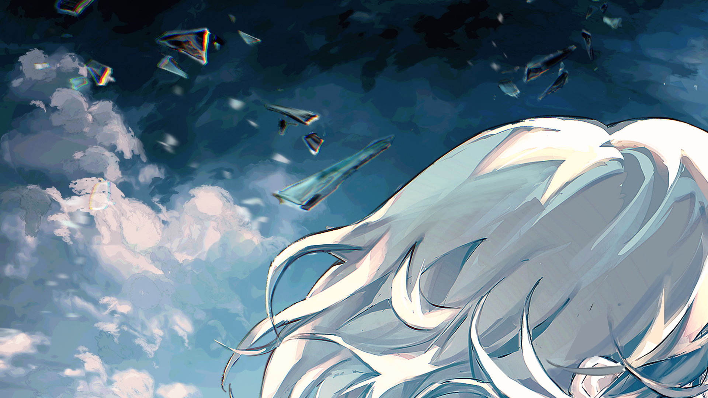
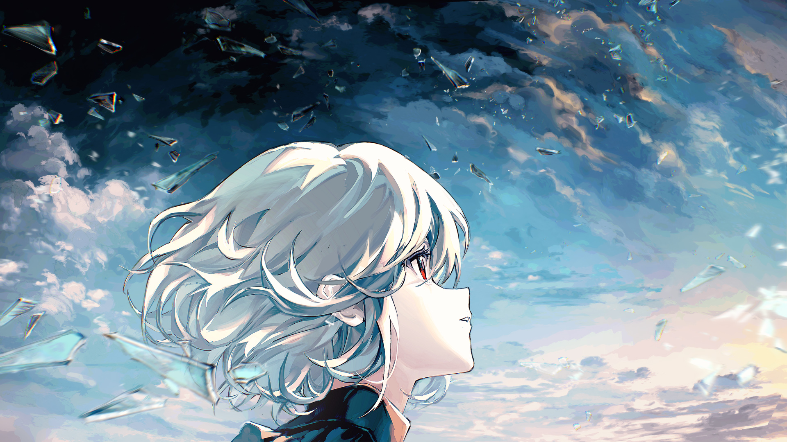

# 12-6

- **Unlock Condition**: 购入HYPER VISION单曲，完成12-5
- **Unlock Requirement**: 通过HYPER VISION

The child marches through valleys of dust and over bridges to nothing. She trudges through wreckage 
and, being in the deep dark all the time, uses the light of what Arcaea follow her to make her way more 
safely. And as for their memories? As for their visions? They're merely a distraction, aren't they...? 
Life is more than being lost to visions.

She considers the winds, imagining that they must be coming from somewhere. That, in fact, there 
must be a sea, or immense lake, or ocean very, very close. There must be something shifting water. 
There must be a moon, and perhaps there's a sun. The world is not cold, so... there must be a sun.

She can't know how little of that is correct to assume, and yet...

...giving herself so many reassurances, and voicing them too in comforting whispers, Vita marches on.

And for her dedication she is rewarded.

----

----
It's still a time of fate, but this isn't fated. It's still a time of feeling, but her desires aren't heard. Sometimes, 
merely trying is all something takes to be done. Vita crests a hill, and finds not an ocean, but the sun.

"W—Wow—What..."

She whispers in surprise and innocence as light fills her eyes. A true world of light with glass dancing 
through the sky. A brilliant sea of clouds in the sky, and a strange seam overhead where night and day 
beautifully and melting meet.

Although she had held her head high until now, refusing the part of "the child", Vita unabashedly 
scrambles over the hill in her excitement, looking back to the night as she reaches the spectacular border.

----
"How is it like this!? This... This is crazy!"

Ecstatic, she shouts through the quiet world, her voice carrying far—being heard by no one. She hops 
around the border, looking up at the silvery and bleeding clash between darkness and daylight—
her mouth agape as she gasps in awe.

She giddily theorizes. She climbs nearby stones and structures to try to gain a better look. She is, for the 
first time since waking, happy.

----
Wonder isn't lost very quickly, either. When she is done looking the border over, and at the strange vista 
that is gazing into "night" from a side of "day", she finds wonder in the newly lit landscapes of Arcaea 
instead. She finds new sights: cathedrals and coliseums, lake houses and new, wired and wooden pillars...

Wonder is not lost quickly. She enjoys what she can see and find. She enjoys the adventure of exploring.

But, when wonder does begin to drift away from her...
When her happiness begins to ebb—only a little at first, but then quite a lot...
...Her worries rapidly encroach on her stomach.

Thinking of night and day, and ruins, and vast emptiness—she begins to think too much.
She thinks too much, and she begins to ask:

"I'm not really all alone, am I...?"

And with the worry in her heart beginning to take the shape of fright, Vita once more starts to shout 
into the world for anyone else to hear—with only echoes answering.

----
The canvas of Arcaea spreads across an unthinkable distance.

Across that distance, physical voices do not carry well. Some may wake here and never find, nor even notice 
the presence of, another.

As Vita calls out "Someone!" and "Anyone?" through quiet alleys and past vacuous caverns, her returning 
voice is a constant confirmation. A creeping, and then pounding sensation that her fate is the fate of so 
many others in this place:

Life, alone.

And even she, even this little one...
...can comprehend the indifferent oppression of time.

After she has wandered over a month's time, with hope left barely as dregs within her chest, little Vita 
crawls to the corner of a nondescript ruin and hides herself from nobody to cry.

----
She breathes in fits and starts. She growls in pain. She says, "No", and "No, no". She hugs her knees, 
and she sobs.

She fills the petal-hearts of her sleeve with her tears.

And as she hiccups, as her chest hurts from the steady thoughts and the terrible weight of knowledge...

Her loud crying deafens her to the sounds of another's footsteps.

----
A woman steps out from the light.

As her foot falls one last time, the sharp sound of it reaches Vita's ear. She hurriedly picks up her head, 
suddenly afraid.

With the brightness of the day behind her, the woman is a figure enshrouded in void. The right of 
her face—her eye?—it catches light and shines through the shade. Curious if it's glass catching that light, 
Vita lifts her head higher and can there see the woman's left eye blinking.

Vita's breath stops in her throat.

Not only is it another person, here and now...
... it is a person with a flower blooming from her right eye.