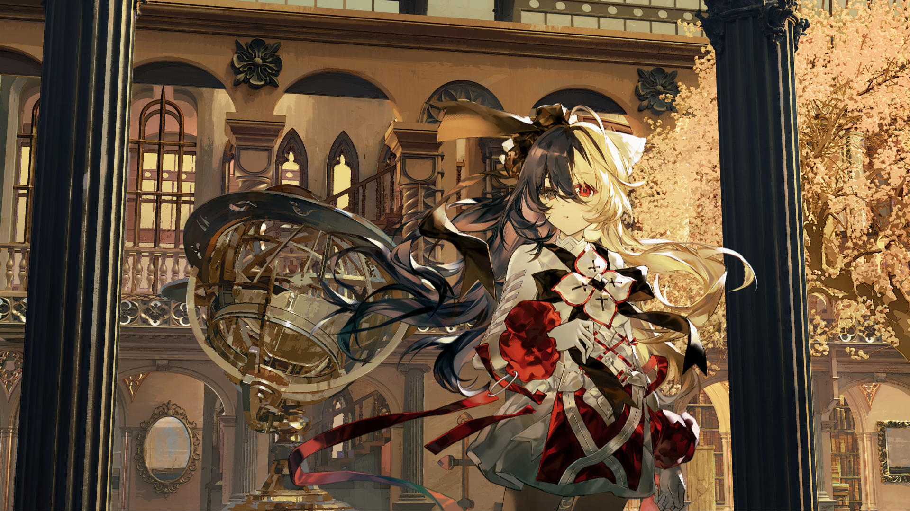

# 23-2

- **解锁条件**：购入Liminal Eclipse曲包，完成23-1

而另一边……
房间很温暖，她的双耳在静寂之中找到了舒适。
 
眼前是一个巨大的中庭。上方的天花板呈脊状排列，宛如某个巨人的骸骨，而她身旁矗立着几根粗犷而
威严的巨型柱子。摩耶莫名感到安心，却仍带着怀疑的目光盯着这一切。
 
她出声问道：这是什么地方，之前自天空而降的那个人现在又在哪里？
 
她一边嘟囔着，双脚也开始行走起来。

----
完美的世界里自然不存在尘埃，法则也并不存在亏缺和漏洞。
 
凡是该有归处的东西，都会有其归处。摩耶将发现许多来自其他地方的物件，在这个地方却不是随便乱
放的。它们都被悉心温柔地摆在每个地方。
 
因此，这个地方正是倒映着祂的心和爱的特殊的一隅。
 
雕像、书籍……
成排，乃至成箱的植物……
地球仪，以及其他悬挂着的或直立的物体——不属于这个世界的地图……
各种工具、器械像展品一样陈列着……
还有喷泉，甚至各种镜子……
 
各式各样，来自各地。

----
当摩耶的脚步声来到新的房间里时，她的声音回响在整个房间里：“庄园……？……可它是空的？”
 
她的声音清晰，标准，是一个刻意的试探。但貌似没有人在场，没有任何被听见的可能。
 
巨幅的肖像、油画——她能找到的任何墙上都挂满了各种作品。她走过的每个大厅和房间都挂满了她不
熟悉的物件，但这些画布依然不断吸引着她的注意力。
 
最终，在一幅白色沙海的画像前，她停了下来。
 
她盯着它……不是因为它看起来很熟悉。
她似乎很想试一下，于是她便伸出手去触碰那奇特的布料。

----
在她触碰之下，影像开始在指尖泛起涟漪，如同触碰水中倒影一般，但她的手指却无法穿过。
 
……分明是毫无分量的试探，但被拒绝的感觉却如一头凶猛的猛兽。
 
通道似乎只为房子的主人开启……
 
摩耶皱了皱眉，不知晓发生了什么，只好继续向前走。

----
她穿过空荡荡的大厅——偶尔有薄纱般的幽灵穿过其间，引起她的注意，让她停下脚步……
 
有时，远处的声音从远处传来，落脚在她的耳间。但在她来得及转身猜测来源之前，她的耳朵却又失去
了它，重归静寂之中……
她游荡着，流浪着，不断寻找更多。这样一个古典而并蓄的世界里，来自外界的事物并不是为了“收藏”，
而是被悉心照料、精心摆放起来。
 
……最后她还是拿走了一本空白的日志，最后她还是拿走了一支看上去已经装满墨水的羽毛笔。
 
她坐在漂亮的椅子上，外面是恒久不变的鎏金与乌黑的光线，从这位女主人宫殿的众多窗户倾洒进来……
 
摩耶开始书写。

----
//摩耶，壹。// 她写道。
 
// 刚醒来的时候，我便确信自己已经死去，但现在我却开始怀疑这一点。或者，更确切地说，我开始觉得
我或许又奇迹般地活了过来。
我醒来的地方……是个叫做Arcaea的地方，但现在我却不在那里。Arcaea或许是一个残酷而奇异的世界，
但我相信至少那里要比现在我所在的这个世界——她/祂的世界，更有潜力。
 
潜力永远都是希望的种子，而种子发芽，鲜花盛开之时，便是未来。//

----
// 我的名字……兴许是「摩耶」。不，我并不信仰祂。// 她写道。
 
// 如果有人哪天发现了这本日志：它存在的意义便是你。我会告诉你一切我所发现的事。//