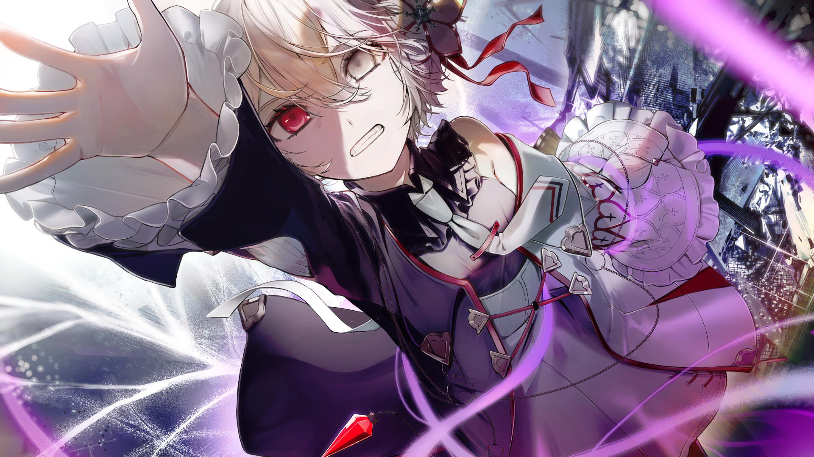

# 23-7

- **解锁条件**：购入Liminal Eclipse曲包，完成23-6
- **解锁要求**：通过Undying Macula

两地间的广阔天地，
随心愿低语而踏入。
呼唤将超越那星辰，
由心灵与思绪聆听。
转瞬之间，灵魂消逝，
坠落，翻滚，穿过崭新的太虚。
 
渴望再度听闻友人的声音，维塔的灵魂自自己的躯体飘离而去。

----
炽烈的白光在她周围汹涌翻腾。她试图保持镇定，却感觉重力紧紧攫着她的躯体。
 
两个世界的边界在此激烈碰撞，她的意识也随之剧烈震颤。

----
然而随着时间流逝……
 
……混乱逐渐平息下来。她虚幻的身躯如今置身于全新的“黑暗”之中。这片有着宇宙漆黑的暗令人熟
悉，她能在此看见其他时空，看见新生的白皙星辰；她能看见遥远星域中流转的存在，能看见一个看似
完美而遥远的世界散发出的光晕。而在那光芒之前——
 
有位少女。
只剩一只手的少女——
一个有着双色头发与眼眸的少女，和她是那么的相似——
 
摩耶飘浮在黑暗之中，几近支离破碎。

----
“摩耶！”维塔高喊道，从未如此笃定。霎时，一种既熟悉又陌生的色彩将她笼罩。目睹着这色彩，感
受着这色彩，维塔浑身颤栗，凛寒刺骨。
 
她举起自己半透明的手。
 
色彩缠绕她的指尖，盘上她的手臂与脖颈，用力拉扯着。她咬紧牙关，拼命往前挣脱。
 
摩耶向她伸出了手。

----
光影在女孩间飞舞，涤尽所有色彩。而她们的手终还是稳稳相触了，就好像真实存在般。
 
维塔感到了自己的心跳，还有摩耶的搏动。
 
浩瀚无垠的星辰间，她们在死寂中相拥。

----
可事实终究无法忤逆。
 
又一则故事要迎来终点了，维塔十分明白。
 
“有趣，真是有趣，”摩耶气若游丝，干巴巴地说道，“到了这种时候，人反而会想起来所有自己曾经
忘记的事……”
 
“摩耶，你现在这样……”维塔问道，“是……是她干的吗？”她看向少女支离破碎的肢体。

摩耶摇了摇头。“事已至此，如此而已，”她说道，“……抱歉，又给你添了段悲伤的回忆。”
 
“……”
 
“那你现在想怎么做？”摩耶问道。

----
“即使是现在，你还是不够关心自己吗，”维塔回道。
 
“嗯……或许吧。但你还没有回答我？”
 
“我？我想怎么做……？我……我也不知道……我并不……”她顿住了，缓缓将目光挪到朋友身上，
“我甚至不知道自己为什么要试着找到你。”
 
于是摩耶恳求维塔暂时放开她。只见她颤抖着，手移到身侧……然后捧出了一本厚厚的日志。“你是说，
为了这个吗？”摩耶打趣道，只是话语中流露着些许哀伤。

----
“我不是为了这个。”维塔的回答干瘪而无奈。
 
“那么你现在应该这么做。”摩耶笑着回应道。
 
“我或许是希望能够救你……”维塔回答道，摩耶则收起了笑容。“我也不想失去你。”
 
“……”

----
“你的意思是……？“
 
“我们聊过的，维塔——”摩耶开口道，维塔反射性地皱了皱眉。“对于对方而言，我们都是什么，你还
记得吗？”
 
“‘记得’……一点都不有趣。”
 
“是啊，我当然明白……”
 
维塔安静了下来，摩耶也一样……
“倘若我的记忆能借由你延续下去，”摩耶说，“那么因为你，我便不会消逝。”
 
维塔问道，声音微小到几乎听不见：“……没有它后，你便会彻底消散吗？”

----
最终，摩耶缓缓点了点头。
 
“我……我应该答应吗？”
 
“……维塔……”
 
“……不，我明白的。”维塔说，同时她对自己也深信不疑。她再次说道：“我明白的。”

----
维塔也抓住了那本本子，二人将摩耶的日志一同捧在中间。
 
不疾不徐，维塔点了下头。
 
“……摩耶，”她回应道，“我们一起。”
 
话音未落……
 
记忆便开始在二人之间流转。