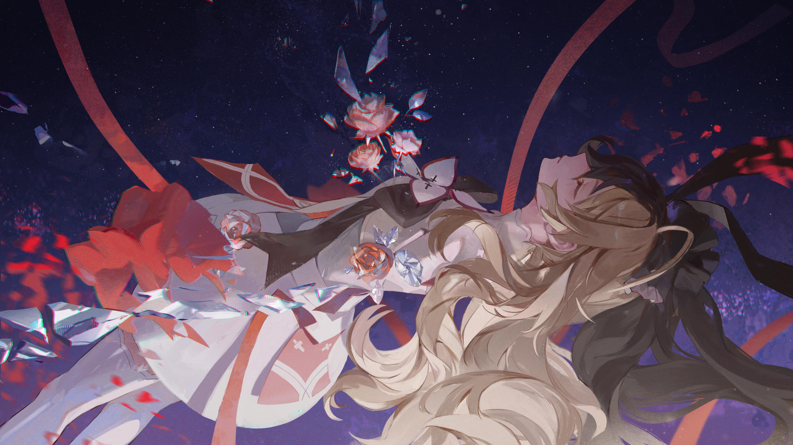

# 23-8

- **解锁条件**：购入Liminal Eclipse曲包，完成23-7
- **解锁要求**：通过Undying Macula

这是摩耶对维塔说的。
“不要再哭了。你不能就这样一直哭下去。”
 
这是维塔对摩耶说的。
“太不公平了，太蠢了——不要再用这种部队里才用的蠢话来应付我。”
 
但摩耶继续说道……
“……哈哈， 你也这么觉得吗？想想确实挺蠢的。”
 
而维塔也继续说道……
“一直都是。”
 
但她们能捕捉到的话语越来越稀薄。

----
谁人的声音被听见了。
 
“我仍记得。”
 
“我仍然……仍然厌恶……厌恶自己一直哭个不停啊。”
 
“我只是感觉很糟糕……如此而已。”
 
谁人的感受被感知到了。
 
不……没关系。没关系的，我不是孤身一人。
 
{{ruby|摩耶|维塔}}……你会没事的。
 
{{ruby|维塔|摩耶}}……嗯，能最终成为你，我很高兴。

----
遥远的星星在远处闪了一下：这一处，另一处，再另一处。
 
水晶般的花瓣自摩耶的躯体内绽放开来，光芒自她躯体的裂隙中徐徐淌出。
 
两位少女闭上了双眼。
 
摩耶的记忆——属于维塔的记忆，就此开始交融。

----
纷杂混乱的世界，神圣的造物充满了怪诞和诡异的恐惧……
 
一切都在她们之间戛然而止。
 
这便是这个故事从始至终所发生的一切：

----
诞生于星际航行的世界，生而为天赋异禀之人；

被培养成为国效劳的精英，成为掌管无数航线之人。
 
在蒙昧中成长的维塔，因为听信不该被信任的声音开启了航道，从而走向了生命的终点。
 
死亡，死亡。崭新的、白色的疆界，让这破碎世界的缺陷再度浮现。
 
由扭曲之心铸就而成的畸形之物——Arcaea夺走了她的记忆，却无法彻底驱散它们。
 
那些记忆久了便开始感知，开始思考，开始散发出痛苦的光芒。
 
而理所当然地，Arcaea便开始以玻璃之驱，为其提供庇护。

----
那另一副躯体在另一处苏醒过来，独立于维塔之外。它带着当初催生它的相同情感醒来，并因此承受着
痛苦。
 
摩耶的记忆……
与维塔的记忆如出一辙。
 
那色彩再度在她们周围流转，被光芒流淌着带走。
 
更多花朵自摩耶的躯体形成、绽放——
 
而环绕着她们的世界，也开始急促地倾转。

----
摩耶和维塔纷纷睁开双眼，刺目的光流迎面扑来，而维塔的另一只手向前探去，紧紧抓住摩耶的肩膀。
二人所在的空间开始崩塌撕裂时，她再次将她拥入怀中。
 
光与声如潮水般将她们淹没，维塔的灵魂再度被拖回了那碎片的世界中去。她眯起双眼，紧紧抓着那另
一半——
 
——她的目光牢牢固定在摩耶的微笑上，而她的另一半身体也开始碎裂崩解。玻璃碎片不断反射、闪烁，
追随着她们的旅程。
 
星辰仍在嘶鸣掠过，直到撕裂的宇宙声响将一切骤然归于寂静。维塔紧握，再紧握，直至再无可握之物。
 
在那另一个世界里，殿堂与长廊再度归于沉寂。
 
维塔睁开了双眼——脑海与心间充盈交织着新与旧的回忆。
回来了，Arcaea。

----
还是漆黑一团……维塔让自己成为这扭曲世界的中心。
 
她举起了自己手中的本子。
 
“……”

----
她将本子平摊在身前，翻开至拯中间那片崭新的空白书页。她凝视着它，读出那最后的字句：
 
//谢谢你回应我的呼唤。//
 
维塔紧握着它，双唇紧抿。她的表情……她竭力保持着平静，却仍呼出滚烫的热气。
 
缓缓地……
 
她默然，以沉寂作为回应。

----
“维塔……你在看什么？”
 
维塔微微倾斜身子，再次看向那本书。
 
手指不断翻阅着书页，她揣度着自己的回答。
 
她记得这些书页里的所有内容，但她总是一遍又一遍地翻着回看——她的视线细细扫过其上的每一个字词。
 
……她思量完了，合上了书。
 
她转过身来，视线对上自己的同伴。
 
她给出了自己的答案。