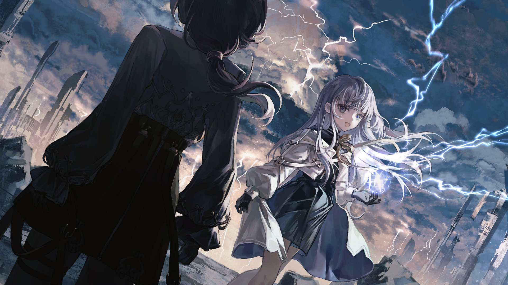

# 20-4

- **Unlock Condition**: 购入Lucent Historia曲包，完成20-3
- **Unlock Requirement**: 通过Rays of Remnant

—Nell wasn't dead yet in this story.
Nell dies later, and then dies again.

—Eventually, the girls came to find the 2nd Seeker of Lephon, whom God named "Faith".

An Ascendant Shaper. A strange woman who spoke breathily and always carried a large and 
shimmering spear...
The two girls took up a job to suppress the Air that involved her, and so found her now at the fifth 
Terra's edge. It had been a month since they'd arrived on this land. They were a little tired, 
and very ready to rest...

They tried and tried to snatch the Seeker's attention, but she was only interested in the unintelligible 
words of the Air surrounding them. L kicked her in her shin, and Nell kicked L's calf in response. 
And, they scowled at one another.

<b>After unlocking 20-8, becomes:</b>

words of the Air surrounding them. I kicked her in her shin, and Nell kicked me back in response.
We gave one another quite the glares with that.

Unfazed, Faith finally looked at them—just as a flock of lesser 
Powers obscure in shape began to graze through the Air between them. Softly, "You're talking to me?" 
asked the 2nd.

----
"Yeah—Yes," Nell corrected herself. "I'm sure you would've wanted the 4th to help, but we're a skillful pair! 
Aha... ahaha..."

"She doesn't have time," answered Faith, meeting the younger Shaper's eyes.

"Ah... yes. I've heard the 11th came back recently and is resting back home on the Heart, but..."

"The Air is bitter, and won't let us speak between Terra," said Faith, finishing Nell's thought with a stoic 
face. "Even Air transmissions will fail, and of course we can't fly through it so... Nothing can be done 
about it... hm."

----
"You could do something," L interjected, and Faith looked down at her. "Why don't you?" the child asked.

But Faith didn't answer.

<b>After unlocking 20-8, becomes:</b>

But Faith didn't answer me.

And Nell thought to herself—Because she can't, only Lephon could.

After getting through to the strange woman properly, the details of this suppression task were conveyed: 
curb Lephon's Breath and cast it back to the realm beyond the Terra—to the swirling vortex that wraps 
over itself endlessly in a dance both seen and unseen, the Place of Powers called the Air.

That sea of life flows throughout the Terra, and while it can't slip into Lephon's bones or behind His back, 
on occasion it will flow too greatly across a Terra and cause... malfunctions, in everything from machines 
to nature itself. There are a few similar concepts outside this world. Think of them as spirits or angels 
coming in all manner of shapes, moving through themselves and acting whim- and willfully to change 
the world around them, to spur spontaneous growth, to harm and... so on. And they are truly "Powers"; 
at times, even one capable of wishing can't fully stand against them.

And so, the two girls were there to help.

----
The pair of them worked apart from the 2nd Seeker, and as they worked the weather 
became strange. As their clothing waved around them in the winds—their arms raised, 
with hands and fingers moving great and invisible beings—dark clouds began to brew 
across the ground. Clouds formed, also, at their feet, and soon rain began to fall upward 
around them. Then it became a matter of managing lightning, too...

While it may have looked fantastic and interesting, the work was rote. Therefore, L quickly 
grew dissatisfied. While taking hold of an arc of lightning and twisting it into a flower's 
shape, she asked Nell a question that she had asked perhaps a dozen times before: 
"Why do we do all this?" And, when Nell ignored her, she asked a couple others, 
"Is it just penance? Is that all this is?"

----
Now Nell answered her: "...Don't overthink it, L. It's just the right thing to—"

"Even though it's worthless? It's all just because we... LORDED over others in the past? I didn't! And even 
if I could rule—so what? Come now, tell me why. Why do any of this at all? Who are we proving ourselves 
to—God? Lephon is dead, and—"

"L, be quiet—"

"—we Shapers killed Him, right?"

----
Nell dropped her hands and turned to look at her student. The child was giggling, but all her teacher 
would give her was a glare. Lightning flew up at their sides, lighting the Shaper's eyes.

"...You are beautiful, Nell," L remarked, looking back at her with a wry grin. "Shame you really are stupid."

The Air flooded around them, and grew hot. Little fires came in and out of the weather as Powers 
whispered between themselves unintelligibly. L snickered again, and Nell stepped toward her.

She grabbed the child's clothing by its front, and lifted her one-handed.

And, her teeth grit, she began, "Why do you always—!?"

----
But she went quiet, and L lost her smile.

After all, it had been a thousand years...

The Shapers said that they had killed God, others said God simply perished, and others still said that 
God gave Himself up: to birth this beautiful world from His body. Others, and others... but the one 
certainty was His death. And yet: the Shapers said that God still had a voice.

For their arrogance, their tyranny, and for their claim to the greatest transgression, people had prayed 
to Powers to punish near every Shaper alive—to have them face a reckoning. And, as Powers do listen 
to prayer... in ancient times, the hands of God were nearly cut fully from Lephon, and the few who 
remained were humbled in the wake of it all.

But still, in faith, Shapers said that the voice could still be heard down on Lephon's Heart and only 
by they, His chosen people; yet here so far from the holy land two young Shapers heard Him:

"Lephon" spoke to the two girls, and told them of a coming End.