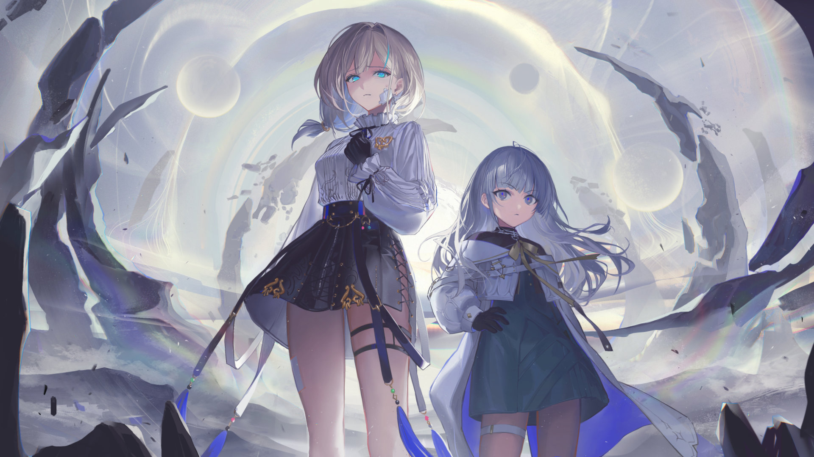

# 20-6

- **Unlock Condition**: 购入Lucent Historia曲包，完成20-5
- **Unlock Requirement**: 通过Lament Rain

Through Umbral Field 26 where shadow hail fell—
Over the Sunken Mountains—
Past the frozen capital Non, beset by frigid Air—
The girls marched, rode, and flew through the fifth Terra, reaching a gate city and 
finding their illegal trespass through Lephon's back. They tried a little subtlety, but 
not much can be managed in a rush. Even when shaping light around oneself—
the invisible can be quite visible.

But still, they made their way.
And then there they were, behind Him:
where the thousand Strands were laid out—where they bled oxygen to flow 
throughout space itself—at least here, behind the back of God.

----
It was a forest of gold and giant threads waving out from a tower Spine.
And a woman was already there: wielding a spear that shimmered strangely against reality.
She, the 2nd Seeker, looked out to them.

"...You two," she said, looking upon them dully. "I know the two of you. Why are you here? 
To watch the comings and goings?" When they didn't answer, she nodded gently. "Ah," she said, 
"it must have been that Lephon spoke to you."

Nell asked her, "Faith... did Lephon tell you to do this?"

And Faith replied, "I believe this to be what He needs." She shook her head sadly. "Nothing I tell you 
would be anything you'd want to hear."

"You're right," L answered, and Faith nodded her way.

----
"Lephon's 'death' is a cruel miracle," said the Seeker. "You two who haven't seen any world 
apart from this... you think that His love is all that matters. You move along lines that you think 
He wants you to move along. You are all slaves to Lephon, and Lephon slaves to you all. This 
is a bad place, worse than you can even imagine, and it doesn't need to be."

Faith lifted her spear, and while it seemed certainly "off" to Nell, to L staring at the blade caused 
her to reflexively wince. That edge hadn't been made "here", and merely by existing in a space 
to-it-foreign, it was already cutting at the world. To look at it made L feel as if her eyes had been 
cut, too.
It wasn't simply a spear to kill, but something forged to "erase".

"I won't bother telling you the plan," said Faith, "only the result: rebirth."

"Through countless deaths...?" asked Nell, her voice beginning to shake.

"Erasing a board isn't a big deal," Faith replied, "even if you don't remember what was written there."

Hearing this, Nell had enough and launched herself forward.

----
Breath was pulled from lungs.
Storms were summoned within space.
Matches were lit, and fire was cast from them...
Force was thrust forward. Force, and power.

It's how Shapers fight.
With "everything"—everything.

...Although, to call this a "fight", sincerely, would be a lie.

In time, Faith simply pointed a finger at Nell, and just with that the young girl was violently forced back.

----
Nell struck against Lephon's Spine with a terrible sound, soon tasting blood on her tongue. She shook, 
almost paralyzed, and when she looked up she saw that Faith had her hand at her apprentice's neck. 
Her thoughts rushed. She wanted to cry out. She prayed. Yes, she prayed.

<b>After unlocking 20-8, becomes:</b>

Her thoughts rushed. She wanted to cry out. She submitted herself. Yes, she prayed.

...It is hardly ever enough to "want", or even to need.
What bends the tide of what some might call "fate" might be a miracle, but often it is instead born from 
old seeds.

Seeds of passion and effort may in time be recognized.

To the erudite and assiduous, should you speak to God, He might hear you.

<b>After unlocking 20-8, becomes:</b>

To the erudite and assiduous, should you speak to God, He will hear you.

For something like that, you don't need faith.

...And yet Nell, that girl: she believed in God.

And it may have made her think: faith is why Lephon heard her then.

----
There is mystery here in Lephon. In a thousand years, Lephon had spoken to no one; Lephon is dead 
and has been far longer than even two millennia. Has He desires? Has He wants? What compels God? 
Why did He Speak to Nell?

A thousand years before, why did He speak to Faith?

To some "End", surely. God has plans for all of you, after all.

<b>After unlocking 20-8, becomes:</b>

To the End of His design. God has plans for all of us, after all.

Nell heard Lephon's voice again. His sound bled into her and the Spine behind her grew hot. 
As something deep in Lephon's Heart resounded, her heart soundly beat back. Her eyes and tongue 
had changed, and after she was left with a piece of God in her palm and another name.

----
The 2nd briefly lost breath as radiance erupted from the bones before her. She gazed through the waving 
Strands, and could see a new "number" being called down. With this hesitation, L seized the opportunity 
and moved the air around them to push the Seeker away.

After, both looked back to God.
They there saw Nell, swathed within gold fragments, and with images of unknown past, present, future 
and beyond reflecting all around her.

Lephon told her to arise eternal. She, Nell, would be the "8th Seeker" and "Compassion".

<b>After unlocking 20-8, becomes:</b>

Lephon told her to arise ephemeral. She, Nell, would be the "6th Seeker" and "Forlorn".

Her body began to heal, and her eyes once more set upon the 2nd—
—and so, as a new "god" was born, Lephon's voice receded again.