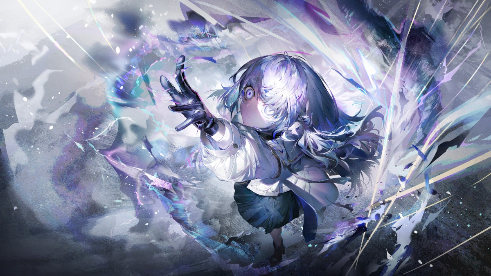
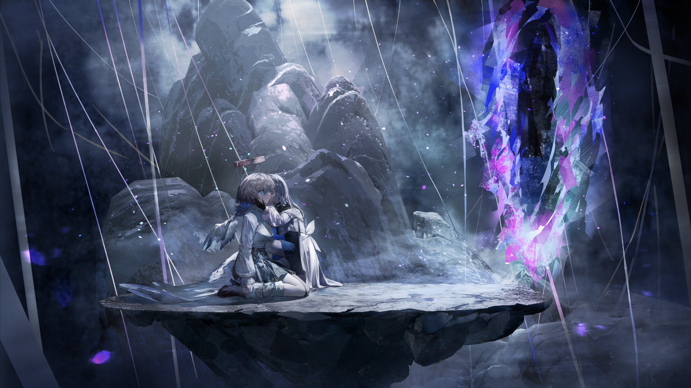

# 20-7

- **Unlock Condition**: 购入Lucent Historia曲包，完成20-6
- **Unlock Requirement**: 通过Designant.

Two Seekers met and clashed.
New light cascaded around them, and power whipped out between the two like typhoon gales.

Although she was young, "Compassion" was determined to have Faith's head.
Faith saw this, saw that L was still trying to help her teacher, and so went to L instead.

She left their fighting briefly, and went straight to the child.
She grabbed the child's right wrist, pulled it up—

—and using her spear, she took the limb from L.

L looked at the limb she'd lost as the 2nd dropped it callously to float through space, 
and she soon felt her consciousness fading. 
Nell shivered and froze on seeing this—so Faith returned to her.

Faith took Nell's shoulder—
drew back her spear again—
and, quickly—

She ran the spear through the young woman's body, the seams of reality 
warping upon contact—undoing "who" Nell "was".

So, in almost an instant, Nell had gone.
The child meanwhile... went still, and cold.

L... believed in nothing.
Belief drives, but it's fickle and can change. Knowledge, logic, certainty—
the stuff that makes Lephon the better place; that all drove the girl.

So now Nell was dead.
She watched the 2nd cast aside her teacher's body through a wide and quivering stare.

She breathed heavily. Though gravely wounded, her thoughts were now clear again. 
She turned her eyes to Lephon's back, and as those eyes began to dry—began to bleed, 
brain pounding, she stopped the flow of time.

The name her first love gave her was "L"—simple and honest, but it became affectionate. 
Still, it was only one letter of her true name.

Her name is special. A name without meaning apart from what she grants it.
Now hallowed within Arcaea's heart, it is the name of a new being beyond all.

This is true:
"Lephon" is One God.

"Lacrymira" is Another.

She looked into His Spine, into His Heart, 
and she saw there the shade of His soul. 
...So, she commanded Him.

—Lephon,
is in many ways inscrutable.
He does not hear prayer for He cannot hear. He does not listen to His children.

But still: to command Him—that's no miracle.
That is only the end of a hundred thousand ways; divine.
And to call it "fate" would be trite, too.

It is undeniable: Lacrymira was deserving.

Hollowed and dried nerves long quiet of synaptic pulse warmed now with recognition.
That stoney back stirred with old feeling. The Heart of God shook,
and, for a moment, the Air went still.

This reality changed then. All "knew", all innately recognized that girl.
Changing Lephon at its core, she became Rule itself.

The girl spoke to God and made Him hear. She made her voice reach depths 
that only her eyes could see.
Those eyes Lephon had blessed her with, and the hands and fingers He had given her too.

She spoke in a tongue she did not know, but felt; told dead Lephon her desire.
Give a number, give a name—give perfection in these symbols, 
and grant this holy one everything.

Not just any number and name: "hers". Nell's.
Nell was one person who did not deserve grace.
Lephon agreed. Lacrymira would instead become his Legacy.

She raised her arm toward His bones.
And there, she shaped the lingering will of God.

A new color was born amidst the forest of giant's gold threads. 
It was Her, Lacrymira, and it shined cold throughout all of space, 
into His Ribs and Spine, and beyond to the Terra and the Air.

Power filled Her body. Her right arm found its way back to Her, 
and She began to re-shape Herself to seal any wounds.

Lephon had listened to Her, and now He spoke again.
She would arise here, behind Him—and after Him:
Lacrymira, or—The Ascendent - 8th Seeker:

"Insight".

After the flow of time resumed, She set Her healed eyes on the 2nd.
Witnessing the risen Insight, Faith realized with pain that Lephon's will had been set.
She fought against it—she did, but it was with the same futility as to fight a wave.

Lacrymira overwhelmed her, and pressed her down against new land She had made. 
She summoned a miniature star above Faith's back, and made it collapse there—
rending the Seeker's body to nothing in only a few moments.

She dismissed the destroyed star and after: all was quiet again.

The story steadily draws to its conclusion.

Lacrymira did not leave Her mentor dead, She brought her down 
to the land She had crafted and revived the young woman, bringing 
her soul back and healing the body's wounds.

But, with the two of them all alone there behind Lephon, Lacrymira standing and Nell on her knees,
Nell knew at once what Lacrymira had done in her absence—and she went a new kind of cold.
In all that it means: Nell had failed her child.

"..."
Lacrymira looked down upon her silently. She looked deeply into her—into the core of her being.
And She asked, "...Nell, why won't you come with me?"

It hadn't been said. She could see in Her sister's heart that the two of them were not aligned.
Within, She could see that her teacher wanted to "beg her not to go". Because
She had floated that idea so many times before: to become a god, and leave the world behind.

"Nell... you're alive again so SPEAK to me," said God.
Nell looked up at Her and finally replied, "'Why won't I come'...? Why do you want to go?"

They both knew Her answer, and yet Lacrymira still gave it: "I can't live for anyone but myself."

"You shouldn't either, Nell. You don't need to.
You won't be thanked for it. You won't be praised.
You will die at the hands of an angel, and no one but I will remember you."

"We don't have to die, L," her teacher answered. "Stay, and we..."

Lacrymira slowly shook Her head. "I can see it," She said,
"there isn't any saving us from that end. Every Shaper here will die."

And Nell hung her head and shook it in turn. "No," she said. "I won't allow that—"

"Shut UP!!"

Lacrymira roared. Her voice struck throughout everything, and made Nell for a moment still.
When Nell looked back to Her, Her eyes stared back wrathful.

"I told you a lie, Nell," she continued in a trembling voice—trembling with rage,
"I can live for you. Do you need me to say it? Do you need me to enunciate?
To put it to paper? To say so obviously that I love you!?"

Hearing this, her mentor shook and broke in expression.
Her eyes brimmed with tears, she hiccupped then.
Tears fell from her face. She cried. She continued to cry.

And Lacrymira, She shouted over Her mentor's tears—

"Of course I love you! Why would I still be standing here if not for you? I won't leave you. I can't.
You're too charming not to love."

"You're nearly everything to me...
I don't want you to die! I hate the idea of you dying, Nell!"

"And great, now you're crying. Crying... And now you won't answer me!
Forlorn Nell, always caring and caring...! I could hate you for it. I do. I hate that in you, completely.
You waste everything you are on people so much less than you!"

She stopped speaking. Her body was trembling now. Her cold eyes fell on the girl beneath her.
Nell shook her head. She would not abandon anyone.
Anyone, but for L.

And Lacrymira told her, with a voice like ice: "You're sad."

"That's right," God repeated, "you're 'Forlorn', and 8 can't belong to you."

Nell stared up at her student, who was now staring into Lephon's back.

"You deserve a mark of ruin," said Lacrymira.
"You deserve a hex. You will be '6'. Bear that cursed symbol forever."

Deep in Lephon's heart, something new was 
scrawled upon a black canvas, and it became the new truth. 
Now changed, the only words "Forlorn" could give her student were "I'm sorry..."

And Lacrymira answered, "You are.
But, Nell... I love you for that, too."

A tear in space opened behind the new God: a gate to elsewhere.

She bent, and held Nell's face gently by one hand. 
She laid Her lips on Her sister's cheek.

She lingered.
She thought, for a moment, to stay.

...She stood, and She turned;
away from Her teacher, and away from Lephon.
For longer, Her hand stayed at her sister's cheek.

She took it away. She hid Her face.
She stepped through the gate.

...It closed, and She was gone.

One final story remains for the Shapers, but it has already 
been told by another—in another place.

The story of when the one you'd call "Tairitsu" died, where Nell had died before her in vain.
Because "Powers" are "power". One can coax them, one can shift them, 
but on Lephon they always "are".

An Angel descended.
For the second and final time, the Shapers had a reckoning.

But... The Eternal One was not there. She remains, and has remained for a very long time.
Many years have passed. Centuries, maybe—although 
another might order events incorrectly, and tell you on top of that that "it wasn’t long ago..."

On Her journey, She found Arcaea.
And with Nell's death, Arcaea has found Her old teacher too.
...No: Lacrymira doesn't know this.

But—Arcaea's stories are not Lephon's. They can be told by another.
This history has been conveyed. "Stolen", maybe. At any rate: recorded.

Now...
The new God's will is whim, and She is a capricious girl. 
Her aims? Wouldn't you like to know them.

Well but, have one truth before you go:
Don't believe in Her.
Belief makes "truth", after all.

Because you see, while the creator of that place has lost her power—
and while Arcaea may be dead or dying...
this is so:

There, god is not.