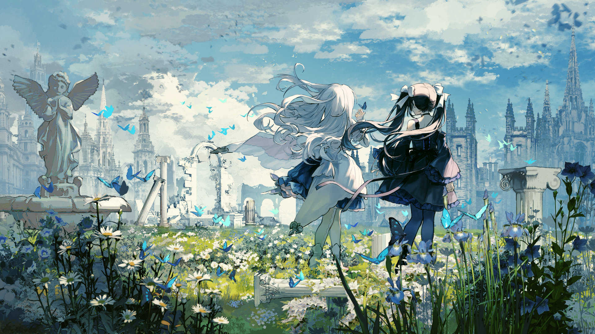

# 20-8

- **Unlock Condition**: 购入Lucent Historia曲包，完成20-7

Listen:

There is no rule to divinity,
rule is set by the divine.

Law, and order, are established by the will of gods.

Why, there is a god called "nature", and there is a god of "nothing".
Brilliant gods with brilliant names, idiot gods and gods with names unspeakable.
And, us human gods.

I am 8. I am Insight.
But, little devil: my true name was not yours to know.
You've been listening to some secret words, haven't you?

Shaper, Ascendant, Seeker; I "am": perfection, infinite, all-seeing.
What else? But "god".

...But now, I, your magnanimous god...
I seek to stitch torn seams back together, and repair a graying veil.
Yet: the world itself still always tumbles down into nothing.

Ah, that so-called "sister" of mine, and her new friend...
I can see the two of them through another eye.
Stumbling through this world, walking Arcaea in its dying.

They've become blind: rejected "god" to accept "life".
And like Arcaea has, this means to have wholly accepted "death".
It's sad.

You know? You know: "I" remember:
that old history that was brought up, and which you've bore witness to.
But? That history? I don't like how it's said.

I've decided to tell the tale a different way.
For if old rule is useless, the rule may freely be broken—
and new law made to spite it.

Remnants of the self, darker parts of you that might recolor your soul;
they are best off forgotten.

Though, while some history is worth forgetting...
...You would do well to remember your name.