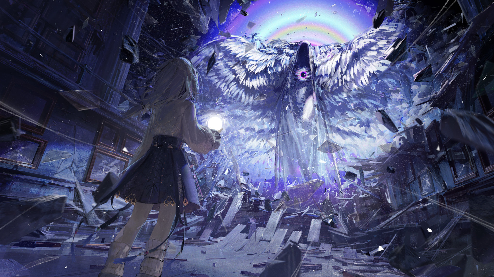

# 20-1

- **解锁条件**：购入Lucent Historia曲包

你相信神吗？
 
在巨人庞大的体内深处、一颗早已冰冷的心脏之上，少女只身踏入一池鲜红与暗红之中。过低的亮度
让少女无法辨认出颜色，但随着愈发深入，她越来越觉得这堆液体像是不断滴在她脸上的逆流的雨。
她伸手触碰了一下粘在她脸颊上的液体，皱了皱眉。
 
幸好周遭是一片黑暗，这个地方在席卷过后留下了怎样一副景象相比起怪物本身的样貌根本不算什么，
而她也并不需要知道——毕竟前三次已经够她受的了，至今回忆起来她还是会不禁起鸡皮疙瘩，但——
 
她不得不不断重复这些“折磨”，毕竟作为承袭了神部分权能的塑形者，驯服怪物天经地义。
她的学徒正在远处等待着她，而她将自己的声音塑形后，跟学徒最后一次确认：
“准备好了？”

<b>解锁20-8后此处变为：</b>

她的学徒——我——正在远处等待着她，而她将自己的声音塑形后，跟学徒最后一次确认：
“准备好了？”

----
很快，她便收到了学徒的回复：“净说些废话。”
“准备好了就闭嘴。”她回击道，接着从腰间取出空之灯点亮，再把光从中取出，拿到自己的面前，随即
将其铺开，照亮了整个画廊。
 
终于能够看清，她将目光一一扫过那些画。
古时的神使，神本身，还有巨大的骸骨——那是殸那神圣的脊骨与肋骨。
当然，她同时也发现了此行的目标——那只凶恶的庞然大物正蛰伏在远处的墙边，在这根又长又宽的
杆子的另一头用仅有的一只眼睛死死盯着她，八只翅膀很好地隐藏了自己巨大的身躯。与它对视一眼，
少女暗暗骂了一句，开始了行动。
 
野兽的眼睛发出了诡异的光芒，少女几秒前所在的区域便几乎在一瞬间被一股巨大而不断波动扩散的
能量炸裂开来。这通体惨白的野兽随即张开了其中两只翅膀，露出了一张没有唇齿的嘴，尖啸起来。

----
这位塑形者举起双手，在怪物的吼声传到她耳边之前便隔断了它。于是那声音落在了她的四周，将她
周遭的大地和整个画廊作品的裱框都震了个粉碎。大能使这头野兽在这里肆虐横行，而它现在正准备
朝她俯冲而来。
 
怪物张开了全部八只翅膀，终于暴露出了自己精瘦而强壮的身体，扭曲，诡异，不似人也不似动物。
它嶙峋的脊背忽然猛地弯曲、弓起，而就在这时，上面的屋顶突然迸裂了。
在这座屋顶彻底坍塌之前，只见构成屋顶的绝大多数彩绘玻璃、石头和木材忽然聚合到了一起，逐渐
汇聚成了一柄长矛，而那长矛的上方出现了一只小小的、属于孩童的手。
 
只见那孩子随后以惊人的力量将这巨大的长矛掷了下去，长矛伴随着巨大的能量顷刻贯穿了大能的
脊柱。巨兽轰然倒地，而白发的孩子则高高在上，用锐利的目光俯视着它；胜负已分。
 
“好啦，乖，坐下吧。”她说。

<b>解锁20-8后此处变为：</b>

“好啦，乖，坐下吧。”我说。我那时可真是可爱极了。

----
猛兽仍在挣扎，但如今它仿佛被“定住”了般，因此这一切也只是徒劳。年长些的塑形者来到它跟前，
伸出手，触碰那巨兽的脖颈。“回到空中去吧，”她说，“其他大能会安顿好你的。”话音刚落，猛兽的
身体突然震颤了一下，散发出刺眼的光亮。接着，它的身体开始以长矛为中心不断坍缩，最终化成了
一颗小小的光球，落入了少女手中。少女回头，将光球掷出了门，完成了收尾工作。“……你给我出来！”
少女紧接着吼道，怒视着坐在巨大的由玻璃、石头和木材制成的那柄长矛末端的孩子，“L，看看你干的
好事，你告诉我我们回去该如何交差？！不撒谎圆过去的话，修屋顶的钱你给我找？”
 
“我亲爱的尼尔老师，作为仲裁真理的塑形者，我们怎么能撒谎呢？我们向来都是讲真话的，你再清楚
不过了。”小孩狡黠地笑着，回答道。接着，一颗碎石飞来，精准地砸在她头上，让她一个踉跄跌倒
在废墟之中。
 
“算了，恐惧大能的化身确实经常会把这一切都搞得满地狼藉。”她老师好整以暇地自言自语道，“这样
他们还真不一定会发现我们在撒谎。看看这堆尸体，有些它只吃了一半，都没来得及吃完……真恶心。”
 
“疼！你干什么打我！”L愤怒地喊道。
 
“因为我想让你闭嘴。”草草回了一句，尼尔懒得继续理她，继续全力搜查着。

----
……你信仰神吗？神，而不是众神。你相信那高于你的独一吗？
 
你的答案与信仰其实都无关紧要：神就在那里，而神，已经死了。
 
此时此刻，我们要讲述的则是一个新神诞生的故事。
 
……但请不要误会，这个问题本身的确很重要。因为它回响于时间长河之中，永远存在。
因为信仰创造了一切。
它使男人和女人行动；它创造出了“真相”；
它，创造出了Arcaea。
纵使神已死去，祂也仍然存在，且是万有的父，权能的父。
 
她们于你而言绝不陌生。
那些塑形者们。
“对立”，并非她本来的名字。
而第八席。
其本名为———— / //。

<b>解锁20-8后此处变为：</b>

而第六席。
其本名为拉可弥拉。

