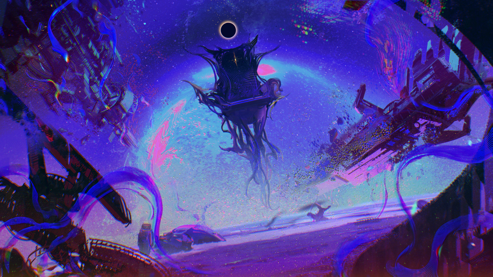

# 22-5

- **Unlock Condition**: 购入Chapter Experientia曲包
- **Unlock Requirement**: 采用野乃香，通过Factorder

And it ends, slow, as the blue runs throughout.

A new and black sun unfolds, and its howl is silenced in space.

The herald, set fast and fused with her Husk at the foot of the throne, is silent too with a lance towering 
up from her chest.

The throne is empty.

The world has turned.

----
And those pleas that were cried from humanity drift across the strips of their vessels.

Once being, they are all gone now.

There will be none to come to see who they were.

This is now all "Color". A beauty has clutched "everything".

----
And it is a web of Color: its spokes and pillars crossing and shining between hollowed ships 
and barren moons.

Every planet will soon change too. They will see perfection, they will yearn for it, and transform.

That is the metamorphosis of the Light she found.

----
And now she dies, and her strange memory is beckoned into glass.

And now, she is born again.

Another strange smile, and eyes that have seen beauty...

They spread and open once more in Arcaea.